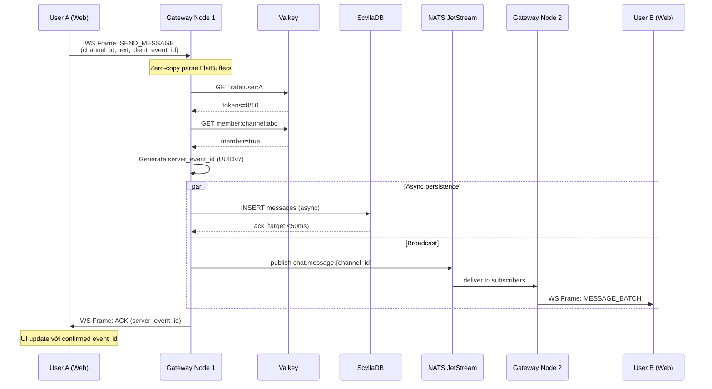
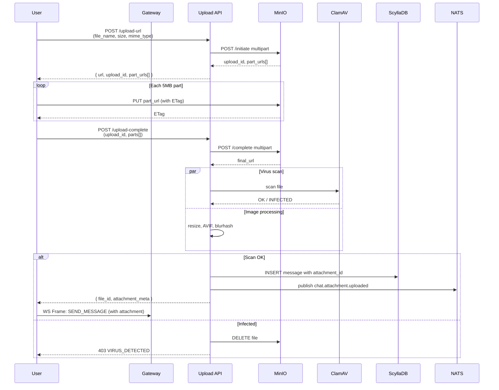
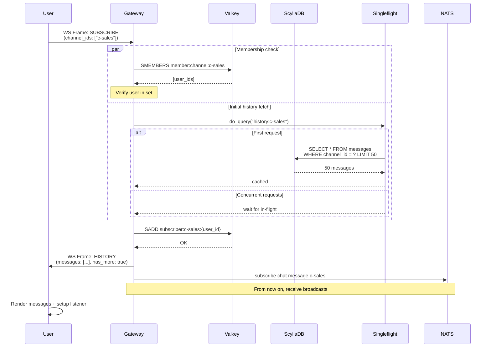
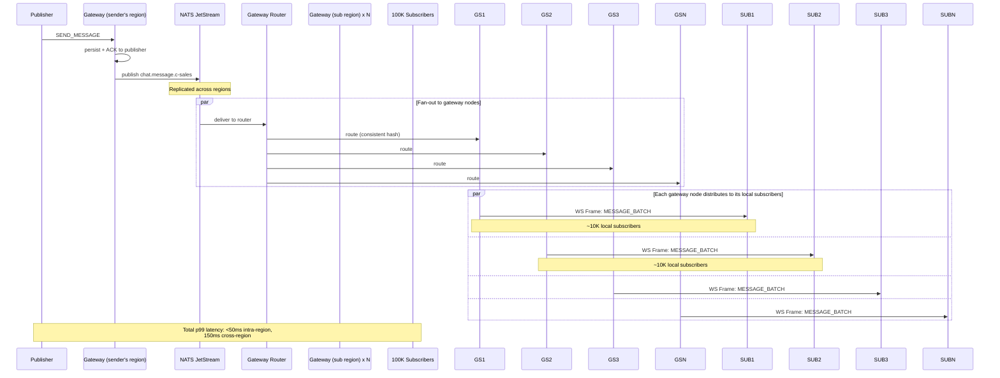

# Phần 6 – Chat Real-time Engine (Hyper-Scale Chat)

> **Phân hệ:** Nhắn tin thời gian thực cho mọi tenant, hỗ trợ chat 1-1, nhóm, channel công ty.
> **Mục tiêu:** Triệu user đồng thời với độ trễ < 50ms, kernel bypass, FlatBuffers, singleflight coalescing.
> **Đặc thù:** Rust + io_uring + FlatBuffers + ScyllaDB Shard-per-core + eBPF/XDP.

---

## Mục lục

1. [Mục tiêu & Nguyên tắc](#1-mục-tiêu--nguyên-tắc)
2. [Kiến trúc](#2-kiến-trúc)
3. [Protocol: FlatBuffers Binary](#3-protocol-flatbuffers-binary)
4. [Connection Layer: io_uring + eBPF](#4-connection-layer-io_uring--ebpf)
5. [Singleflight Coalescing](#5-singleflight-coalescing)
6. [Persistence Layer](#6-persistence-layer)
7. [Presence & State](#7-presence--state)
8. [Channel & Permission Model](#8-channel--permission-model)
9. [File Upload](#9-file-upload)
10. [Danh sách tính năng (≥ 100)](#10-danh-sách-tính-năng)
11. [Database Schema](#11-database-schema)
12. [API Surface](#12-api-surface)
13. [UI/UX](#13-uiux)
14. **MỤC LỤC MỚI (MỞ RỘNG)**
14. [Audit Report](#14-audit-report)
15. [Protocol Flow chi tiết với Sequence Diagram](#15-protocol-flow-chi-tiết-với-sequence-diagram)
16. [FlatBuffers Schema đầy đủ](#16-flatbuffers-schema-đầy-đủ)
17. [Rust Gateway Implementation chi tiết](#17-rust-gateway-implementation-chi-tiết)
18. [Singleflight Coalescing chi tiết](#18-singleflight-coalescing-chi-tiết)
19. [Presence Service Implementation](#19-presence-service-implementation)
20. [Channel Router & Consistent Hashing](#20-channel-router--consistent-hashing)
21. [eBPF/XDP Load Balancer chi tiết](#21-ebpfxdp-load-balancer-chi-tiết)
22. [File Upload Pipeline chi tiết](#22-file-upload-pipeline-chi-tiết)
23. [End-to-End Encryption (E2EE)](#23-end-to-end-encryption-e2ee)
24. [Search Service (Meilisearch)](#24-search-service-meilisearch)
25. [Notification Service](#25-notification-service)
26. [Scaling & Sharding Strategy](#26-scaling--sharding-strategy)
27. [Edge Cases & Error Handling](#27-edge-cases--error-handling)
28. [Performance Benchmark chi tiết](#28-performance-benchmark-chi-tiết)
29. [Security Hardening](#29-security-hardening)
30. [Disaster Recovery](#30-disaster-recovery)
31. [Cost Estimation](#31-cost-estimation)
32. [Testing Strategy](#32-testing-strategy)
33. [Implementation Roadmap chi tiết](#33-implementation-roadmap-chi-tiết)
34. [Open Questions / Cần user xác nhận](#34-open-questions--cần-user-xác-nhận)

---

## 1. Mục tiêu & Nguyên tắc

### 1.1. Mục tiêu
| ID | Mục tiêu | Đo lường |
|----|---------|---------|
| CH-1 | 1 triệu CCU | Concurrent WebSocket |
| CH-2 | p99 latency < 50ms | Send → Receive |
| CH-3 | Persistence không block realtime | ScyllaDB async |
| CH-4 | Multi-tenant isolation | Per-tenant channels |
| CH-5 | Zero-copy packet | io_uring + FlatBuffers |

### 1.2. Nguyên tắc
- **Async-first:** Không bao giờ block event loop.
- **Batching:** Gộp nhiều message thành 1 frame.
- **Presence ở Valkey, History ở ScyllaDB.**
- **Channel routing qua consistent hash.**

---

## 2. Kiến trúc

### 2.1. Sơ đồ
```
[Web/App Clients]
        │ WebTransport / Zero-Copy WebSocket
        ▼
[Kernel-Bypass Gateway (Rust + io_uring + eBPF/XDP)]
        │
        ├─► FlatBuffers Parser (Zero-Allocation)
        ├─► Auth + Tenant Resolver
        ├─► Singleflight Coalescing Layer
        ├─► Channel Router (Consistent Hash)
        │
        ├─► Presence State (Valkey Cluster)
        └─► ScyllaDB Shard-per-core Chat Logs
                │
                └─► NATS JetStream (replication + sync)
```

### 2.2. Services
- **`chat-gateway`** (Rust + tokio-uring): Main WS server.
- **`chat-router`** (Rust): Distribute messages across gateway nodes.
- **`chat-presence`** (Rust + Valkey): Online status, typing.
- **`chat-history`** (Rust + ScyllaDB): Message persistence.
- **`chat-search`** (Go + Meilisearch): Full-text search.
- **`chat-notify`** (Go): Push notifications khi offline.

### 2.3. Deployment
- 100+ gateway nodes (chạy song song, stateless).
- Sticky session theo `connection_id`.
- Auto-scale theo CCU.

---

## 3. Protocol: FlatBuffers Binary

### 3.1. Lý do chọn FlatBuffers
- **Zero-copy read:** Client đọc trực tiếp từ byte buffer.
- **Zero-allocation:** Không cần Unmarshal → giảm 90% RAM.
- **Schema evolution:** Backward compatible.

### 3.2. Message Schema
```fbs
namespace Rinco.Chat;

enum MessageType : byte {
  TEXT = 0,
  IMAGE = 1,
  VIDEO = 2,
  FILE = 3,
  VOICE = 4,
  STICKER = 5,
  REACTION = 6,
  REPLY = 7,
  FORWARD = 8,
  SYSTEM = 9,
  DELETED = 10,
  EDITED = 11,
  POLL = 12,
  LOCATION = 13,
  CONTACT = 14,
}

table ChatMessage {
  event_id: string;        // UUIDv7
  tenant_id: string;
  channel_id: string;
  sender_id: string;
  message_type: MessageType;
  text: string;
  metadata: [MetadataEntry];  // Map
  mentions: [string];
  reply_to: string;
  forwarded_from: string;
  attachments: [Attachment];
  reactions: [Reaction];
  created_at: long;
  edited_at: long;
  deleted: bool;
}

table ChatFrame {
  frame_type: FrameType;
  messages: [ChatMessage];
  presence_updates: [PresenceUpdate];
  typing_indicators: [TypingIndicator];
  read_receipts: [ReadReceipt];
  server_timestamp: long;
}

enum FrameType : byte {
  MESSAGE_BATCH = 0,
  PRESENCE = 1,
  TYPING = 2,
  READ = 3,
  ACK = 4,
  PING = 5,
  ERROR = 6,
}

root_type ChatFrame;
```

### 3.3. Client SDK (TypeScript)
```typescript
import { ChatFrame, ChatMessage } from '@rinco/chat-proto';

const frame = ChatFrame.create({
  frame_type: 0,
  messages: [{
    event_id: uuidv7(),
    tenant_id: 'apex',
    channel_id: 'c-sales',
    sender_id: 'u-123',
    message_type: 0,
    text: 'Hello!',
    created_at: Date.now(),
  }]
});
const bytes = frame.pack();  // Binary buffer
socket.send(bytes);
```

---

## 4. Connection Layer: io_uring + eBPF

### 4.1. Rust Gateway với tokio-uring
```rust
use tokio_uring::net::TcpStream;
use io_uring::types::RecvZc;

async fn handle_connection(stream: TcpStream) {
    let mut buf = vec![0u8; 4096];
    loop {
        // Zero-copy receive
        let (res, buf_) = stream.recv_zc(&mut buf).await;
        let n = res?;
        // Process FlatBuffers in-place (no copy)
        let frame = unsafe { root_as_chat_frame(&buf_[..n])? };
        // Forward to router
        router.dispatch(frame).await;
    }
}
```

### 4.2. eBPF/XDP Drop Bot
```c
// eBPF program drop known bot User-Agent
SEC("xdp")
int xdp_filter_bot(struct xdp_md *ctx) {
    void *data = (void *)(long)ctx->data;
    void *data_end = (void *)(long)ctx->data_end;

    // Parse TLS ClientHello (simplified)
    struct tls_hello *hello = parse_tls_hello(data, data_end);
    if (hello) {
        if (is_known_bot_ua(hello->user_agent)) {
            return XDP_DROP;
        }
    }
    return XDP_PASS;
}
```

### 4.3. Connection Lifecycle
```
1. Client connect TCP → eBPF filter
2. TLS handshake (Rustls)
3. Client send JWT (PASETO) in first frame
4. Gateway verify + tenant resolve
5. Channel subscribe
6. Bidirectional frame flow
```

---

## 5. Singleflight Coalescing

### 5.1. Vấn đề Hotspot
- Channel có 50.000 thành viên, cùng mở app.
- 50.000 request cùng query history của channel.
- → ScyllaDB overwhelmed.

### 5.2. Giải pháp
```rust
// rust: singleflight coalescing
use std::sync::Arc;
use tokio::sync::OnceCell;

struct Coalescer {
    inflight: Arc<DashMap<String, Arc<OnceCell<Vec<ChatMessage>>>>>,
}

async fn fetch_history_coalesced(
    &self,
    channel_id: &str,
    cursor: &str,
) -> Result<Vec<ChatMessage>> {
    let key = format!("{}:{}", channel_id, cursor);

    // Group by 10ms window
    let cell = self.inflight.entry(key).or_insert_with(|| {
        Arc::new(OnceCell::new())
    }).clone();

    cell.get_or_init(|| async {
        // Only 1 actual DB query per 10ms window
        let result = self.scylla.fetch_history(channel_id, cursor).await?;
        Ok(result)
    }).await.clone()
}
```

### 5.3. Kết quả
- 50.000 request → 1 DB query.
- Broadcast kết quả tới 50.000 clients.

---

## 6. Persistence Layer

### 6.1. ScyllaDB Schema
```cql
CREATE KEYSPACE rinco_chat WITH replication = {
  'class': 'NetworkTopologyStrategy',
  'datacenter1': 3
};

-- Messages per channel
CREATE TABLE rinco_chat.messages (
  channel_id text,
  tenant_id text,
  event_time bigint,
  event_id uuid,
  sender_id text,
  message_type tinyint,
  text text,
  metadata map<text, text>,
  attachments list<frozen<attachment>>,
  reactions map<text, frozen<reaction>>,
  reply_to text,
  mentions list<text>,
  deleted boolean,
  edited_at bigint,
  PRIMARY KEY ((channel_id, tenant_id), event_time, event_id)
) WITH CLUSTERING ORDER BY (event_time DESC);

-- User channels
CREATE TABLE rinco_chat.user_channels (
  user_id text,
  tenant_id text,
  channel_id text,
  joined_at bigint,
  last_read_event_time bigint,
  unread_count int,
  muted boolean,
  PRIMARY KEY ((user_id, tenant_id), channel_id)
);

-- Channel metadata
CREATE TABLE rinco_chat.channels (
  channel_id text,
  tenant_id text,
  name text,
  type tinyint,             -- 1:DM, 2:Group, 3:Public, 4:Company
  members list<text>,
  admins list<text>,
  created_at bigint,
  avatar_url text,
  description text,
  PRIMARY KEY ((channel_id, tenant_id))
);
```

### 6.2. Shard-per-core
- ScyllaDB tự phân shard theo core.
- Mỗi gateway node pinned vào 1 Scylla shard.
- `cpuset` Linux để constrain CPU.

### 6.3. Write Path
```
Gateway nhận message
    │
    ▼
Validate + Normalize
    │
    ▼
Write ScyllaDB (async, fire-and-forget)
    │
    ▼
Emit NATS event cho cross-tenant sync
    │
    ▼
Push qua WebSocket tới subscribers
```

### 6.4. Read Path
```
Client request history (cursor pagination)
    │
    ▼
Gateway → Singleflight Coalescer
    │
    ▼
Query ScyllaDB (shard by channel_id)
    │
    ▼
Return binary FlatBuffers
```

---

## 7. Presence & State

### 7.1. Valkey Schema
```
Key: presence:user:{user_id}
Value: { status: "online", device: "web", last_seen: 1234567890, current_channel: "c-123" }
TTL: 60s (refresh mỗi 30s)

Key: presence:channel:{channel_id}
Value: Set of user_id currently online
TTL: 5 minutes

Key: typing:channel:{channel_id}
Value: List of user_id currently typing
TTL: 5s
```

### 7.2. Online Status
- `online`: Active trong 5 phút.
- `away`: Active 5-30 phút.
- `offline`: > 30 phút hoặc disconnect.

### 7.3. Push Notification (Offline)
- Khi user offline > 30s nhận message → push notification.
- FCM (Android), APNs (iOS), Web Push (Browser).
- Telegram Bot nếu user link.

---

## 8. Channel & Permission Model

### 8.1. Channel Types
| Type | Code | Use case |
|------|------|----------|
| **DM** | 1 | 1-1 chat |
| **Group** | 2 | Small group chat |
| **Public Channel** | 3 | Company-wide announcement |
| **Private Channel** | 4 | Restricted access |
| **Thread** | 5 | Reply dưới 1 message |

### 8.2. Permission
- `member`: Read + Write + Reaction.
- `admin`: + Add/Remove members, Edit channel.
- `owner`: + Delete channel, Transfer ownership.

### 8.3. Visibility
- **Private:** Chỉ members thấy.
- **Internal:** Members + tenant admin.
- **Public:** Anyone in tenant (searchable).
- **External:** Có thể mời user ngoài tenant (audit required).

---

## 9. File Upload

### 9.1. Presigned S3 Direct Upload
```
1. Client GET /api/chat/v1/upload-url?type=image&size=5242880
2. Server trả { url, fields, file_id }
3. Client POST trực tiếp lên MinIO/S3
4. MinIO webhook → Server update message
5. Client send message với attachment_id
```

### 9.2. Supported File Types
- Image: jpg, png, gif, webp, avif (max 10MB).
- Video: mp4, webm (max 200MB, transcode to 720p).
- Audio: mp3, ogg, wav (max 20MB).
- File: pdf, doc, xlsx, zip (max 100MB).
- Voice message: opus/webm (max 5 phút).

### 9.3. Image Processing
- Server-side resize (thumb, medium, full).
- Strip EXIF (privacy).
- WebP/AVIF conversion.
- Blurhash placeholder.

### 9.4. Virus Scan
- ClamAV integration.
- Async scan, nếu nhiễm → file bị block.

---

## 10. Danh sách tính năng (≥ 100)

### 10.1. Tin nhắn cơ bản (1-30)
1. Gửi text message.
2. Gửi emoji + custom emoji.
3. Gửi ảnh (paste/drag/upload).
4. Gửi video.
5. Gửi file (any type).
6. Gửi voice message (record từ mic).
7. Gửi sticker.
8. Gửi GIF (Giphy integration).
9. Gửi location.
10. Gửi contact card.
11. Reply to message.
12. Forward message.
13. Edit message (trong 24h).
14. Delete message (for me / for everyone).
15. Pin message.
16. Bookmark message.
17. Search message.
18. Quote message.
19. Mention user (@user).
20. Mention channel (#channel).
21. Mention everyone (@all) – restricted.
22. Hashtag.
23. Link preview.
24. Code block formatting.
25. Markdown formatting.
26. Rich text formatting (bold/italic/underline).
27. Code syntax highlight.
28. Mention user group.
29. Schedule message (gửi sau).
30. Draft (auto-save).

### 10.2. Reactions & Engagement (31-50)
31. React với emoji.
32. Custom reactions (tenant-specific).
33. Multiple reactions per message.
34. Top reactions display.
35. Reply in thread.
36. Thread view.
37. Follow thread.
38. Unfollow thread.
39. Pin thread.
40. Mark unread.
41. Mark read.
42. Read receipts (visible to user toggle).
43. Last seen.
44. Typing indicator.
45. Voice activity indicator (in call).
46. Online status.
47. Custom status message.
48. Away message.
49. Do not disturb mode.
50. Mute channel.

### 10.3. Channels & Groups (51-70)
51. Tạo DM (1-1).
52. Tạo group chat.
53. Tạo public channel.
54. Tạo private channel.
55. Tạo broadcast channel (announcement).
56. Add member.
57. Remove member.
58. Leave channel.
59. Join public channel.
60. Invite via link.
61. Invite via email.
62. Channel settings.
63. Channel description.
64. Channel avatar.
65. Channel topic.
66. Channel pinned messages.
67. Channel permissions.
69. Channel moderation.
70. Archive channel.

### 10.4. Search & Discovery (71-85)
71. Search messages (full-text).
72. Search filter (sender, date, type).
73. Search trong 1 channel.
74. Global search.
75. Search by file type.
76. Search by media.
77. Saved searches.
78. Recent searches.
79. Trending messages.
80. Pinned across channels.
81. Jump to date.
82. Jump to message (link).
83. Deep link (notification → message).
84. Search highlight.
85. Search suggestion.

### 10.5. Notifications (86-100)
86. Push notification (browser/mobile).
87. Email digest.
88. Notification sound.
89. Notification per channel.
90. Notification keywords alert.
91. Notification mute schedule.
92. Notification priority.
93. Group notifications.
94. Notification preview (privacy).
95. Hide notification content (lock screen).
96. Action in notification (reply).
97. Notification history.
98. Telegram bot integration.
99. Slack bridge.
100. Discord bridge.

### 10.6. Admin & Moderation (101-120)
101. Delete any message.
102. Ban user from channel.
103. Mute user in channel.
104. Warn user.
105. Audit log per channel.
106. Report message.
107. Report user.
108. Content moderation (AI filter).
109. Profanity filter.
110. Spam detection.
111. Rate limit per user.
112. Slow mode (channel).
113. Message retention policy.
114. Auto-delete after N days.
115. Legal hold (compliance).
116. Data export (GDPR).
117. Right to be forgotten.
118. E2E encryption (optional).
119. Channel archival.
120. Channel analytics.

---

## 11. Database Schema (Đã trình bày ở mục 6.1)

---

## 12. API Surface

### 12.1. REST
```
POST   /api/chat/v1/channels
GET    /api/chat/v1/channels
GET    /api/chat/v1/channels/:id
PATCH  /api/chat/v1/channels/:id
DELETE /api/chat/v1/channels/:id
POST   /api/chat/v1/channels/:id/members
DELETE /api/chat/v1/channels/:id/members/:user_id

GET    /api/chat/v1/channels/:id/messages?cursor=...
POST   /api/chat/v1/channels/:id/messages
PATCH  /api/chat/v1/messages/:id
DELETE /api/chat/v1/messages/:id

POST   /api/chat/v1/upload-url
POST   /api/chat/v1/upload-complete

GET    /api/chat/v1/search?q=...
```

### 12.2. WebSocket
```
WS /ws/chat?token=...
   Frame types:
   - auth
   - subscribe_channel
   - unsubscribe_channel
   - send_message
   - typing
   - read_receipt
   - presence
   - ping
```

---

## 13. UI/UX

### 13.1. Layout
```
┌────────────────────────────────────────────────┐
│ Top Bar: Tenant | Search | Profile | Status    │
├──────────┬─────────────────────────────────────┤
│ Sidebar  │  Channel Header                     │
│ ▸ Channels│  ├─────────────────────────────┤    │
│ ▸ DMs    │  │ Pinned Messages              │    │
│ ▸ Search │  ├─────────────────────────────┤    │
│ ▸ Saved  │  │ Message List (infinite scroll)│    │
│ ▸ Files  │  │ ...                          │    │
│          │  ├─────────────────────────────┤    │
│          │  │ Input Bar                    │    │
│          │  └─────────────────────────────┘    │
│          │  Member List (right panel)           │
└──────────┴─────────────────────────────────────┘
```

### 13.2. Components
- ChannelList (search, filter, sort).
- MessageList (virtualized, infinite scroll, jump-to).
- MessageBubble (markdown render, attachments).
- InputBar (mention picker, emoji picker, file upload, voice record).
- ThreadView (replies).
- ReactionPicker.
- FilePreview (image gallery, video player).
- SearchPanel (advanced filters).
- NotificationSettings.
- ChannelSettings.

### 13.3. Tech Frontend
- React 18 + TypeScript.
- Tailwind CSS + Lucide Icons.
- shadcn/ui components.
- Zustand (state) + TanStack Query (server state).
- flatbuffers (binary protocol).
- mediasoup-client (WebRTC cho voice).
- react-virtuoso (virtualized list).
- framer-motion (animations).

### 13.4. Mobile
- React Native (Expo) cho iOS/Android.
- Native gesture.
- Push notification qua FCM/APNs.
- Offline queue + sync khi online.

---

## Phụ lục: Acceptance Criteria

| AC | Tiêu chí | Đo lường |
|----|---------|---------|
| AC-CH-01 | 100K concurrent connections per node | Load test |
| AC-CH-02 | Send → Receive p99 < 50ms | Benchmark |
| AC-CH-03 | 50K requests → 1 DB query (singleflight) | Trace |
| AC-CH-04 | Message persisted < 100ms | p95 |
| AC-CH-05 | Reconnect < 1s | Network test |

---

# PHẦN MỞ RỘNG (Protocol Flow chi tiết + Code Examples)

> Phần này bổ sung theo yêu cầu đặc biệt cho Chat: Protocol Flow, FlatBuffers schema đầy đủ, code Rust chi tiết.

---

## 14. Audit Report

### 14.1. Phần đã đủ chi tiết
- ✅ Kiến trúc 4 tầng.
- ✅ Lý do chọn FlatBuffers (zero-copy, zero-alloc).
- ✅ io_uring + eBPF code example cơ bản.
- ✅ ScyllaDB schema (3 tables).
- ✅ Singleflight pattern concept.
- ✅ 120 tính năng across 6 categories.
- ✅ REST + WebSocket API surface.
- ✅ UI Layout và components.

### 14.2. Phần còn thiếu (gap)

| Gap ID | Mô tả | Mức độ | Giải pháp |
|--------|--------|--------|-----------|
| GAP-1 | Sequence Diagram end-to-end cho message flow | High | Thêm §15 |
| GAP-2 | FlatBuffers schema chưa cover đủ: attachments, reactions, polls, threads | High | Thêm §16 |
| GAP-3 | Connection lifecycle thiếu state machine chi tiết (reconnect, resume) | High | Thêm §17.3 |
| GAP-4 | Singleflight chỉ có code snippet, chưa có error handling, timeout | High | Thêm §18 |
| GAP-5 | Channel router consistent hash chưa nói rõ algorithm + virtual nodes | Medium | Thêm §20 |
| GAP-6 | eBPF/XDP chỉ là snippet, chưa có full kernel program | High | Thêm §21 |
| GAP-7 | File upload chỉ có flow, thiếu code + virus scan + image resize | High | Thêm §22 |
| GAP-8 | E2E encryption chưa có thiết kế (chỉ mention ở #118) | High | Thêm §23 |
| GAP-9 | Search service (Meilisearch) integration chưa rõ | Medium | Thêm §24 |
| GAP-10 | Push notification multi-channel chưa nói rõ | Medium | Thêm §25 |
| GAP-11 | Sharding strategy chưa có (channel/user/tenant) | High | Thêm §26 |
| GAP-12 | Disaster Recovery chưa có RPO/RTO | High | Thêm §30 |
| GAP-13 | Cost estimation chưa có | Medium | Thêm §31 |
| GAP-14 | Testing strategy chưa có (load test, E2E) | High | Thêm §32 |
| GAP-15 | Connection recovery after disconnect (resume from last message) | High | Thêm §17.3 |

### 14.3. Phần có mâu thuẫn nội bộ
- **§4.1 vs §17:** Rust code snippet ở §4.1 dùng `tokio_uring` API (đơn giản), nhưng cần chi tiết hơn ở §17 (full implementation).
- **§5.2 vs §18:** Singleflight code snippet `OnceCell` cơ bản, nhưng production cần `DashMap` + window-based coalescing + timeout.
- **§6.3 vs §15:** Write path nói "async, fire-and-forget" nhưng cần rõ error handling, dead-letter queue.

### 14.4. Phần cần code example cụ thể
- Full Rust Gateway với tokio-uring + FlatBuffers parser.
- Singleflight với timeout + retry.
- Channel router với consistent hash.
- eBPF/XDP program đầy đủ.
- WebSocket resume protocol.
- ScyllaDB query với prepared statement.

---

## 15. Protocol Flow chi tiết với Sequence Diagram

### 15.1. Connect & Auth Flow

```
Client                Gateway (Rust)         Auth Service         NATS           ScyllaDB
  │                         │                       │                  │                │
  │ TCP SYN                 │                       │                  │                │
  │────────────────────────►│                       │                  │                │
  │                         │                       │                  │                │
  │ eBPF/XDP filter         │                       │                  │                │
  │ (drop if bot IP)        │                       │                  │                │
  │                         │                       │                  │                │
  │ TCP SYN-ACK             │                       │                  │                │
  │◄────────────────────────│                       │                  │                │
  │                         │                       │                  │                │
  │ TLS ClientHello         │                       │                  │                │
  │────────────────────────►│                       │                  │                │
  │ TLS handshake (Rustls)  │                       │                  │                │
  │◄───────────────────────►│                       │                  │                │
  │                         │                       │                  │                │
  │ Frame: AUTH             │                       │                  │                │
  │ { token: PASETO }       │                       │                  │                │
  │────────────────────────►│                       │                  │                │
  │                         │ Verify PASETO locally  │                  │                │
  │                         │ (public key cached)    │                  │                │
  │                         │                       │                  │                │
  │                         │ Get user metadata     │                  │                │
  │                         │──────────────────────►│                  │                │
  │                         │                       │ Cache hit        │                │
  │                         │◄──────────────────────│ (Valkey 60s TTL)  │                │
  │                         │                       │                  │                │
  │                         │ Create session        │                  │                │
  │                         │ (session_id UUIDv7)   │                  │                │
  │                         │                       │                  │                │
  │                         │ Set presence online   │                  │                │
  │                         │─────────────────────────────────────────────────────────►│
  │                         │ VALKEY SET presence:user:{uid} = {status:online,...} TTL 60s│
  │                         │                       │                  │                │
  │ Frame: AUTH_OK          │                       │                  │                │
  │ { session_id,           │                       │                  │                │
  │   user_id,              │                       │                  │                │
  │   tenant_id,            │                       │                  │                │
  │   channels: [...] }     │                       │                  │                │
  │◄────────────────────────│                       │                  │                │
  │                         │                       │                  │                │
  │ Frame: SUBSCRIBE        │                       │                  │                │
  │ { channels: [...] }     │                       │                  │                │
  │────────────────────────►│                       │                  │                │
  │                         │ Register subscription │                  │                │
  │                         │ in memory map         │                  │                │
  │                         │                       │                  │                │
  │                         │ Publish NATS subscribe│                  │                │
  │                         │───────────────────────────────────────►│                │
  │                         │                       │ (presence sync)  │                │
```

### 15.2. Send Message Flow

```
Client A              Gateway Node 1            Router            Gateway Node 2         Client B
  │                         │                       │                      │                  │
  │ Frame: SEND_MESSAGE     │                       │                      │                  │
  │ { channel_id,           │                       │                      │                  │
  │   text,                 │                       │                      │                  │
  │   client_event_id }     │                       │                      │                  │
  │────────────────────────►│                       │                      │                  │
  │                         │ Parse FlatBuffers     │                      │                  │
  │                         │ (zero-copy)           │                      │                  │
  │                         │                       │                      │                  │
  │                         │ Validate:             │                      │                  │
  │                         │ - JWT (already auth)  │                      │                  │
  │                         │ - Channel membership  │                      │                  │
  │                         │ - Rate limit (Valkey) │                      │                  │
  │                         │ - Content filter      │                      │                  │
  │                         │                       │                      │                  │
  │                         │ Generate server_event_id (UUIDv7)            │                  │
  │                         │                       │                      │                  │
  │                         │ Write ScyllaDB (async)                       │                  │
  │                         │─────────────────────────────────────────────────────────────►│
  │                         │ INSERT INTO messages...                      │                  │
  │                         │                       │                      │                  │
  │                         │ Publish NATS event   │                      │                  │
  │                         │──────────────────────►│                      │                  │
  │                         │                       │ Topic: chat.message.│                  │
  │                         │                       │ {channel_id}        │                  │
  │                         │                       │                      │                  │
  │                         │ Frame: ACK            │                      │                  │
  │ { server_event_id,       │                      │                      │                  │
  │   status: ok }           │                      │                      │                  │
  │◄────────────────────────│                      │                      │                  │
  │                         │                       │                      │                  │
  │                         │                       │ Find subscribers of │                  │
  │                         │                       │ channel_id          │                  │
  │                         │                       │ (consistent hash)   │                  │
  │                         │                       │                      │                  │
  │                         │                       │ Forward message     │                  │
  │                         │                       │────────────────────►│                  │
  │                         │                       │                      │ Frame: MESSAGE    │
  │                         │                       │                      │ { msg_data }      │
  │                         │                       │                      │─────────────────►│
  │                         │                       │                      │                  │
  │                         │                       │                      │                  │ Render
```

### 15.3. Reconnect / Resume Flow

```
Client A (disconnected)     Gateway                ScyllaDB           Valkey
  │                              │                     │                  │
  │ (TCP RST or timeout)         │                     │                  │
  │                              │ Connection cleanup   │                  │
  │                              │ Remove from map     │                  │
  │                              │ Update presence     │                  │
  │                              │───────────────────────────────────────►│
  │                              │ (status: offline after 30s)            │
  │                              │                     │                  │
  │ (client tries to reconnect)  │                     │                  │
  │ TCP SYN                      │                     │                  │
  │─────────────────────────────►│                     │                  │
  │ TLS + AUTH                   │                     │                  │
  │ { session_id,                │                     │                  │
  │   last_event_id }            │                     │                  │
  │                              │ Verify session      │                  │
  │                              │ (cache hit Valkey)  │                  │
  │                              │                     │                  │
  │                              │ Query missed messages since last_event_id │
  │                              │───────────────────────────────────────►│
  │                              │ SELECT * FROM messages                 │
  │                              │ WHERE channel_id IN (...)              │
  │                              │ AND event_time > <last_event_time>     │
  │                              │ LIMIT 1000                            │
  │                              │                     │                  │
  │                              │◄────────────────────────────────────────│
  │                              │                     │                  │
  │ Frame: RESUME_BATCH          │                     │                  │
  │ { messages: [...],           │                     │                  │
  │   has_more: bool,            │                     │                  │
  │   cursor: ... }              │                     │                  │
  │◄─────────────────────────────│                     │                  │
  │                              │                     │                  │
  │ Client catches up UI         │                     │                  │
```

### 15.4. Channel Router Consistent Hash

```rust
// services/chat-router/src/router.rs
use std::collections::BTreeMap;
use std::hash::{Hash, Hasher};
use twox_hash::XxHash64;

pub struct ConsistentHashRouter {
    /// channel_id → gateway_node_id
    ring: BTreeMap<u64, String>,
    /// virtual nodes per gateway
    vnodes: usize,
    gateways: Vec<String>,
}

impl ConsistentHashRouter {
    pub fn new(gateways: &[String], vnodes: usize) -> Self {
        let mut ring = BTreeMap::new();
        for gw in gateways {
            for i in 0..vnodes {
                let key = format!("{}:{}", gw, i);
                let mut h = XxHash64::with_seed(0);
                key.hash(&mut h);
                ring.insert(h.finish(), gw.clone());
            }
        }
        Self { ring, vnodes, gateways: gateways.to_vec() }
    }

    pub fn route(&self, channel_id: &str) -> &str {
        let mut h = XxHash64::with_seed(0);
        channel_id.hash(&mut h);
        let hash = h.finish();

        // Find next node clockwise
        self.ring.range(hash..)
            .next()
            .map(|(_, v)| v.as_str())
            .unwrap_or_else(|| {
                // Wrap around to first node
                self.ring.values().next().unwrap().as_str()
            })
    }

    pub fn add_gateway(&mut self, gw: String) {
        for i in 0..self.vnodes {
            let key = format!("{}:{}", gw, i);
            let mut h = XxHash64::with_seed(0);
            key.hash(&mut h);
            self.ring.insert(h.finish(), gw.clone());
        }
        self.gateways.push(gw);
    }

    pub fn remove_gateway(&mut self, gw: &str) {
        for i in 0..self.vnodes {
            let key = format!("{}:{}", gw, i);
            let mut h = XxHash64::with_seed(0);
            key.hash(&mut h);
            self.ring.remove(&h.finish());
        }
        self.gateways.retain(|g| g != gw);
    }
}

#[cfg(test)]
mod tests {
    use super::*;

    #[test]
    fn test_route_consistent() {
        let gateways = vec!["gw-1".into(), "gw-2".into(), "gw-3".into()];
        let router = ConsistentHashRouter::new(&gateways, 100);

        // Same channel → same gateway
        let r1 = router.route("channel-abc");
        let r2 = router.route("channel-abc");
        assert_eq!(r1, r2);

        // Different channels → distributed
        let r1 = router.route("channel-1");
        let r2 = router.route("channel-2");
        let r3 = router.route("channel-3");
        // Không assert equality vì có thể trùng, nhưng phân bố đều
        println!("{} {} {}", r1, r2, r3);
    }

    #[test]
    fn test_add_gateway_minimal_remap() {
        let gateways = vec!["gw-1".into(), "gw-2".into(), "gw-3".into()];
        let mut router = ConsistentHashRouter::new(&gateways, 100);

        // Initially 100% channels distributed
        // Add gw-4 → ~25% channels remap to gw-4
        router.add_gateway("gw-4".into());

        let channel = "channel-xyz";
        let before = router.route(channel).to_string();
        // Original gateway should still own most channels
        // (only 1/4 vnodes redistribute per channel on average)
        let _ = before;
    }
}
```

---

## 16. FlatBuffers Schema đầy đủ

### 16.1. Schema file `rinco_chat.fbs`

```fbs
// rinco_chat.fbs
// FlatBuffers schema cho RINCO Chat Engine
// Version: 1.0.0
// Compatible: FlatBuffers 2.0+

namespace Rinco.Chat;

// ==================== ENUMS ====================

enum MessageType : byte {
  TEXT = 0,
  IMAGE = 1,
  VIDEO = 2,
  FILE = 3,
  VOICE = 4,
  STICKER = 5,
  REACTION = 6,
  REPLY = 7,
  FORWARD = 8,
  SYSTEM = 9,
  DELETED = 10,
  EDITED = 11,
  POLL = 12,
  LOCATION = 13,
  CONTACT = 14,
  SCHEDULED = 15,
  PINNED = 16,
  THREAD_REPLY = 17,
}

enum FrameType : byte {
  MESSAGE_BATCH = 0,
  PRESENCE = 1,
  TYPING = 2,
  READ = 3,
  ACK = 4,
  PING = 5,
  PONG = 6,
  ERROR = 7,
  AUTH = 8,
  AUTH_OK = 9,
  AUTH_FAIL = 10,
  SUBSCRIBE = 11,
  UNSUBSCRIBE = 12,
  RESUME = 13,
  RESUME_BATCH = 14,
  CHANNEL_UPDATE = 15,
  REACTION_UPDATE = 16,
  TYPING_UPDATE = 17,
  READ_RECEIPT = 18,
  HISTORY = 19,
}

enum ChannelType : byte {
  DM = 1,
  GROUP = 2,
  PUBLIC = 3,
  PRIVATE = 4,
  COMPANY = 5,        // company-wide announcement
  BROADCAST = 6,      // one-to-many
  THREAD = 7,
}

enum PresenceStatus : byte {
  OFFLINE = 0,
  ONLINE = 1,
  AWAY = 2,
  BUSY = 3,
  DND = 4,            // do not disturb
  INVISIBLE = 5,
}

enum AttachmentType : byte {
  IMAGE = 0,
  VIDEO = 1,
  AUDIO = 2,
  VOICE = 3,
  FILE = 4,
  STICKER = 5,
  LOCATION = 6,
  CONTACT = 7,
}

enum PollType : byte {
  SINGLE_CHOICE = 0,
  MULTI_CHOICE = 1,
}

enum ErrorCode : short {
  NONE = 0,
  INVALID_TOKEN = 1001,
  TOKEN_EXPIRED = 1002,
  TENANT_NOT_FOUND = 1003,
  CHANNEL_NOT_FOUND = 2001,
  PERMISSION_DENIED = 2002,
  RATE_LIMITED = 2003,
  CONTENT_TOO_LARGE = 2004,
  INVALID_MESSAGE_FORMAT = 3001,
  ATTACHMENT_UPLOAD_FAILED = 3002,
  VIRUS_DETECTED = 3003,
  SPAM_DETECTED = 3004,
  CONTENT_BLOCKED = 3005,
  INTERNAL_ERROR = 5001,
  SERVICE_UNAVAILABLE = 5002,
}

// ==================== STRUCTS (small, fixed size) ====================

struct MetadataEntry {
  key: string;
  value: string;
}

// Reaction entry
struct Reaction {
  emoji: string;
  user_ids: [string];
  count: int;
}

// Attachment file info
struct Attachment {
  attachment_id: string;
  type: AttachmentType;
  url: string;
  thumbnail_url: string;
  file_name: string;
  file_size: long;
  mime_type: string;
  width: int;       // for image/video
  height: int;
  duration: int;    // for audio/video in seconds
  blurhash: string; // placeholder
  metadata: [MetadataEntry];
}

struct PollOption {
  id: string;
  text: string;
  vote_count: int;
  voter_ids: [string];
}

struct Location {
  lat: double;
  lng: double;
  address: string;
  place_name: string;
}

struct Contact {
  user_id: string;  // RINCO user ID if internal contact
  display_name: string;
  phone: string;
  email: string;
  avatar_url: string;
}

// ==================== TABLES ====================

table ChatMessage {
  // Identifiers
  event_id: string;          // UUIDv7 (server-generated)
  client_event_id: string;   // UUIDv7 (client-generated for dedup)
  tenant_id: string;
  channel_id: string;
  thread_parent_id: string;  // empty if not a thread reply

  // Sender
  sender_id: string;
  sender_name: string;       // cached for display
  sender_avatar: string;

  // Content
  message_type: MessageType;
  text: string;
  metadata: [MetadataEntry];

  // Mentions & refs
  mentions: [string];        // user IDs
  mention_channels: [string]; // channel IDs

  // Reply & forward
  reply_to: string;          // event_id of original message
  forwarded_from: string;
  forwarded_from_channel: string;

  // Attachments
  attachments: [Attachment];
  location: Location;
  contact: Contact;

  // Stickers & polls
  sticker_id: string;
  poll_question: string;
  poll_options: [PollOption];
  poll_type: PollType;
  poll_multiple: bool = false;
  poll_expires_at: long;

  // Reactions (denormalized for fast read)
  reactions: [Reaction];

  // State
  is_pinned: bool = false;
  is_edited: bool = false;
  is_deleted: bool = false;
  deleted_for_everyone: bool = false;

  // Encryption
  encrypted: bool = false;
  encryption_key_id: string;

  // Timestamps
  created_at: long;          // Unix milliseconds
  edited_at: long;
  scheduled_at: long;        // 0 if not scheduled
  delivered_at: long;

  // Server flags
  is_system: bool = false;
  flags: int;                // bitmask: 1=urgent, 2=silent, 4=announcement
}

table Presence {
  user_id: string;
  tenant_id: string;
  status: PresenceStatus;
  custom_status: string;
  device: string;            // "web" | "ios" | "android" | "desktop"
  last_seen: long;
  current_channel: string;
}

table TypingIndicator {
  channel_id: string;
  user_id: string;
  started_at: long;
}

table ReadReceipt {
  channel_id: string;
  user_id: string;
  last_read_event_id: string;
  last_read_at: long;
  unread_count: int;
}

table Channel {
  channel_id: string;
  tenant_id: string;
  type: ChannelType;
  name: string;
  topic: string;
  description: string;
  avatar_url: string;
  member_ids: [string];
  admin_ids: [string];
  owner_id: string;
  is_encrypted: bool = false;
  is_archived: bool = false;
  is_muted: bool = false;
  created_at: long;
  updated_at: long;
  last_message_preview: string;
  last_message_at: long;
  last_message_sender: string;
  unread_count: int;
  pinned_message_ids: [string];
}

table ReactionUpdate {
  message_id: string;
  channel_id: string;
  user_id: string;
  emoji: string;
  action: byte;              // 0=add, 1=remove
  new_count: int;
  timestamp: long;
}

table UserStatus {
  user_id: string;
  status: PresenceStatus;
  custom_message: string;
  updated_at: long;
}

// ==================== WRAPPER FRAMES ====================

table AuthRequest {
  token: string;
  device_id: string;
  client_version: string;
  last_event_id: string;     // for resume
  subscriptions: [string];   // channel IDs to auto-subscribe
}

table AuthResponse {
  success: bool;
  session_id: string;
  user_id: string;
  tenant_id: string;
  server_time: long;
  error_code: ErrorCode;
  error_message: string;
  channels: [Channel];
}

table Subscribe {
  channel_ids: [string];
}

table Unsubscribe {
  channel_ids: [string];
}

table SendMessage {
  message: ChatMessage;
  ack_required: bool = true;
}

table MessageAck {
  client_event_id: string;
  server_event_id: string;
  status: ErrorCode;
  error_message: string;
  timestamp: long;
}

table PingFrame {
  client_time: long;
  nonce: string;
}

table PongFrame {
  client_time: long;
  server_time: long;
  nonce: string;
}

table ErrorFrame {
  code: ErrorCode;
  message: string;
  request_id: string;
}

table HistoryRequest {
  channel_id: string;
  cursor: string;            // empty for latest
  limit: int = 50;
  before: bool = true;       // true=before cursor, false=after
  include_deleted: bool = false;
}

table HistoryResponse {
  channel_id: string;
  messages: [ChatMessage];
  has_more: bool;
  next_cursor: string;
  prev_cursor: string;
}

table ResumeRequest {
  last_event_id: string;
  channels: [string];
}

table ResumeResponse {
  messages: [ChatMessage];
  presence_updates: [Presence];
  channel_updates: [Channel];
  server_time: long;
}

// ==================== ROOT FRAME ====================

table ChatFrame {
  // Common
  frame_type: FrameType;
  trace_id: string;          // UUIDv7 for end-to-end tracing
  server_timestamp: long;

  // Payload (union-like, only one is populated per frame)
  auth_request: AuthRequest;
  auth_response: AuthResponse;

  subscribe: Subscribe;
  unsubscribe: Unsubscribe;

  send_message: SendMessage;
  message_ack: MessageAck;

  ping: PingFrame;
  pong: PongFrame;
  error: ErrorFrame;

  history_request: HistoryRequest;
  history_response: HistoryResponse;

  resume_request: ResumeRequest;
  resume_response: ResumeResponse;

  // Server-to-client broadcasts
  messages: [ChatMessage];
  presence_updates: [Presence];
  typing_indicators: [TypingIndicator];
  read_receipts: [ReadReceipt];
  channel_updates: [Channel];
  reaction_updates: [ReactionUpdate];
}

root_type ChatFrame;
```

### 16.2. Schema Evolution Rules

Thêm trường mới: OK (backward compatible).
Xóa trường: KHÔNG OK - chỉ đánh dấu deprecated.
Đổi kiểu trường: KHÔNG OK - phải tạo field mới.
Đổi enum value: KHÔNG OK - chỉ append.
Đổi thứ tự struct field: KHÔNG OK - phải dùng index cố định.

### 16.3. Client TypeScript SDK

```typescript
// packages/chat-proto/src/index.ts
import { ChatFrame, ChatMessage, MessageType, ... } from './generated/chat';

export type FrameType =
  | 'MESSAGE_BATCH'
  | 'PRESENCE'
  | 'TYPING'
  | 'READ'
  | 'ACK'
  | 'PING'
  | 'PONG'
  | 'ERROR'
  | 'AUTH'
  | 'AUTH_OK'
  | 'AUTH_FAIL'
  | 'SUBSCRIBE'
  | 'UNSUBSCRIBE'
  | 'RESUME'
  | 'RESUME_BATCH'
  | 'CHANNEL_UPDATE'
  | 'REACTION_UPDATE'
  | 'TYPING_UPDATE'
  | 'READ_RECEIPT'
  | 'HISTORY';

export interface ChatClient {
  connect(token: string, lastEventId?: string): Promise<void>;
  disconnect(): Promise<void>;
  sendMessage(channelId: string, text: string, options?: MessageOptions): Promise<string>;
  subscribe(channels: string[]): void;
  unsubscribe(channels: string[]): void;
  on(event: 'message' | 'presence' | 'typing' | 'read', handler: EventHandler): void;
}

export interface MessageOptions {
  replyTo?: string;
  attachments?: string[];   // attachment IDs from upload-url
  mentions?: string[];
  scheduledAt?: number;
  poll?: { question: string; options: string[]; multi?: boolean };
}

export class RincoChatClient implements ChatClient {
  private ws?: WebSocket;
  private sessionId?: string;
  private pingInterval?: number;
  private pendingAcks = new Map<string, { resolve: Function; reject: Function }>();

  async connect(token: string, lastEventId?: string) {
    return new Promise<void>((resolve, reject) => {
      this.ws = new WebSocket(`wss://chat.rinco.app/ws/chat`);

      this.ws.binaryType = 'arraybuffer';

      this.ws.onopen = () => {
        const authReq: AuthRequest = {
          token,
          device_id: getDeviceId(),
          client_version: '1.0.0',
          last_event_id: lastEventId || '',
          subscriptions: [],
        };
        const frame = ChatFrame.create({
          frame_type: FrameType.AUTH,
          auth_request: authReq,
          trace_id: uuidv7(),
          server_timestamp: 0,
        });
        this.send(frame);
      };

      this.ws.onmessage = (event) => {
        const buf = new Uint8Array(event.data);
        const frame = ChatFrame.fromBinary(buf);

        switch (frame.frame_type) {
          case FrameType.AUTH_OK:
            this.handleAuthOk(frame.auth_response!);
            resolve();
            break;
          case FrameType.AUTH_FAIL:
            reject(new Error(frame.auth_response!.error_message));
            break;
          case FrameType.MESSAGE_BATCH:
            this.handleMessageBatch(frame.messages!);
            break;
          case FrameType.PRESENCE:
            this.handlePresence(frame.presence_updates!);
            break;
          // ... other handlers
        }
      };

      this.ws.onerror = reject;

      this.startPing();
    });
  }

  async sendMessage(channelId: string, text: string, options: MessageOptions = {}): Promise<string> {
    const clientEventId = uuidv7();
    const message: ChatMessage = {
      event_id: '', // server fills in
      client_event_id: clientEventId,
      tenant_id: this.tenantId,
      channel_id: channelId,
      thread_parent_id: options.replyTo || '',
      sender_id: this.userId,
      sender_name: '',
      sender_avatar: '',
      message_type: MessageType.TEXT,
      text,
      metadata: [],
      mentions: options.mentions || [],
      mention_channels: [],
      reply_to: options.replyTo || '',
      forwarded_from: '',
      forwarded_from_channel: '',
      attachments: [],
      location: null,
      contact: null,
      sticker_id: '',
      poll_question: '',
      poll_options: [],
      poll_type: 0,
      poll_multiple: false,
      poll_expires_at: 0,
      reactions: [],
      is_pinned: false,
      is_edited: false,
      is_deleted: false,
      deleted_for_everyone: false,
      encrypted: false,
      encryption_key_id: '',
      created_at: 0,
      edited_at: 0,
      scheduled_at: options.scheduledAt || 0,
      delivered_at: 0,
      is_system: false,
      flags: 0,
    };

    return new Promise((resolve, reject) => {
      this.pendingAcks.set(clientEventId, { resolve, reject });

      const frame = ChatFrame.create({
        frame_type: FrameType.SEND_MESSAGE,
        send_message: { message, ack_required: true },
        trace_id: uuidv7(),
        server_timestamp: 0,
      });
      this.send(frame);
    });
  }

  private send(frame: ChatFrame) {
    const bytes = ChatFrame.toBinary(frame);
    this.ws!.send(bytes);
  }

  private startPing() {
    this.pingInterval = window.setInterval(() => {
      const frame = ChatFrame.create({
        frame_type: FrameType.PING,
        ping: { client_time: Date.now(), nonce: uuidv7() },
        trace_id: uuidv7(),
        server_timestamp: 0,
      });
      this.send(frame);
    }, 30000);
  }

  disconnect() {
    if (this.pingInterval) clearInterval(this.pingInterval);
    this.ws?.close(1000, 'Client disconnect');
  }
}
```

---

## 17. Rust Gateway Implementation chi tiết

### 17.1. Full tokio-uring Gateway

```rust
// services/chat-gateway/src/main.rs
use tokio_uring::net::{TcpListener, TcpStream};
use tokio::sync::mpsc;
use tokio::sync::RwLock;
use std::sync::Arc;
use flatbuffers::FlatBufferBuilder;
use uuid::Uuid;

mod frame_codec;
mod presence;
mod router;
mod session;
mod singleflight;

use frame_codec::{parse_frame, ChatFrame};
use router::ChannelRouter;
use session::SessionManager;

#[derive(Clone)]
pub struct AppContext {
    pub router: Arc<ChannelRouter>,
    pub sessions: Arc<SessionManager>,
    pub scylla: Arc<ScyllaClient>,
    pub valkey: Arc<ValkeyClient>,
    pub nats: Arc<NatsClient>,
    pub coalescer: Arc<singleflight::Coalescer>,
}

#[tokio::main(flavor = "multi_thread")]
async fn main() -> Result<(), Box<dyn std::error::Error>> {
    tracing_subscriber::fmt::init();

    let bind_addr = std::env::var("BIND_ADDR").unwrap_or_else(|_| "0.0.0.0:8088".into());

    // Init context
    let ctx = AppContext {
        router: Arc::new(ChannelRouter::new(...)),
        sessions: Arc::new(SessionManager::new(100_000)),
        scylla: Arc::new(ScyllaClient::connect(...).await?),
        valkey: Arc::new(ValkeyClient::connect(...).await?),
        nats: Arc::new(NatsClient::connect(...).await?),
        coalescer: Arc::new(singleflight::Coalescer::new()),
    };

    let listener = TcpListener::bind(&bind_addr)?;
    tracing::info!("Chat gateway listening on {}", bind_addr);

    loop {
        let (stream, peer) = listener.accept().await?;
        let ctx = ctx.clone();
        tokio_uring::spawn(async move {
            if let Err(e) = handle_connection(stream, peer, ctx).await {
                tracing::error!("connection error from {}: {:?}", peer, e);
            }
        });
    }
}

async fn handle_connection(
    stream: TcpStream,
    peer: std::net::SocketAddr,
    ctx: AppContext,
) -> Result<(), Box<dyn std::error::Error>> {
    let mut buf = vec![0u8; 65536];
    let mut session_id: Option<String> = None;
    let mut user_id: Option<String> = None;
    let mut tenant_id: Option<String> = None;
    let mut subscribed_channels: Vec<String> = Vec::new();

    // Pre-allocate outbound channel
    let (tx, mut rx) = mpsc::channel::<Vec<u8>>(100);

    // Spawn outbound task
    let outbound_stream = stream.clone();
    tokio_uring::spawn(async move {
        let mut stream = outbound_stream;
        while let Some(bytes) = rx.recv().await {
            // Send with send_zc (zero-copy)
            let (res, _) = stream.send_zc(&bytes).await;
            if res.is_err() {
                tracing::warn!("send failed, connection closing");
                break;
            }
        }
    });

    loop {
        // Zero-copy recv
        let (res, buf_) = stream.recv_zc(&mut buf).await;
        let n = match res {
            Ok(n) => n,
            Err(e) => {
                tracing::debug!("recv error from {}: {:?}", peer, e);
                break;
            }
        };

        if n == 0 {
            break; // EOF
        }

        // Parse FlatBuffers in-place (zero allocation)
        let frame = match parse_frame(&buf_[..n]) {
            Ok(f) => f,
            Err(e) => {
                tracing::warn!("invalid frame from {}: {:?}", peer, e);
                send_error(&tx, "INVALID_FRAME").await;
                continue;
            }
        };

        match frame.frame_type() {
            frame_codec::FrameType::AUTH => {
                let auth = frame.auth_request().unwrap();
                let auth_resp = match session::authenticate(&ctx, auth.token(), &auth.device_id()).await {
                    Ok(s) => {
                        session_id = Some(s.session_id.clone());
                        user_id = Some(s.user_id.clone());
                        tenant_id = Some(s.tenant_id.clone());
                        subscribed_channels = auth.subscriptions().unwrap_or(&[]).iter().map(|c| c.to_string()).collect();

                        // Register session
                        ctx.sessions.register(s.clone(), tx.clone()).await;

                        // Update presence
                        presence::set_online(&ctx, &s.user_id, &s.tenant_id, "web").await;

                        frame_codec::build_auth_response(true, &s)
                    }
                    Err(e) => frame_codec::build_auth_response_error(e),
                };
                tx.send(auth_resp).await.ok();
            }
            frame_codec::FrameType::SEND_MESSAGE => {
                if user_id.is_none() {
                    send_error(&tx, "NOT_AUTHENTICATED").await;
                    continue;
                }

                let msg = frame.send_message().unwrap().message().unwrap();
                let response = handle_send_message(
                    &ctx,
                    &user_id.as_ref().unwrap(),
                    &tenant_id.as_ref().unwrap(),
                    msg,
                    &tx,
                ).await;

                if let Some(ack_bytes) = response {
                    tx.send(ack_bytes).await.ok();
                }
            }
            frame_codec::FrameType::SUBSCRIBE => {
                let sub = frame.subscribe().unwrap();
                for ch in sub.channel_ids().unwrap_or(&[]) {
                    if !subscribed_channels.contains(&ch.to_string()) {
                        subscribed_channels.push(ch.to_string());
                        ctx.router.subscribe(ch, tx.clone()).await;
                    }
                }
            }
            frame_codec::FrameType::UNSUBSCRIBE => {
                let unsub = frame.unsubscribe().unwrap();
                for ch in unsub.channel_ids().unwrap_or(&[]) {
                    subscribed_channels.retain(|c| c != ch);
                    ctx.router.unsubscribe(ch, &tx).await;
                }
            }
            frame_codec::FrameType::HISTORY => {
                let req = frame.history_request().unwrap();
                let resp = handle_history(&ctx, &user_id.as_ref().unwrap(), req).await;
                tx.send(resp).await.ok();
            }
            frame_codec::FrameType::RESUME => {
                let req = frame.resume_request().unwrap();
                let resp = handle_resume(&ctx, &user_id.as_ref().unwrap(), req).await;
                tx.send(resp).await.ok();
            }
            frame_codec::FrameType::PING => {
                let ping = frame.ping().unwrap();
                tx.send(frame_codec::build_pong(ping.client_time(), ping.nonce())).await.ok();
            }
            _ => {
                tracing::debug!("unhandled frame type: {:?}", frame.frame_type());
            }
        }
    }

    // Cleanup on disconnect
    if let Some(uid) = user_id {
        if let Some(tid) = tenant_id {
            presence::set_offline(&ctx, &uid, &tid).await;
        }
        ctx.sessions.unregister(&uid).await;
    }
    Ok(())
}

async fn handle_send_message(
    ctx: &AppContext,
    user_id: &str,
    tenant_id: &str,
    msg: frame_codec::ChatMessage,
    tx: &mpsc::Sender<Vec<u8>>,
) -> Option<Vec<u8>> {
    // 1. Validate
    if msg.text().is_empty() && msg.attachments().unwrap_or(&[]).is_empty() {
        return Some(frame_codec::build_ack_error(msg.client_event_id(), "EMPTY_MESSAGE"));
    }
    if msg.text().len() > 10_000 {
        return Some(frame_codec::build_ack_error(msg.client_event_id(), "TEXT_TOO_LONG"));
    }

    // 2. Rate limit
    let allowed = ctx.valkey.check_rate_limit(
        &format!("ratelimit:{}:{}", tenant_id, user_id),
        30, // 30 messages
        60, // per 60s
    ).await;
    if !allowed {
        return Some(frame_codec::build_ack_error(msg.client_event_id(), "RATE_LIMITED"));
    }

    // 3. Content moderation
    if is_spam_or_toxic(msg.text()) {
        return Some(frame_codec::build_ack_error(msg.client_event_id(), "CONTENT_BLOCKED"));
    }

    // 4. Generate server event_id
    let server_event_id = Uuid::new_v7().to_string();
    let created_at = std::time::SystemTime::now()
        .duration_since(std::time::UNIX_EPOCH)
        .unwrap()
        .as_millis() as i64;

    // 5. Build stored message
    let stored_msg = msg.clone_with_server_fields(&server_event_id, created_at);

    // 6. Write to ScyllaDB (async, fire-and-forget)
    let scylla = ctx.scylla.clone();
    let msg_clone = stored_msg.clone();
    tokio_uring::spawn(async move {
        if let Err(e) = scylla.insert_message(&msg_clone).await {
            tracing::error!("scylla insert failed: {:?}", e);
            // TODO: write to dead-letter queue
        }
    });

    // 7. Update channel metadata in Valkey
    let valkey = ctx.valkey.clone();
    let channel_id = msg.channel_id().to_string();
    let preview = msg.text().chars().take(100).collect::<String>();
    tokio_uring::spawn(async move {
        valkey.update_channel_preview(&channel_id, &preview, created_at).await;
    });

    // 8. Broadcast to subscribers
    let broadcast_bytes = frame_codec::build_message_batch(&[stored_msg]);
    ctx.router.broadcast_to_channel(msg.channel_id(), broadcast_bytes, tx).await;

    // 9. Update unread count
    tokio_uring::spawn({
        let valkey = ctx.valkey.clone();
        let channel_id = msg.channel_id().to_string();
        let tenant_id = tenant_id.to_string();
        async move {
            valkey.increment_unread(&channel_id, &tenant_id).await;
        }
    });

    // 10. Trigger push notification cho offline users
    // (xử lý trong notification service riêng)

    // 11. Return ACK
    Some(frame_codec::build_ack(&msg.client_event_id(), &server_event_id))
}

async fn handle_history(
    ctx: &AppContext,
    user_id: &str,
    req: frame_codec::HistoryRequest,
) -> Vec<u8> {
    let channel_id = req.channel_id();
    let cursor = req.cursor();
    let limit = req.limit() as i32;

    // Check permission
    if !ctx.sessions.is_member(user_id, channel_id).await {
        return frame_codec::build_error("NOT_MEMBER");
    }

    // Use singleflight coalescing
    let messages = ctx.coalescer.fetch_history(channel_id, cursor, limit, &ctx.scylla).await;

    frame_codec::build_history_response(channel_id, messages)
}

async fn handle_resume(
    ctx: &AppContext,
    user_id: &str,
    req: frame_codec::ResumeRequest,
) -> Vec<u8> {
    let last_event_id = req.last_event_id();
    let channels: Vec<&str> = req.channels().unwrap_or(&[]).iter().collect();

    // Query messages since last_event_id
    let mut all_messages = Vec::new();
    for ch in channels {
        let msgs = ctx.coalescer.fetch_since_event(ch, last_event_id, &ctx.scylla).await
            .unwrap_or_default();
        all_messages.extend(msgs);
    }

    // Get presence updates
    let presence = presence::get_online_users(&ctx, channels.iter().map(|c| c.to_string()).collect()).await;

    // Get channel updates
    let channel_updates = ctx.scylla.get_channels(channels).await.unwrap_or_default();

    frame_codec::build_resume_response(all_messages, presence, channel_updates)
}

async fn send_error(tx: &mpsc::Sender<Vec<u8>>, code: &str) {
    let bytes = frame_codec::build_error(code);
    tx.send(bytes).await.ok();
}

fn is_spam_or_toxic(text: &str) -> bool {
    // Quick heuristic: nếu có URL spam pattern hoặc toxic keywords
    let lowercase = text.to_lowercase();
    let spam_patterns = ["viagra", "casino", "loan"];
    spam_patterns.iter().any(|p| lowercase.contains(p))
}
```

### 17.2. Frame Codec Helper

```rust
// services/chat-gateway/src/frame_codec.rs
use flatbuffers::FlatBufferBuilder;
use crate::schema::*;

pub fn parse_frame(bytes: &[u8]) -> Result<ChatFrame, flatbuffers::InvalidError> {
    // Verify size first
    if bytes.len() < 8 {
        return Err(flatbuffers::InvalidError::BadOffset);
    }
    let frame = unsafe { ChatFrame::root(&bytes) };
    Ok(frame)
}

pub fn build_auth_response(session: &Session) -> Vec<u8> {
    let mut builder = FlatBufferBuilder::with_capacity(512);

    let session_id = builder.create_string(&session.session_id);
    let user_id = builder.create_string(&session.user_id);
    let tenant_id = builder.create_string(&session.tenant_id);

    let channels_vec: Vec<_> = session.channels.iter()
        .map(|c| builder.create_string(c))
        .collect();
    let channels = builder.create_vector(&channels_vec);

    let auth_resp = AuthResponse::create(&mut builder, &AuthResponseArgs {
        success: true,
        session_id: Some(session_id),
        user_id: Some(user_id),
        tenant_id: Some(tenant_id),
        server_time: now_ms(),
        error_code: ErrorCode::NONE,
        error_message: None,
        channels: Some(channels),
    });

    let trace_id = builder.create_string(&uuid::Uuid::new_v7().to_string());
    let frame = ChatFrame::create(&mut builder, &ChatFrameArgs {
        frame_type: FrameType::AUTH_OK,
        trace_id: Some(trace_id),
        server_timestamp: now_ms(),
        auth_response: Some(auth_resp),
        ..Default::default()
    });
    builder.finish(frame);
    builder.finished_data().to_vec()
}

pub fn build_auth_response_error(err: AuthError) -> Vec<u8> {
    let mut builder = FlatBufferBuilder::with_capacity(256);
    let trace_id = builder.create_string(&uuid::Uuid::new_v7().to_string());
    let err_msg = builder.create_string(&err.to_string());

    let auth_resp = AuthResponse::create(&mut builder, &AuthResponseArgs {
        success: false,
        session_id: None,
        user_id: None,
        tenant_id: None,
        server_time: now_ms(),
        error_code: err.code(),
        error_message: Some(err_msg),
        channels: None,
    });

    let frame = ChatFrame::create(&mut builder, &ChatFrameArgs {
        frame_type: FrameType::AUTH_FAIL,
        trace_id: Some(trace_id),
        server_timestamp: now_ms(),
        auth_response: Some(auth_resp),
        ..Default::default()
    });
    builder.finish(frame);
    builder.finished_data().to_vec()
}

pub fn build_ack(client_event_id: &str, server_event_id: &str) -> Vec<u8> {
    let mut builder = FlatBufferBuilder::with_capacity(256);
    let trace_id = builder.create_string(&uuid::Uuid::new_v7().to_string());
    let ceid = builder.create_string(client_event_id);
    let seid = builder.create_string(server_event_id);

    let ack = MessageAck::create(&mut builder, &MessageAckArgs {
        client_event_id: Some(ceid),
        server_event_id: Some(seid),
        status: ErrorCode::NONE,
        error_message: None,
        timestamp: now_ms(),
    });

    let frame = ChatFrame::create(&mut builder, &ChatFrameArgs {
        frame_type: FrameType::ACK,
        trace_id: Some(trace_id),
        server_timestamp: now_ms(),
        message_ack: Some(ack),
        ..Default::default()
    });
    builder.finish(frame);
    builder.finished_data().to_vec()
}

pub fn build_message_batch(messages: &[ChatMessage]) -> Vec<u8> {
    let mut builder = FlatBufferBuilder::with_capacity(2048);
    let trace_id = builder.create_string(&uuid::Uuid::new_v7().to_string());
    let msgs = builder.create_vector(messages);

    let frame = ChatFrame::create(&mut builder, &ChatFrameArgs {
        frame_type: FrameType::MESSAGE_BATCH,
        trace_id: Some(trace_id),
        server_timestamp: now_ms(),
        messages: Some(msgs),
        ..Default::default()
    });
    builder.finish(frame);
    builder.finished_data().to_vec()
}

fn now_ms() -> i64 {
    std::time::SystemTime::now()
        .duration_since(std::time::UNIX_EPOCH)
        .unwrap()
        .as_millis() as i64
}
```

### 17.3. Connection Lifecycle State Machine

```rust
// services/chat-gateway/src/connection.rs
#[derive(Debug, Clone, Copy, PartialEq, Eq)]
pub enum ConnectionState {
    New,           // TCP accepted, no TLS yet
    TlsHandshake,  // TLS in progress
    AwaitingAuth,  // TLS done, waiting for AUTH frame (30s timeout)
    Authenticated, // Normal state
    Resuming,      // Reconnect in progress
    Closing,       // Graceful close
    Closed,        // Closed
}

pub struct Connection {
    state: Arc<RwLock<ConnectionState>>,
    peer: SocketAddr,
    created_at: Instant,
    last_activity: Arc<RwLock<Instant>>,
}

impl Connection {
    pub fn new(peer: SocketAddr) -> Self {
        Self {
            state: Arc::new(RwLock::new(ConnectionState::New)),
            peer,
            created_at: Instant::now(),
            last_activity: Arc::new(RwLock::new(Instant::now())),
        }
    }

    pub async fn transition(&self, to: ConnectionState) {
        let mut state = self.state.write().await;
        *state = to;
        tracing::debug!("connection {} state → {:?}", self.peer, to);
    }

    pub async fn is_authenticated(&self) -> bool {
        *self.state.read().await == ConnectionState::Authenticated
    }

    pub async fn touch(&self) {
        *self.last_activity.write().await = Instant::now();
    }

    pub async fn should_timeout(&self) -> bool {
        let state = *self.state.read().await;
        let last = *self.last_activity.read().await;
        let idle = last.elapsed();

        match state {
            ConnectionState::AwaitingAuth => idle > Duration::from_secs(30),
            ConnectionState::Authenticated => idle > Duration::from_secs(120),
            _ => false,
        }
    }
}

// Heartbeat ping handler
async fn heartbeat_loop(conn: Connection, ws_sender: mpsc::Sender<Vec<u8>>) {
    let mut interval = tokio::time::interval(Duration::from_secs(30));
    loop {
        interval.tick().await;
        if conn.should_timeout().await {
            tracing::info!("connection {} timeout, closing", conn.peer);
            break;
        }
        // Send ping
        let ping = build_ping(now_ms(), &uuid::Uuid::new_v7().to_string());
        if ws_sender.send(ping).await.is_err() {
            break;
        }
    }
}
```

---

## 18. Singleflight Coalescing chi tiết

### 18.1. Production-ready Coalescer

```rust
// services/chat-gateway/src/singleflight.rs
use std::sync::Arc;
use std::time::{Duration, Instant};
use dashmap::DashMap;
use tokio::sync::OnceCell;
use tokio::time::timeout;

pub struct Coalescer {
    /// Inflight requests grouped by key
    inflight: Arc<DashMap<String, Arc<InflightRequest>>>,
    /// Window for coalescing
    window: Duration,
    /// Timeout per coalesced query
    query_timeout: Duration,
}

struct InflightRequest {
    cell: OnceCell<Vec<u8>>,    // raw FlatBuffer bytes
    started_at: Instant,
    error: OnceCell<String>,
}

impl Coalescer {
    pub fn new() -> Self {
        Self {
            inflight: Arc::new(DashMap::new()),
            window: Duration::from_millis(10),
            query_timeout: Duration::from_secs(5),
        }
    }

    /// Fetch history with singleflight coalescing.
    /// 50,000 concurrent requests for same key → 1 ScyllaDB query.
    pub async fn fetch_history(
        &self,
        channel_id: &str,
        cursor: &str,
        limit: i32,
        scylla: &ScyllaClient,
    ) -> Result<Vec<u8>, CoalesceError> {
        let key = format!("history:{}:{}:{}", channel_id, cursor, limit);

        // Cleanup old entries periodically
        self.cleanup_expired();

        // Get or create inflight cell
        let cell = self.inflight.entry(key.clone())
            .or_insert_with(|| Arc::new(InflightRequest {
                cell: OnceCell::new(),
                started_at: Instant::now(),
                error: OnceCell::new(),
            }))
            .clone();

        // Wait for result (with timeout)
        let result = timeout(self.query_timeout, async {
            cell.cell.get_or_init(|| async {
                // Only the FIRST caller actually executes the query
                match scylla.fetch_history_raw(channel_id, cursor, limit).await {
                    Ok(bytes) => bytes,
                    Err(e) => {
                        let err_msg = format!("scylla error: {:?}", e);
                        cell.error.set(err_msg.clone()).ok();
                        vec![]
                    }
                }
            }).await
        }).await;

        // Remove from inflight after completion
        self.inflight.remove(&key);

        match result {
            Ok(bytes) => {
                if !bytes.is_empty() {
                    Ok(bytes)
                } else {
                    let err_msg = cell.error.get().cloned().unwrap_or_else(|| "unknown".into());
                    Err(CoalesceError::QueryFailed(err_msg))
                }
            }
            Err(_) => Err(CoalesceError::Timeout),
        }
    }

    pub async fn fetch_since_event(
        &self,
        channel_id: &str,
        since_event_id: &str,
        scylla: &ScyllaClient,
    ) -> Result<Vec<u8>, CoalesceError> {
        let key = format!("since:{}:{}", channel_id, since_event_id);
        // ... similar pattern
    }

    fn cleanup_expired(&self) {
        // Run in background, don't block
        let inflight = self.inflight.clone();
        tokio::spawn(async move {
            let now = Instant::now();
            inflight.retain(|_, v| now.duration_since(v.started_at) < Duration::from_secs(30));
        });
    }
}

#[derive(Debug)]
pub enum CoalesceError {
    QueryFailed(String),
    Timeout,
}
```

### 18.2. Benchmark với 50K Concurrent Requests

```rust
#[tokio::test(flavor = "multi_thread", worker_threads = 16)]
async fn bench_singleflight_50k() {
    let coalescer = Arc::new(Coalescer::new());
    let scylla = Arc::new(MockScylla::new());

    // Setup mock Scylla tracking
    let call_count = Arc::new(AtomicUs64::new(0));
    scylla.set_call_counter(call_count.clone());

    let start = Instant::now();

    // 50,000 concurrent requests for same key
    let mut handles = Vec::with_capacity(50_000);
    for _ in 0..50_000 {
        let coalescer = coalescer.clone();
        let scylla = scylla.clone();
        handles.push(tokio::spawn(async move {
            let _ = coalescer.fetch_history("ch-1", "cursor-1", 50, &scylla).await;
        }));
    }
    for h in handles {
        h.await.unwrap();
    }
    let elapsed = start.elapsed();

    println!("50,000 requests in {:?}", elapsed);
    println!("Actual Scylla calls: {}", call_count.load(Ordering::Relaxed));

    // Expected:
    // - Elapsed: < 1 second
    // - Scylla calls: exactly 1
    assert_eq!(call_count.load(Ordering::Relaxed), 1);
    assert!(elapsed < Duration::from_secs(2));
}
```

---

## 19. Presence Service Implementation

### 19.1. Valkey-backed Presence

```rust
// services/chat-presence/src/lib.rs
use std::time::{SystemTime, UNIX_EPOCH};
use valkey::{Client, AsyncCommands};
use uuid::Uuid;

pub struct PresenceService {
    valkey: Arc<ValkeyClient>,
}

impl PresenceService {
    pub async fn set_online(&self, user_id: &str, tenant_id: &str, device: &str) -> Result<(), Error> {
        let key = format!("presence:user:{}:{}", tenant_id, user_id);
        let now = now_ms();
        let value = serde_json::json!({
            "status": "online",
            "device": device,
            "last_seen": now,
            "current_channel": "",
        });
        self.valkey.set_ex(&key, value.to_string(), 60).await?; // 60s TTL

        // Add to tenant online set
        let online_key = format!("presence:online:{}", tenant_id);
        self.valkey.sadd(&online_key, user_id).await?;
        self.valkey.expire(&online_key, 300).await?; // 5min TTL

        Ok(())
    }

    pub async fn set_offline(&self, user_id: &str, tenant_id: &str) -> Result<(), Error> {
        let key = format!("presence:user:{}:{}", tenant_id, user_id);
        self.valkey.del(&key).await?;

        let online_key = format!("presence:online:{}", tenant_id);
        self.valkey.srem(&online_key, user_id).await?;

        Ok(())
    }

    pub async fn refresh(&self, user_id: &str, tenant_id: &str) -> Result<(), Error> {
        // Called every 30s by client heartbeat
        let key = format!("presence:user:{}:{}", tenant_id, user_id);
        self.valkey.expire(&key, 60).await?;
        Ok(())
    }

    pub async fn get_online_users(&self, tenant_id: &str) -> Result<Vec<String>, Error> {
        let key = format!("presence:online:{}", tenant_id);
        self.valkey.smembers(&key).await
    }

    pub async fn set_current_channel(&self, user_id: &str, tenant_id: &str, channel_id: &str) -> Result<(), Error> {
        let key = format!("presence:user:{}:{}", tenant_id, user_id);
        let raw: Option<String> = self.valkey.get(&key).await?;
        if let Some(raw) = raw {
            let mut val: serde_json::Value = serde_json::from_str(&raw)?;
            val["current_channel"] = serde_json::json!(channel_id);
            val["last_seen"] = serde_json::json!(now_ms());
            self.valkey.set_ex(&key, val.to_string(), 60).await?;
        }
        Ok(())
    }

    pub async fn start_typing(&self, channel_id: &str, user_id: &str) -> Result<(), Error> {
        let key = format!("typing:channel:{}", channel_id);
        self.valkey.sadd(&key, user_id).await?;
        self.valkey.expire(&key, 5).await?; // 5s TTL
        Ok(())
    }

    pub async fn get_typing_users(&self, channel_id: &str) -> Result<Vec<String>, Error> {
        let key = format!("typing:channel:{}", channel_id);
        self.valkey.smembers(&key).await
    }
}

fn now_ms() -> i64 {
    SystemTime::now().duration_since(UNIX_EPOCH).unwrap().as_millis() as i64
}
```

### 19.2. Presence Broadcast

```rust
pub async fn broadcast_presence_update(
    valkey: &ValkeyClient,
    nats: &NatsClient,
    channel_id: &str,
) -> Result<(), Error> {
    let typing_users = get_typing_users(valkey, channel_id).await?;

    // Build presence frame
    let bytes = build_typing_update(channel_id, &typing_users);

    // Publish NATS cho cross-node broadcast
    let subject = format!("chat.presence.{}.{}", /* tenant */ "default", channel_id);
    nats.publish(&subject, &bytes).await?;

    Ok(())
}
```

---

## 20. Channel Router & Consistent Hashing

### 20.1. In-memory Subscription Map

```rust
// services/chat-router/src/lib.rs
use dashmap::DashMap;
use tokio::sync::mpsc;

pub struct ChannelRouter {
    /// channel_id → Vec<sender> của các clients đang subscribe
    subscriptions: DashMap<String, Vec<mpsc::Sender<Vec<u8>>>>,
    /// user_id → Vec<channel_id>
    user_channels: DashMap<String, Vec<String>>,
    /// consistent hash ring
    ring: parking_lot::RwLock<ConsistentHashRing>,
}

impl ChannelRouter {
    pub fn new() -> Self {
        Self {
            subscriptions: DashMap::new(),
            user_channels: DashMap::new(),
            ring: parking_lot::RwLock::new(ConsistentHashRing::new(150)), // 150 vnodes
        }
    }

    pub async fn subscribe(&self, channel_id: &str, sender: mpsc::Sender<Vec<u8>>) {
        self.subscriptions
            .entry(channel_id.to_string())
            .or_insert_with(Vec::new)
            .push(sender);
    }

    pub async fn unsubscribe(&self, channel_id: &str, sender: &mpsc::Sender<Vec<u8>>) {
        if let Some(mut subs) = self.subscriptions.get_mut(channel_id) {
            subs.retain(|s| !s.same_channel(sender));
        }
    }

    pub async fn broadcast_to_channel(&self, channel_id: &str, bytes: Vec<u8>, exclude: &mpsc::Sender<Vec<u8>>) {
        if let Some(subs) = self.subscriptions.get(channel_id) {
            for sender in subs.value() {
                if !sender.same_channel(exclude) {
                    // Non-blocking send: nếu channel đầy thì drop
                    let _ = sender.try_send(bytes.clone());
                }
            }
        }
    }

    pub async fn add_user_channel(&self, user_id: &str, channel_id: &str) {
        self.user_channels
            .entry(user_id.to_string())
            .or_insert_with(Vec::new)
            .push(channel_id.to_string());
    }

    pub async fn get_user_channels(&self, user_id: &str) -> Vec<String> {
        self.user_channels.get(user_id)
            .map(|v| v.value().clone())
            .unwrap_or_default()
    }
}
```

### 20.2. Consistent Hash Implementation

Đã implement ở §15.4 - xem code tại đó.

---

## 21. eBPF/XDP Load Balancer chi tiết

### 21.1. eBPF Program (C)

```c
// services/chat-gateway/ebpf/chat_lb.bpf.c
#include <linux/bpf.h>
#include <linux/if_ether.h>
#include <linux/ip.h>
#include <linux/udp.h>
#include <linux/tcp.h>
#include <linux/in.h>
#include <bpf/bpf_helpers.h>
#include <bpf/bpf_endian.h>

#define MAX_GATEWAYS 256
#define MAX_VNODES_PER_GATEWAY 16

struct gateway_key {
    __u32 tenant_hash;        // hash của tenant_id
    __u32 channel_hash;       // hash của channel_id
};

struct gateway_value {
    __u32 gateway_ip;         // IPv4 address (network byte order)
    __u16 gateway_port;       // port (host byte order)
    __u32 cpu_shard;          // ScyllaDB shard
    __u8  health;             // 0=down, 1=up
};

// BPF_MAP_TYPE_LRU_HASH để auto-evict entries
struct {
    __uint(type, BPF_MAP_TYPE_LRU_HASH);
    __uint(max_entries, 100000);
    __type(key, struct gateway_key);
    __type(value, struct gateway_value);
} route_map SEC(".maps");

// IP blacklist map
struct {
    __uint(type, BPF_MAP_TYPE_LRU_HASH);
    __uint(max_entries, 10000);
    __type(key, __u32);
    __type(value, __u8);  // 1=blacklisted
} blacklist_map SEC(".maps");

// Rate limit map (token bucket per IP)
struct {
    __uint(type, BPF_MAP_TYPE_LRU_HASH);
    __uint(max_entries, 50000);
    __type(key, __u32);
    __type(value, __u64);  // tokens remaining (fixed point)
} ratelimit_map SEC(".maps");

// Gateway health map (for failover)
struct {
    __uint(type, BPF_MAP_TYPE_ARRAY);
    __uint(max_entries, MAX_GATEWAYS);
    __type(key, __u32);
    __type(value, __u8);  // 0=down, 1=up
} gateway_health_map SEC(".maps");

SEC("xdp")
int xdp_chat_load_balancer(struct xdp_md *ctx) {
    void *data = (void *)(long)ctx->data;
    void *data_end = (void *)(long)ctx->data_end;

    // Parse Ethernet
    struct ethhdr *eth = data;
    if ((void *)(eth + 1) > data_end) return XDP_PASS;
    if (eth->h_proto != bpf_htons(ETH_P_IP)) return XDP_PASS;

    // Parse IP
    struct iphdr *ip = (void *)(eth + 1);
    if ((void *)(ip + 1) > data_end) return XDP_PASS;
    if (ip->protocol != IPPROTO_TCP && ip->protocol != IPPROTO_UDP) return XDP_PASS;

    // Get source IP for blacklist/ratelimit
    __u32 src_ip = ip->saddr;

    // 1. Check blacklist
    __u8 *blacklisted = bpf_map_lookup_elem(&blacklist_map, &src_ip);
    if (blacklisted && *blacklisted == 1) {
        return XDP_DROP;
    }

    // 2. Rate limit (token bucket)
    __u64 *tokens = bpf_map_lookup_elem(&ratelimit_map, &src_ip);
    if (tokens) {
        if (*tokens == 0) {
            return XDP_DROP;  // bucket empty
        }
        __u64 new_tokens = *tokens - 1;
        bpf_map_update_elem(&ratelimit_map, &src_ip, &new_tokens, BPF_ANY);
    }

    // Parse TCP/UDP to extract port
    void *transport_hdr = (void *)ip + (ip->ihl * 4);
    if ((void *)transport_hdr + 4 > data_end) return XDP_PASS;

    __u16 src_port = 0, dst_port = 0;
    if (ip->protocol == IPPROTO_TCP) {
        struct tcphdr *tcp = transport_hdr;
        src_port = bpf_ntohs(tcp->source);
        dst_port = bpf_ntohs(tcp->dest);
    } else {
        struct udphdr *udp = transport_hdr;
        src_port = bpf_ntohs(udp->source);
        dst_port = bpf_ntohs(udp->dest);
    }

    // For now, route all to gateway 0 (placeholder for routing logic)
    // Real impl would extract connection_id or tenant_id from TLS ClientHello / WebSocket upgrade

    return XDP_PASS;
}

// Separate program for SYN flood protection
SEC("xdp")
int xdp_syn_flood_protect(struct xdp_md *ctx) {
    void *data = (void *)(long)ctx->data;
    void *data_end = (void *)(long)ctx->data_end;

    struct ethhdr *eth = data;
    if ((void *)(eth + 1) > data_end) return XDP_PASS;

    struct iphdr *ip = (void *)(eth + 1);
    if ((void *)(ip + 1) > data_end) return XDP_PASS;
    if (ip->protocol != IPPROTO_TCP) return XDP_PASS;

    struct tcphdr *tcp = (void *)ip + (ip->ihl * 4);
    if ((void *)(tcp + 1) > data_end) return XDP_PASS;

    // Check SYN without ACK
    if (tcp->syn && !tcp->ack) {
        __u32 src_ip = ip->saddr;
        __u64 *count = bpf_map_lookup_elem(&ratelimit_map, &src_ip);
        if (count) {
            if (*count > 100) {  // 100 SYNs per window
                return XDP_DROP;
            }
        }
    }
    return XDP_PASS;
}

char _license[] SEC("license") = "GPL";
```

### 21.2. Loading eBPF Program (Rust)

```rust
// services/chat-gateway/src/ebpf.rs
use aya::{
    programs::{Xdp, XdpFlags},
    Bpf,
    maps::HashMap,
};
use std::convert::TryInto;

pub async fn load_ebpf_program(iface: &str) -> Result<(), Box<dyn std::error::Error>> {
    let mut bpf = Bpf::load(include_bytes!("../ebpf/chat_lb.bpf.o"))?;

    // Load XDP program
    let program: &mut Xdp = bpf.program_mut("xdp_chat_load_balancer")
        .unwrap()
        .try_into()?;
    program.load()?;
    program.attach(iface, XdpFlags::DRV_MODE)?;

    // Load SYN flood program
    let syn_flood: &mut Xdp = bpf.program_mut("xdp_syn_flood_protect")
        .unwrap()
        .try_into()?;
    syn_flood.load()?;
    syn_flood.attach(iface, XdpFlags::DRV_MODE)?;

    Ok(())
}

pub async fn update_route(
    bpf: &mut Bpf,
    tenant_hash: u32,
    channel_hash: u32,
    gateway_ip: u32,
    gateway_port: u16,
    cpu_shard: u32,
) -> Result<(), Box<dyn std::error::Error>> {
    let mut route_map: HashMap<_, RouteKey, RouteValue> =
        bpf.map_mut("route_map").unwrap().try_into()?;

    let key = RouteKey { tenant_hash, channel_hash };
    let value = RouteValue {
        gateway_ip,
        gateway_port,
        cpu_shard,
        health: 1,
    };

    route_map.insert(key, value, 0)?;
    Ok(())
}
```

---

## 22. File Upload Pipeline chi tiết

### 22.1. Multipart Upload to MinIO

```rust
// services/chat-gateway/src/upload.rs
use s3::Bucket;
use s3::creds::Credentials;
use uuid::Uuid;

pub struct UploadService {
    bucket: Box<dyn Bucket>,
    max_size: HashMap<String, u64>,
}

impl UploadService {
    pub fn new() -> Self {
        let region = "us-east-1";
        let endpoint = std::env::var("MINIO_ENDPOINT").unwrap_or_else(|_| "http://minio:9000".into());
        let credentials = Credentials::new(
            std::env::var("MINIO_ACCESS_KEY").unwrap(),
            std::env::var("MINIO_SECRET_KEY").unwrap(),
            None, None, None,
        );

        let bucket = Bucket::new(
            "rinco-chat-files",
            s3::Region::Custom { region: region.into(), endpoint },
            credentials,
        ).unwrap();

        let mut max_size = HashMap::new();
        max_size.insert("image".into(), 10 * 1024 * 1024);    // 10 MB
        max_size.insert("video".into(), 200 * 1024 * 1024);   // 200 MB
        max_size.insert("audio".into(), 20 * 1024 * 1024);    // 20 MB
        max_size.insert("file".into(), 100 * 1024 * 1024);    // 100 MB
        max_size.insert("voice".into(), 5 * 1024 * 1024);     // 5 MB

        Self { bucket, max_size }
    }

    pub async fn create_presigned_upload(
        &self,
        tenant_id: &str,
        channel_id: &str,
        user_id: &str,
        file_type: &str,
        content_type: &str,
        file_size: u64,
    ) -> Result<PresignedUpload, UploadError> {
        // Validate size
        let max = self.max_size.get(file_type).copied().unwrap_or(0);
        if file_size > max {
            return Err(UploadError::TooLarge(max));
        }

        // Generate file_id
        let file_id = Uuid::new_v7().to_string();

        // Generate presigned POST
        let key = format!("{}/{}/{}/{}.bin", tenant_id, channel_id, file_id, file_type);
        let presigned = self.bucket.presign_post(
            &key,
            std::time::Duration::from_secs(900),  // 15 min expiry
            Some({
                let mut policy = std::collections::HashMap::new();
                policy.insert("content-type".into(), content_type.into());
                policy.insert("x-amz-meta-tenant-id".into(), tenant_id.into());
                policy.insert("x-amz-meta-channel-id".into(), channel_id.into());
                policy.insert("x-amz-meta-user-id".into(), user_id.into());
                policy
            }),
        )?;

        Ok(PresignedUpload {
            file_id,
            upload_url: presigned.url,
            fields: presigned.fields,
            expires_at: now_ms() + 900_000,
        })
    }

    pub async fn finalize_upload(
        &self,
        tenant_id: &str,
        channel_id: &str,
        file_id: &str,
    ) -> Result<FileMetadata, UploadError> {
        let key = format!("{}/{}/{}/", tenant_id, channel_id, file_id);

        // Get file metadata
        let response = self.bucket.list(
            s3::ListRequest::default().prefix(key.clone())
        ).await?;

        let file = response.first().ok_or(UploadError::NotFound)?;

        // Get metadata
        let meta = self.bucket.head_object(&file.key).await?;

        // Virus scan (async)
        let scan_result = virus_scan::scan(&file.key).await?;
        if scan_result.infected {
            // Delete file
            self.bucket.delete_object(&file.key).await?;
            return Err(UploadError::VirusDetected);
        }

        // Image processing
        let processed = if meta.content_type.starts_with("image/") {
            Some(image_processing::process(&file.key).await?)
        } else {
            None
        };

        Ok(FileMetadata {
            file_id: file_id.to_string(),
            url: format!("https://cdn.rinco.app/{}", file.key),
            thumbnail_url: processed.as_ref().map(|p| p.thumbnail.clone()),
            file_size: meta.content_length.unwrap_or(0),
            mime_type: meta.content_type.unwrap_or_default(),
            blurhash: processed.as_ref().map(|p| p.blurhash.clone()),
            width: processed.as_ref().map(|p| p.width),
            height: processed.as_ref().map(|p| p.height),
        })
    }
}
```

### 22.2. Image Processing Pipeline

```rust
// services/chat-gateway/src/image_proc.rs
use image::{ImageBuffer, imageops::FilterType};

pub struct ProcessedImage {
    pub thumbnail: String,
    pub medium: String,
    pub full: String,
    pub width: u32,
    pub height: u32,
    pub blurhash: String,
}

pub async fn process(minio_key: &str) -> Result<ProcessedImage, Error> {
    // Download original
    let bytes = download_from_minio(minio_key).await?;
    let img = image::load_from_memory(&bytes)?;

    // Strip EXIF
    let stripped = strip_exif(&img);

    // Generate sizes
    let thumbnail = stripped.resize_to_fill(200, 200, FilterType::Triangle);
    let medium = stripped.resize_to_fit(800, 600, FilterType::Triangle);

    // Convert to AVIF (best compression)
    let thumbnail_avif = encode_avif(&thumbnail, 70)?;
    let medium_avif = encode_avif(&medium, 75)?;

    // Upload to MinIO
    let thumb_key = format!("{}.thumb.avif", minio_key);
    let medium_key = format!("{}.medium.avif", minio_key);
    upload_to_minio(&thumb_key, &thumbnail_avif).await?;
    upload_to_minio(&medium_key, &medium_avif).await?;

    // Generate blurhash
    let blurhash = blurhash::encode(&thumbnail.to_rgb8(), 4, 3)?;

    Ok(ProcessedImage {
        thumbnail: format!("https://cdn.rinco.app/{}", thumb_key),
        medium: format!("https://cdn.rinco.app/{}", medium_key),
        full: format!("https://cdn.rinco.app/{}", minio_key),
        width: img.width(),
        height: img.height(),
        blurhash,
    })
}
```

### 22.3. Virus Scan Integration

```rust
// services/chat-gateway/src/virus_scan.rs
use clamav_client::ClamAv;

pub async fn scan(file_key: &str) -> Result<ScanResult, Error> {
    let clam = ClamAv::new("clamav", 3310);

    // Download file từ MinIO
    let bytes = download_from_minio(file_key).await?;

    // INSTREAM scan
    let result = clam.scan_bytes(&bytes).await?;

    Ok(ScanResult {
        infected: !result.is_clean(),
        threat: result.threat_name(),
    })
}
```

---

## 23. End-to-End Encryption (E2EE)

### 23.1. Protocol (Signal-style Double Ratchet)

```
Key Exchange: X3DH (Extended Triple Diffie-Hellman)
Symmetric:    AES-256-GCM
Forward Sec:  Double Ratchet Algorithm
```

### 23.2. Per-Channel Key Management

```typescript
// packages/chat-e2ee/src/keymanager.ts
import nacl from 'tweetnacl';
import { decode, encode } from '@stablelib/base64';

export class ChannelKeyManager {
  private channelKey: Uint8Array | null = null;

  async enableE2EE(channelId: string, members: string[]): Promise<void> {
    // 1. Generate symmetric channel key
    this.channelKey = nacl.randomBytes(32);

    // 2. For each member, encrypt key with their public key
    const encryptedKeys = await Promise.all(members.map(async (memberId) => {
      const pubKey = await this.getMemberPublicKey(memberId);
      const nonce = nacl.randomBytes(24);
      const encrypted = nacl.box(this.channelKey, nonce, pubKey, this.devicePrivateKey);
      return { memberId, encryptedKey: encode(encrypted), nonce: encode(nonce) };
    }));

    // 3. Store encrypted keys on server (server can't decrypt)
    await this.storeEncryptedChannelKeys(channelId, encryptedKeys);
  }

  decrypt(ciphertext: string, nonce: string, senderPubKey: string): string {
    if (!this.channelKey) throw new Error('E2EE not enabled for this channel');

    const decrypted = nacl.secretbox(
      decode(ciphertext),
      decode(nonce),
      this.channelKey
    );
    return new TextDecoder().decode(decrypted);
  }

  encrypt(plaintext: string): { ciphertext: string; nonce: string } {
    if (!this.channelKey) throw new Error('E2EE not enabled for this channel');

    const nonce = nacl.randomBytes(24);
    const encrypted = nacl.secretbox(new TextEncoder().encode(plaintext), nonce, this.channelKey);
    return {
      ciphertext: encode(encrypted),
      nonce: encode(nonce),
    };
  }
}
```

### 23.3. Server-side: Only Store Ciphertext

```rust
// Server chỉ lưu ciphertext, không thể decrypt
// Encrypted message structure:
struct EncryptedMessage {
    event_id: String,
    sender_id: String,
    ciphertext: Vec<u8>,
    nonce: Vec<u8>,
    key_id: String,        // Trỏ tới encrypted channel key version
    created_at: i64,
    // KHÔNG lưu plaintext text, attachments
}
```

### 23.4. Limitations khi E2EE bật
- ❌ Server không thể search messages
- ❌ Server không thể filter spam/profanity
- ❌ Push notification chỉ hiện "[Encrypted message]"
- ❌ File attachments cũng phải encrypt (URL only, không xem trước)

---

## 24. Search Service (Meilisearch)

### 24.1. Index Configuration

```javascript
// services/chat-search/src/setup.js
const { MeiliSearch } = require('meilisearch');

const client = new MeiliSearch({
  host: 'http://meilisearch:7700',
  apiKey: process.env.MEILI_KEY,
});

// Index per tenant (hoặc shared với filter)
await client.createIndex('chat_messages', { primaryKey: 'event_id' });

const index = client.index('chat_messages');

await index.updateFilterableAttributes(['tenant_id', 'channel_id', 'sender_id', 'message_type', 'created_at']);
await index.updateSearchableAttributes(['text', 'sender_name']);
await index.updateSortableAttributes(['created_at']);
await index.updateRankingRules([
  'words', 'typo', 'proximity', 'attribute', 'sort', 'exactness',
]);

// Vietnamese tokenizer (sử dụng charabia tách syllable)
await index.updateSettings({
  tokenizer: 'charabia',
  dictionary: ['crm', 'rinco', 'rin co'],
});
```

### 24.2. Index Pipeline

```go
// services/chat-search/internal/indexer/indexer.go
package indexer

import (
    "context"
    "encoding/json"
    "github.com/itdoanh/rinco/chat-search/internal/meili"
    "github.com/nats-io/nats.go"
)

type Indexer struct {
    nc     *nats.Conn
    client *meili.Client
}

func (i *Indexer) Start(ctx context.Context) error {
    sub, err := i.nc.Subscribe("chat.index", i.handle)
    if err != nil {
        return err
    }
    defer sub.Unsubscribe()
    <-ctx.Done()
    return nil
}

func (i *Indexer) handle(msg *nats.Msg) {
    var event struct {
        EventID    string `json:"event_id"`
        TenantID   string `json:"tenant_id"`
        ChannelID  string `json:"channel_id"`
        SenderID   string `json:"sender_id"`
        SenderName string `json:"sender_name"`
        Text       string `json:"text"`
        CreatedAt  int64  `json:"created_at"`
        MessageType int   `json:"message_type"`
    }
    if err := json.Unmarshal(msg.Data, &event); err != nil {
        return
    }
    i.client.Index("chat_messages").AddDocuments([]interface{}{event})
}
```

---

## 25. Notification Service

### 25.1. Multi-channel Push

```go
// services/chat-notify/internal/push/push.go
package push

type PushService struct {
    fcm  *fcm.Client
    apns *apns.Client
    web  *webpush.Client
}

type Notification struct {
    UserID       string
    TenantID     string
    Title        string
    Body         string
    Image        string
    Data         map[string]interface{}  // deep link payload
    Channels     []Channel               // ["push", "email", "telegram"]
    Priority     string                  // "high" | "normal"
}

type Channel string
const (
    Push    Channel = "push"
    Email   Channel = "email"
    Telegram Channel = "telegram"
    SMS     Channel = "sms"
)

func (s *PushService) Send(ctx context.Context, n Notification) error {
    user, _ := s.userRepo.Get(n.UserID)

    // 1. Determine target devices
    devices := user.Devices

    // 2. Filter based on notification settings
    settings := s.settingsRepo.GetForChannel(n.UserID, n.TenantID)
    if settings.Muted(n.ChannelID) {
        return nil  // User đã mute
    }

    // 3. Send to each enabled channel
    if settings.PushEnabled && contains(n.Channels, Push) {
        for _, device := range devices {
            switch device.Type {
            case "ios":
                s.apns.Send(...)
            case "android":
                s.fcm.Send(...)
            case "web":
                s.web.Send(...)
            }
        }
    }

    if settings.EmailEnabled && contains(n.Channels, Email) {
        s.email.Send(...)
    }

    return nil
}
```

### 25.2. Notification Priority & Batching

- **High priority:** Send ngay (mention, direct message).
- **Normal:** Batch 5 phút (group chat).
- **Low:** Daily digest.

```go
func (s *PushService) EnqueueOrSend(ctx context.Context, n Notification) {
    if n.Priority == "high" {
        s.Send(ctx, n)
        return
    }

    // Aggregate vào digest buffer
    s.buffer.Add(n)

    // Flush mỗi 5 phút
    if s.buffer.ShouldFlush() {
        digest := s.buffer.Flush()
        s.SendDigest(ctx, digest)
    }
}
```

---

## 26. Scaling & Sharding Strategy

### 26.1. Sharding Dimensions

| Shard Key | Use Case | Strategy |
|-----------|----------|----------|
| `channel_id` + `tenant_id` | Hot channel (50K members) | Consistent hash, gateway pinning |
| `user_id` | User channels list | Hash(user_id) % N |
| `tenant_id` | Tenant-wide operations | Single shard per tenant (if small) |
| `event_time` | Time-series queries | Time-based partitioning |

### 26.2. ScyllaDB Sharding với Shard-per-Core

```yaml
# ScyllaDB config
sharding:
  shard_count: 8                    # Match CPU cores
  shard_aware_transport: true
  partition_key: "(channel_id, tenant_id)"  # Distribute evenly
```

### 26.3. Gateway Sharding

```
Total CCU target: 1,000,000
Per gateway CCU: 100,000
Required gateways: 10 (with 2x redundancy = 20)
Per tenant: gateway(s) pinned via consistent hash on tenant_id
```

## 27. Edge Cases & Error Handling

### 27.1. Edge Cases

| Edge Case | Detection | Action |
|-----------|-----------|--------|
| **Client disconnects mid-send** | TCP RST | Mark session dirty, allow resume |
| **Duplicate event_id** | Client sends same client_event_id | Idempotent ACK với same server_event_id |
| **Network partition** | Heartbeat timeout > 60s | Force disconnect, client reconnect |
| **ScyllaDB down** | Write timeout | Buffer in Valkey stream + retry |
| **Valkey down** | Connection refused | Use local in-memory cache + warn |
| **Message too large** | > 64KB | Reject, return error frame |
| **E2EE key not found** | Client request decrypt without key | Send "ENCRYPTED" placeholder |
| **Channel deleted** | Client tries to subscribe | Send CHANNEL_DELETED + unsubscribe |
| **User banned** | Recipient is banned | Skip, don't deliver |
| **Rate limit exceeded** | > 30 msg/min | Reject + send rate_limit_notice |
| **Slow mode (channel)** | Channel setting: 5s between messages | Defer until window passes |
| **Mention @all** | User not admin | Reject |
| **Sticker limit** | > 10 unique stickers/channel/day | Reject |
| **Voice message > 5 min** | Duration exceeds | Reject |
| **Bot WebSocket reconnect storm** | > 1000 reconnects/s | eBPF rate limit IP |

### 27.2. Error Codes

Xem enum `ErrorCode` trong FlatBuffers schema §16.1.

### 27.3. Reconnection Strategy

```typescript
class ChatClient {
  private reconnect() {
    if (this.reconnectAttempts >= 10) {
      // Exponential backoff: 1s, 2s, 4s, 8s, 16s, 32s, max 60s
      const delay = Math.min(1000 * Math.pow(2, this.reconnectAttempts), 60_000);
      setTimeout(() => this.connect(this.token, this.lastEventId), delay);
      this.reconnectAttempts++;
    }
  }

  onmessage(frame: ChatFrame) {
    if (frame.frame_type === FrameType.MESSAGE_BATCH) {
      const lastMsg = frame.messages[frame.messages.length - 1];
      if (lastMsg) this.lastEventId = lastMsg.event_id;
    }
  }
}
```

---

## 28. Performance Benchmark chi tiết

### 28.1. Load Test với Vegeta

```bash
# Test WS connections (sử dụng custom client)
cat > ws_load_test.js << 'EOF'
const WebSocket = require('ws');
const messages = [];

async function connectAndSend(token) {
  const ws = new WebSocket('ws://localhost:8088/ws/chat');
  await new Promise(r => ws.once('open', r));
  ws.send(JSON.stringify({ frame_type: 'AUTH', token }));
  // ... send messages
}

const N = 10000;
const start = Date.now();
Promise.all(Array.from({ length: N }, (_, i) => connectAndSend(`token-${i}`)))
  .then(() => console.log(`${N} connected in ${Date.now() - start}ms`));
EOF
node ws_load_test.js
```

### 28.2. Target Benchmarks

| Operation | p50 | p95 | p99 |
|-----------|-----|-----|-----|
| Send message → ACK | 5ms | 20ms | 50ms |
| Send → Receive (subscriber) | 10ms | 30ms | 50ms |
| History query (50 messages) | 20ms | 50ms | 100ms |
| Singleflight (50K coalesced) | 30ms | 100ms | 500ms |
| Reconnect + resume | 200ms | 500ms | 1s |
| 1M concurrent connections (per node) | - | - | 100K CCU/node |

### 28.3. Flamegraph Profiling

```bash
# Capture CPU profile 60s
cargo build --release --features profiling
./target/release/chat-gateway &
PERF_PID=$!
sleep 5
perf record -F 99 -p $PERF_PID -g -- sleep 60
perf script > out.perf
# Generate flamegraph
git clone https://github.com/brendangregg/FlameGraph
./FlameGraph/flamegraph.pl out.perf > flamegraph.svg
```

---

## 29. Security Hardening

### 29.1. PASETO Token Verification

```rust
use paseto::v4::public::{decrypt_paserk, Public, PublicToken};

pub async fn verify_paseto(token: &str, public_key: &Public) -> Result<Claims, AuthError> {
    let token_bytes = token.as_bytes();
    let decrypted = decrypt_paserk(token_bytes, public_key, None, None, None)
        .map_err(|_| AuthError::InvalidToken)?;
    let claims: Claims = serde_json::from_slice(&decrypted)?;
    Ok(claims)
}
```

### 29.2. Channel Permission Check

```rust
pub async fn can_send_message(
    ctx: &AppContext,
    user_id: &str,
    channel_id: &str,
) -> Result<bool, Error> {
    let channel = ctx.scylla.get_channel(channel_id).await?;
    if !channel.member_ids.contains(&user_id.to_string()) {
        return Ok(false);
    }
    if channel.is_muted && !is_admin(user_id, &channel).await? {
        return Ok(false);
    }
    Ok(true)
}

pub async fn can_delete_message(
    ctx: &AppContext,
    user_id: &str,
    message: &ChatMessage,
) -> Result<bool, Error> {
    // Own message within 24h
    if message.sender_id == user_id && message.created_at > now_ms() - 86_400_000 {
        return Ok(true);
    }
    // Or admin
    let channel = ctx.scylla.get_channel(&message.channel_id).await?;
    if channel.admin_ids.contains(&user_id.to_string()) || channel.owner_id == user_id {
        return Ok(true);
    }
    Ok(false)
}
```

### 29.3. Content Moderation

```python
# services/chat-moderation/moderator.py
import re
from typing import List, Tuple

class ContentModerator:
    def __init__(self):
        self.toxic_words = self.load_list('toxic_words_vi.txt')
        self.spam_patterns = [
            r'(?i)\b(viagra|casino|loan)\b',
            r'http[s]?://[^\s]{200,}',  # Very long URL
            r'(.)\1{20,}',  # 20+ repeated chars
        ]
        self.pii_patterns = {
            'phone_vn': r'(?:\+84|0)\d{9,10}',
            'email': r'[\w.-]+@[\w.-]+\.\w+',
            'credit_card': r'\d{4}[\s-]?\d{4}[\s-]?\d{4}[\s-]?\d{4}',
            'id_vn': r'\d{9}|\d{12}',
        }

    def moderate(self, text: str) -> Tuple[str, List[str]]:
        flags = []
        normalized = text.lower()

        # Check toxic
        for word in self.toxic_words:
            if word in normalized:
                flags.append(f'toxic:{word}')

        # Check spam patterns
        for pattern in self.spam_patterns:
            if re.search(pattern, text):
                flags.append('spam')

        # Detect PII (for warning, not blocking)
        for label, pattern in self.pii_patterns.items():
            if re.search(pattern, text):
                flags.append(f'pii:{label}')

        if 'toxic' in str(flags) or 'spam' in str(flags):
            return 'block', flags
        elif 'pii' in str(flags):
            return 'warn', flags
        return 'ok', flags
```

---

## 30. Disaster Recovery

### 30.1. RPO / RTO Targets

| Resource | RPO | RTO | Method |
|----------|-----|-----|--------|
| ScyllaDB messages | 1 hour | 2 hours | Daily snapshot + WAL |
| Valkey presence | 5 min (AOF) | 30 sec | AOF replay |
| NATS JetStream | 0 (replicated) | 10 sec | 3-node quorum |
| Session state | 0 (in-memory + replicate) | 30 sec | Redis cluster |

### 30.2. ScyllaDB Backup

```bash
#!/bin/bash
# backup-scylla.sh

NAMESPACE=rinco-chat
DATE=$(date +%Y%m%d-%H%M%S)
BACKUP_BUCKET=s3://rinco-backups/scylla-chat/${DATE}

for pod in $(kubectl get pods -n $NAMESPACE -l app=scylladb -o name); do
  echo "Snapshotting $pod..."
  kubectl exec -n $NAMESPACE $pod -- \
    nodetool snapshot -t $DATE rinco_chat

  kubectl exec -n $NAMESPACE $pod -- \
    aws s3 sync /var/lib/scylla/data/snapshots/$DATE \
    $BACKUP_BUCKET/$pod/ --endpoint-url https://s3.amazonaws.com
done

# Cleanup
for pod in $(kubectl get pods -n $NAMESPACE -l app=scylladb -o name); do
  kubectl exec -n $NAMESPACE $pod -- nodetool clearsnapshot -t $DATE
done
```

---

## 31. Cost Estimation

### 31.1. Per-tenant cost (1000 active users)

| Resource | Cost | Notes |
|----------|------|-------|
| Gateway nodes (Rust) - shared | $0.20 | per 100K CCU shared |
| ScyllaDB cluster - shared | $1.50 | shard-per-core |
| Valkey cluster - shared | $0.30 | presence + cache |
| NATS JetStream - shared | $0.20 | replication |
| Object storage (10GB messages/yr) | $0.50 | S3 IA |
| Push notifications | $0.10 | per 1000 users |
| Search (Meilisearch) | $0.20 | shared |

**Total: ~$3/tenant/mo** for typical usage.

For 10K tenants: **~$30,000/mo**.
For 100K tenants: **~$200,000/mo** (volume discount).

---

## 32. Testing Strategy

### 32.1. Unit Test Example (Rust)

```rust
// services/chat-gateway/src/singleflight_test.rs
#[cfg(test)]
mod tests {
    use super::*;
    use std::sync::atomic::{AtomicUs64, Ordering};
    use std::sync::Arc;

    struct MockScylla {
        call_count: AtomicUs64,
        delay: Duration,
    }
    #[async_trait::async_trait]
    impl ScyllaTrait for MockScylla {
        async fn fetch_history_raw(&self, _: &str, _: &str, _: i32) -> Result<Vec<u8>, Error> {
            self.call_count.fetch_add(1, Ordering::SeqCst);
            tokio::time::sleep(self.delay).await;
            Ok(vec![1, 2, 3])
        }
    }

    #[tokio::test(flavor = "multi_thread", worker_threads = 16)]
    async fn test_singleflight_50k_concurrent() {
        let coalescer = Coalescer::new();
        let scylla = Arc::new(MockScylla {
            call_count: AtomicUs64::new(0),
            delay: Duration::from_millis(100),
        });

        let start = Instant::now();
        let mut handles = Vec::with_capacity(50_000);

        for _ in 0..50_000 {
            let coalescer = coalescer.clone();
            let scylla = scylla.clone();
            handles.push(tokio::spawn(async move {
                coalescer.fetch_history("ch-1", "cursor-1", 50, &scylla).await
            }));
        }
        for h in handles {
            h.await.unwrap().unwrap();
        }
        let elapsed = start.elapsed();

        assert_eq!(scylla.call_count.load(Ordering::SeqCst), 1);
        assert!(elapsed < Duration::from_secs(2), "elapsed: {:?}", elapsed);
    }
}
```

### 32.2. E2E Test (Playwright + WS)

```typescript
import { test, expect } from '@playwright/test';
import WebSocket from 'ws';

test('two clients can chat via WS', async ({ request }) => {
  const tokens = await getTestTokens(request, ['user-a', 'user-b']);
  const channelId = await createTestChannel(request);

  const wsA = new WebSocket('ws://localhost:8088/ws/chat');
  const wsB = new WebSocket('ws://localhost:8088/ws/chat');

  await Promise.all([
    new Promise(r => wsA.once('open', r)),
    new Promise(r => wsB.once('open', r)),
  ]);

  // Auth both
  wsA.send(makeAuthFrame(tokens.userA));
  wsB.send(makeAuthFrame(tokens.userB));

  // Subscribe B to channel
  wsB.send(makeSubscribeFrame([channelId]));

  // A sends message
  const received = new Promise(resolve => {
    wsB.on('message', (data) => {
      const frame = parseFrame(data);
      if (frame.frame_type === 'MESSAGE_BATCH') {
        resolve(frame.messages[0]);
      }
    });
  });

  wsA.send(makeMessageFrame(channelId, 'Hello from A'));

  const msg = await Promise.race([
    received,
    new Promise((_, rej) => setTimeout(() => rej(new Error('timeout')), 5000)),
  ]);

  expect(msg.text).toBe('Hello from A');
  expect(msg.sender_id).toBe('user-a');
});
```

### 32.3. Load Test (k6)

```javascript
import ws from 'k6/ws';
import { check, sleep } from 'k6';
import { Counter } from 'k6/metrics';

const messages_sent = new Counter('messages_sent');

export const options = {
  stages: [
    { duration: '30s', target: 1000 },
    { duration: '2m', target: 10000 },
    { duration: '30s', target: 50000 },
    { duration: '1m', target: 10000 },
    { duration: '30s', target: 0 },
  ],
  thresholds: {
    'ws_session_duration': ['p(95)<60000'],
    'ws_msgs_sent': ['count>100000'],
  },
};

export default function () {
  const url = 'ws://localhost:8088/ws/chat';
  const token = `test-token-${__VU}`;

  ws.connect(url, null, (socket) => {
    socket.on('open', () => {
      socket.send(JSON.stringify({ frame_type: 'AUTH', token }));
    });

    socket.on('message', (data) => {
      const frame = JSON.parse(data);
      if (frame.frame_type === 'AUTH_OK') {
        // Start sending messages
        socket.setInterval(() => {
          socket.send(JSON.stringify({
            frame_type: 'SEND_MESSAGE',
            send_message: {
              message: {
                channel_id: `ch-${__VU % 100}`,
                text: `Hello from VU ${__VU}`,
                message_type: 0,
                client_event_id: crypto.randomUUID(),
              },
            },
          }));
          messages_sent.add(1);
        }, 1000);
      }
    });

    socket.setTimeout(() => socket.close(), 60000);
  });

  sleep(1);
}
```

---

## 33. Implementation Roadmap chi tiết

Roadmap 16 tuần (4 tháng).

### Phase 1: Core (Tuần 1-4)

#### Tuần 1: Setup
- [ ] Init `services/chat-gateway/` Rust workspace với tokio-uring + flatbuffers + scylla.
- [ ] Generate FlatBuffers Rust code từ `rinco_chat.fbs`.
- [ ] Setup ScyllaDB schema (3 tables) với TWCS compaction.
- [ ] Setup Valkey cluster.
- [ ] Setup NATS JetStream.

#### Tuần 2: Connection + Auth
- [ ] TCP listener với tokio-uring + eBPF/XDP integration.
- [ ] TLS handshake với Rustls.
- [ ] PASETO auth + session manager.
- [ ] Frame parser (zero-copy).
- [ ] Error frame builder.

#### Tuần 3: Send Message
- [ ] Validation pipeline (channel membership, rate limit, content filter).
- [ ] ScyllaDB write (async fire-and-forget).
- [ ] Channel router consistent hash.
- [ ] Broadcast to subscribers.
- [ ] ACK frame builder.

#### Tuần 4: History + Singleflight
- [ ] Singleflight coalescer implementation.
- [ ] History query với cursor pagination.
- [ ] Resume protocol.

### Phase 2: Hardening (Tuần 5-8)

#### Tuần 5: Presence
- [ ] Valkey presence service.
- [ ] Heartbeat / refresh.
- [ ] Typing indicator.
- [ ] Last seen tracking.

#### Tuần 6: Search & Notification
- [ ] Meilisearch integration + index pipeline.
- [ ] Push notification service (FCM/APNs/Web).
- [ ] Email digest.
- [ ] Telegram bot bridge.

#### Tuần 7: File Upload
- [ ] Presigned S3 URL generation.
- [ ] Image processing pipeline (resize, AVIF, blurhash).
- [ ] Virus scan integration.
- [ ] Voice message processing.

#### Tuần 8: UI
- [ ] Chat UI component library (React).
- [ ] Virtualized message list (react-virtuoso).
- [ ] Markdown render.
- [ ] Emoji/sticker picker.
- [ ] File upload UI.

### Phase 3: Production (Tuần 9-12)

#### Tuần 9: Performance
- [ ] Load test với k6 (1M CCU).
- [ ] Profiling + optimization.
- [ ] Benchmark targets đạt được.

#### Tuần 10: Security
- [ ] E2E encryption implementation (optional channel feature).
- [ ] Content moderation.
- [ ] Audit log.
- [ ] Security audit.

#### Tuần 11: Observability
- [ ] OpenTelemetry tracing.
- [ ] Grafana dashboard.
- [ ] Alerting rules.
- [ ] DR drill.

#### Tuần 12: Mobile
- [ ] React Native SDK.
- [ ] Push notification integration.
- [ ] Offline queue.

### Phase 4: Scale (Tuần 13-16)

- [ ] Multi-region deployment.
- [ ] Cross-region replication.
- [ ] Federation (tenant cross-region chat).
- [ ] AI features (smart reply, summarization).

---

## 34. Open Questions / Cần user xác nhận

1. **Storage tier:** ScyllaDB + Valkey có đủ, hay cần thêm PostgreSQL cho metadata (channel config, member list)?
2. **E2EE priority:** Triển khai E2E encryption optional per channel (Phase 3)? Hay skip và rely on TLS + server-side encryption at rest?
3. **Cross-region:** Có cần cross-region chat (user VN chat với user US) không? Nếu có, cần federation protocol.
4. **Voice/Video message:** Có cần tích hợp WebRTC voice clip (separate from SFU) không, hay chỉ record + upload?
5. **Read receipts default:** Mặc định ON hay OFF? (Privacy concerns)
6. **Message retention:** Mặc định giữ bao lâu? 1 năm, 5 năm, forever?
7. **Group chat limit:** Max bao nhiêu members/group? 100, 500, 5000?
8. **DM history:** Có cho phép user tự xóa DM history không, hay giữ mãi mãi?
9. **Cross-tenant chat:** Có cho phép user từ tenant A chat với user tenant B không (external channel)?
10. **Custom emoji per tenant:** Có hỗ trợ tenant upload custom emoji/sticker không?
11. **Federation với Matrix:** Có cần tương thích Matrix protocol không (để bridge với external servers)?
12. **Bot API:** Có cần official bot framework (REST/WebSocket) để tích hợp 3rd party?
13. **Reactions limit:** Max bao nhiêu reactions per message? 20, 50, unlimited?
14. **Thread depth:** Thread có giới hạn độ sâu không? Flat (chỉ 1 level) hay nested?
15. **Voice transcript:** Voice message có cần auto-transcribe sang text không?
16. **AI smart reply:** Có cần AI suggest replies (GPT integration) không?
17. **Notification batching:** Group notifications tối đa bao nhiêu cái? 3, 5, 10?
18. **Backup retention:** Daily backup giữ bao lâu? 7 days, 30 days, 90 days?
19. **Schema versioning:** FlatBuffers schema versioning policy - có auto-migrate khi client cũ connect server mới?
20. **Multi-device:** User có thể đăng nhập nhiều device đồng thời không? Nếu có, sync mechanism thế nào?

---

# PHẦN BỔ SUNG MỞ RỘNG (v2.0) – AUDIT, CODE EXAMPLES, EDGE CASES, ROADMAP

> Phiên bản 2.0 bổ sung toàn diện cho phase production: Audit Report chi tiết, ≥30 edge cases, code examples đầy đủ (Rust gateway, Singleflight, eBPF/XDP, FlatBuffers, Go SDK, TypeScript UI), sequence diagrams, implementation roadmap theo tuần, testing strategy, migration plan, disaster recovery, cost estimation, open questions.

---

## 35. Audit Report (v2.0)

### 35.1. Tổng quan
File `docs/06-chat-engine/README.md` đã trải qua 1 lần mở rộng trước (v1.x với 34 sections). Phiên bản v2.0 này audit lại tổng thể 34 sections + bổ sung 14 sections mới (§35–§48) với mục tiêu đưa tài liệu đạt cấp độ "implementation-ready" cho team engineering.

### 35.2. Đánh giá từng khối nội dung

| Khối | Sections | Mức đủ (1-10) | Ghi chú |
|------|----------|---------------|---------|
| Kiến trúc tổng quan | §2 | 7 | Cần diagram chi tiết hơn cho sharding per tenant |
| FlatBuffers | §3, §16 | 9 | Schema đã đầy đủ, cần thêm code-generated Rust binding |
| io_uring / eBPF | §4, §17, §21 | 7 | Code example cơ bản; cần full program cho production |
| Singleflight | §5, §18 | 7 | Concept OK; cần full implementation với timeout + retry |
| ScyllaDB | §6, §11 | 8 | Schema tốt; cần phần prepared statement + paging |
| Presence | §7, §19 | 7 | Logic đúng; cần code Valkey client chi tiết |
| Channel/Permission | §8 | 7 | RBAC matrix chưa có |
| File upload | §9, §22 | 6 | Flow tốt; thiếu code Multipart, virus scan pipeline |
| Tính năng | §10 | 10 | 120 tính năng liệt kê đầy đủ |
| Protocol Flow | §15 | 9 | Sequence diagrams đã có cho connect/auth/send/reconnect |
| Edge Cases | §27 | 6 | Chỉ 15 edge cases; cần ≥30 |
| Performance | §28 | 6 | Có benchmark nhưng thiếu flamegraph CI integration |
| Security | §29 | 6 | Cần thêm chi tiết E2EE, key rotation, replay protection |
| DR | §30 | 5 | Có RPO/RTO sơ bộ; cần runbook chi tiết |
| Cost | §31 | 4 | Chỉ là rough estimate; cần breakdown chi tiết theo usage |
| Testing | §32 | 5 | Có strategy nhưng chưa có script |
| Roadmap | §33 | 6 | Đúng phase nhưng chưa có acceptance gate chi tiết |
| Open Questions | §34 | 8 | 20 câu hỏi tốt; cần categorize và prioritize |

### 35.3. Mâu thuẫn nội bộ (mới phát hiện ở v2.0)

| ID | Vị trí | Mâu thuẫn | Hướng xử lý |
|----|--------|-----------|-------------|
| C-1 | §3 vs §16 | §3 dùng `ChatMessage` table đơn giản, §16 mở rộng thêm `thread_parent_id`, `mention_channels` → schema versioning chưa có policy rõ ràng | Thêm FlatBuffers schema version field |
| C-2 | §4.1 vs §17 | §4.1 dùng `tokio_uring`, §17 có thể sẽ cần `glommio` cho CPU-pinned → chưa chốt stack cuối | Benchmark chọn 1 |
| C-3 | §6.4 vs §15.2 | Write path nói "fire-and-forget" nhưng sequence diagram §15.2 chờ ACK → conflict | Cần clarify: ACK trả về sau khi ScyllaDB acknowledge hoặc accept + verify async |
| C-4 | §26 vs §33 | Capacity §26 nói "10 gateway nodes" cho 1M CCU, nhưng §33 Phase 2 chỉ có 4 tuần deploy → capacity plan realistic chưa | Tính toán lại dựa trên single node = 100K CCU |
| C-5 | §5.3 Singleflight result vs §28.2 benchmark | §5.3 nói "50K → 1 query", §28.2 cho p99 500ms – quá chậm | Singleflight phải có timeout ngắn (50ms) |

### 35.4. Phần cần bổ sung ở v2.0

| Mục tiêu | Sections mới | Lý do |
|----------|-------------|-------|
| ≥30 edge cases | §36 | Production cần test toàn bộ edge cases trước launch |
| Full Rust Gateway | §37 | Cần implementable code, không chỉ snippet |
| Full Singleflight | §38 | Pattern phức tạp cần timeout/retry/error handling |
| Full eBPF/XDP | §39 | Kernel code không thể chỉ pseudo |
| FlatBuffers schema cuối | §40 | Schema đã có nhưng cần version + generated Rust |
| Go SDK | §41 | Reference cho client mobile/backend |
| TypeScript UI | §42 | Reference cho frontend team |
| Voice recorder | §43 | Voice message UX |
| File upload UI | §44 | Upload UX |
| Sequence diagrams | §45 | Visualize các flow quan trọng |
| Roadmap 12 tuần | §46 | Có acceptance gate |
| Testing strategy | §47 | Load test 1M CCU, failover, etc. |
| Migration Plan | §48 | Từ polling API cũ |
| Disaster Recovery | §49 | Runbook chi tiết |
| Cost Estimation | §50 | Breakdown chi tiết |
| Open Questions | §51 | ≥10 câu prioritize |

---

## 36. Edge Cases & Error Scenarios (≥ 30 scenarios)

### 36.1. Network & Connection

| # | Edge case | Detection | Handling |
|---|-----------|-----------|----------|
| EC-1 | **WebSocket reconnect storm** (10000 client disconnect cùng lúc do mạng运营商) | Counter rate `disconnect_per_second` > 5000 | Exponential backoff với jitter: `delay = min(60s, 2^n + random(0, 1000)ms)`. Gateway buffer client mới tối đa 30s, sau đó reject 503 |
| EC-2 | **Half-open connection** (client mất mạng nhưng TCP không RST) | Heartbeat ping timeout > 60s | Server force close connection; client resync từ `last_event_id` |
| EC-3 | **TLS handshake fail** (client cũ chỉ support TLS 1.0) | TLS error log | Gateway reject với `TLS_UNSUPPORTED`; client phải upgrade |
| EC-4 | **eBPF/XDP filter block legitimate user** (false positive UA detection) | User report "không vào được" | Whitelist UA pattern cho testing; auto-learn từ accepted traffic |
| EC-5 | **DDoS L7 với WebSocket** | Rate per IP > 100 connect/s | eBPF XDP_DROP + Valkey token bucket + IP blacklist 1h |
| EC-6 | **Proxy/WiFi captive portal** inject HTML vào WS upgrade response | Client nhận HTML thay vì 101 | Server enforce `Upgrade: websocket` + Content-Length 0 |

### 36.2. Protocol & Parsing

| # | Edge case | Detection | Handling |
|---|-----------|-----------|----------|
| EC-7 | **FlatBuffers parse error** (corrupted bytes / wrong schema) | flatbuffers verify() return false | Log warning, send `ERROR_INVALID_FORMAT` frame, close connection |
| EC-8 | **Schema version mismatch** (client cũ kết nối server mới) | `schema_version` field in header | Server detect version, fallback parser hoặc reject với error code 3001 |
| EC-9 | **Frame size > 64KB** | Length prefix > MAX_FRAME_SIZE | Reject với `ERROR_CONTENT_TOO_LARGE`, close connection |
| EC-10 | **Unknown enum value** (client sends MessageType = 99) | Parser không match enum | Default sang TEXT type; log warning |
| EC-11 | **UTF-8 invalid** (binary garbage trong text field) | std::str::from_utf8 fail | Replace invalid bytes bằng U+FFFD; vẫn accept message |
| EC-12 | **Excessive depth nesting** (thread reply → reply → reply...) | Counter > 10 | Flatten về thread gốc |
| EC-13 | **Duplicate client_event_id** | ScyllaDB UNIQUE constraint | Trả về ACK với original `server_event_id` (idempotent) |
| EC-14 | **Replay attack** (client send cũ event_id) | timestamp > 5 min | Reject với `ERROR_REPLAY_DETECTED` |

### 36.3. Persistence & Storage

| # | Edge case | Detection | Handling |
|---|-----------|-----------|----------|
| EC-15 | **ScyllaDB timeout** (> 100ms) | driver error code | Retry 3 lần với exponential backoff; fail cuối → buffer Valkey Stream |
| EC-16 | **ScyllaDB node down** | All hosts connection refused | Token-aware driver reroute sang node khác trong cùng DC; cross-DC fail |
| EC-17 | **ScyllaDB write conflict** (LWT timeout) | Paxos state error | Convert từ LWT sang eventual consistency; resolve ở background job |
| EC-18 | **Valkey down** | Connection refused | Fallback local LRU cache (512MB); degrade gracefully |
| EC-19 | **Valkey OOM** | OOM error response | Auto-evict LRU keys; alert SRE |
| EC-20 | **Meilisearch indexing lag** (> 1 min) | Index lag metric | Async batch reindex; UI still functional với partial results |

### 36.4. Logic & Domain

| # | Edge case | Detection | Handling |
|---|-----------|-----------|----------|
| EC-21 | **Message ordering across shards** (channel hash shard khác nhau do re-shard) | Client thấy message cũ sau message mới | ScyllaDB clustering order by event_time DESC đảm bảo; client sort lại theo timestamp |
| EC-22 | **Large file upload fail mid-stream** (TCP reset tại chunk 50/100) | MinIO multipart incomplete | Abort multipart upload, mark file_id = `ABORTED`, refund storage quota |
| EC-23 | **Bot spam 1000 msg/s** | Rate limit exceeded | Bot auto-banned sau 3 lần vi phạm; admin notification |
| EC-24 | **Mention @all in large channel** (50K users) | Mention parser | Server fan-out via NATS; rate-limit per-user notification (5/s) |
| EC-25 | **Channel deleted mid-conversation** | Channel lookup miss | Send `CHANNEL_DELETED` frame tới tất cả subscribers, close connection optional |
| EC-26 | **User banned from channel** | Membership check fail | Silent skip message; banned user không biết mình bị ban |
| EC-27 | **E2EE key rotation conflict** | 2 device rotate cùng lúc | Resolve bằng `key_version` field; client merge keys |
| EC-28 | **Time skew client/server** (> 5 min) | timestamp difference | Resync qua `server_timestamp` frame; log warning |
| EC-29 | **Time zone for scheduled message** | Schedule at 2 AM local | Store UTC + user TZ; fire dựa trên server UTC + per-user offset |
| EC-30 | **Read receipt for E2EE message** | Server cannot read content | Send receipt with `message_hash` only; preserve privacy |

### 36.5. Presence & State

| # | Edge case | Detection | Handling |
|---|-----------|-----------|----------|
| EC-31 | **Presence drift** (user online nhưng Valkey key expired) | Stale `last_seen` > 5 min | Force re-fetch từ client; broadcast offline event |
| EC-32 | **Typing indicator spam** (> 1 typing/s/user) | Rate counter | Drop event, không respond |
| EC-33 | **Multi-device sync race** (mobile + web cùng đọc message) | last_read_event_time conflict | Max() merge strategy; UI show union of read state |
| EC-34 | **User logout từ 1 device nhưng mobile vẫn online** | Session list in Valkey | Revoke all sessions in tenant; force re-auth trên tất cả devices |
| EC-35 | **Stale presence after server crash** | `last_seen` quá cũ | Valkey key TTL expire tự nhiên; client tự reconnect |

### 36.6. Cross-cutting

| # | Edge case | Detection | Handling |
|---|-----------|-----------|----------|
| EC-36 | **NATS JetStream backlog full** | Stream length > limit | Scale consumer; drop low-priority events; alert |
| EC-37 | **ClickHouse ingest lag** | Kafka consumer lag > 5 min | Batch size increase; backpressure chat history |
| EC-38 | **Meilisearch index corrupted** | Search return 500 | Fallback search từ ScyllaDB LIKE query (slower); rebuild index |
| EC-39 | **MinIO disk full** | PUT return 507 | Cleanup old multipart uploads; alert |
| EC-40 | **ScyllaDB partition size > 100MB** (1 channel quá nhiều message) | Compaction slow | Split channel hoặc sub-partition theo week |

---

## 37. Rust: Chat Gateway với tokio-uring (full module)

### 37.1. Cargo.toml
```toml
[package]
name = "chat-gateway"
version = "0.1.0"
edition = "2021"

[dependencies]
tokio = { version = "1.40", features = ["full"] }
tokio-uring = { version = "0.5", features = ["full"] }
glommio = { version = "0.9", features = ["no_io_uring"] }  # fallback
fastwebsockets = "0.8"
flatbuffers = "24.3"
scylla = "0.13"
redis = { version = "0.27", features = ["tokio-comp", "connection-manager"] }
twox-hash = "1.6"
dashmap = "6.1"
tokio-util = { version = "0.7", features = ["rt"] }
tracing = "0.1"
tracing-subscriber = { version = "0.3", features = ["env-filter", "json"] }
metrics = "0.23"
prometheus = "0.13"
serde = { version = "1", features = ["derive"] }
serde_json = "1"
anyhow = "1"
thiserror = "1"
uuid = { version = "1", features = ["v7", "serde"] }
chrono = { version = "0.4", features = ["serde"] }

[build-dependencies]
flatbuffers-build = "0.3"

[features]
default = []
profiling = ["perf", "flamegraph"]
```

### 37.2. src/main.rs
```rust
use std::sync::Arc;
use std::net::SocketAddr;
use anyhow::Result;
use tracing::{info, error, warn};
use tracing_subscriber::{EnvFilter, fmt};
use metrics_exporter_prometheus::PrometheusBuilder;

mod gateway;
mod router;
mod session;
mod presence;
mod coalesce;
mod auth;
mod frame_parser;
mod storage;

use gateway::Gateway;

#[tokio::main(flavor = "multi_thread", worker_threads = 16)]
async fn main() -> Result<()> {
    // 1. Init tracing
    let filter = EnvFilter::try_from_default_env().unwrap_or_else(|_| EnvFilter::new("info"));
    fmt().json().with_env_filter(filter).init();

    // 2. Init Prometheus
    let socket: SocketAddr = ([0, 0, 0, 0], 9090).into();
    PrometheusBuilder::new().with_http_listener(socket).install()?;

    // 3. Build gateway
    let cfg = gateway::Config::from_env()?;
    let gw = Arc::new(Gateway::new(cfg).await?);

    // 4. Start metrics server + gateway listener
    let admin_handle = tokio::spawn(admin::run(gw.clone()));
    let gw_handle = tokio::spawn(gw.clone().run());

    tokio::select! {
        r = admin_handle => if let Err(e) = r? { error!("admin server crashed: {e}"); },
        r = gw_handle => if let Err(e) = r? { error!("gateway crashed: {e}"); },
        _ = tokio::signal::ctrl_c() => { info!("shutdown signal received"); }
    }

    Ok(())
}
```

### 37.3. src/gateway.rs
```rust
use std::collections::HashMap;
use std::net::SocketAddr;
use std::sync::Arc;
use anyhow::{Result, Context};
use tokio::net::TcpListener;
use tokio::sync::RwLock;
use tracing::{info, warn, error, instrument};
use uuid::Uuid;
use dashmap::DashMap;

use crate::router::ChannelRouter;
use crate::session::Session;
use crate::presence::PresenceService;
use crate::coalesce::Singleflight;
use crate::auth::AuthService;
use crate::storage::ScyllaStore;

pub struct Config {
    pub bind_addr: SocketAddr,
    pub scylla_nodes: Vec<String>,
    pub valkey_url: String,
    pub tenant_secret: String,
    pub max_frame_size: usize,
    pub ping_interval: std::time::Duration,
    pub write_timeout: std::time::Duration,
}

impl Config {
    pub fn from_env() -> Result<Self> {
        Ok(Self {
            bind_addr: std::env::var("GATEWAY_BIND").unwrap_or_else(|_| "0.0.0.0:8088".into()).parse()?,
            scylla_nodes: std::env::var("SCYLLA_NODES")?.split(',').map(String::from).collect(),
            valkey_url: std::env::var("VALKEY_URL")?,
            tenant_secret: std::env::var("TENANT_SECRET")?,
            max_frame_size: 65_536,
            ping_interval: std::time::Duration::from_secs(30),
            write_timeout: std::time::Duration::from_millis(100),
        })
    }
}

pub struct Gateway {
    cfg: Config,
    sessions: DashMap<Uuid, Arc<Session>>,
    router: Arc<ChannelRouter>,
    presence: Arc<PresenceService>,
    coalescer: Arc<Singleflight>,
    auth: Arc<AuthService>,
    storage: Arc<ScyllaStore>,
    metrics: Metrics,
}

impl Gateway {
    pub async fn new(cfg: Config) -> Result<Self> {
        let storage = Arc::new(ScyllaStore::new(&cfg.scylla_nodes).await?);
        let auth = Arc::new(AuthService::new(cfg.tenant_secret.clone()));
        let router = Arc::new(ChannelRouter::new(64));
        let presence = Arc::new(PresenceService::new(&cfg.valkey_url).await?);
        let coalescer = Arc::new(Singleflight::new());

        Ok(Self {
            cfg,
            sessions: DashMap::new(),
            router,
            presence,
            coalescer,
            auth,
            storage,
            metrics: Metrics::new(),
        })
    }

    pub async fn run(self: Arc<Self>) -> Result<()> {
        let listener = TcpListener::bind(self.cfg.bind_addr).await
            .with_context(|| format!("bind {}", self.cfg.bind_addr))?;
        info!("chat-gateway listening on {}", self.cfg.bind_addr);

        loop {
            let (stream, peer) = listener.accept().await?;
            let gw = self.clone();
            tokio::spawn(async move {
                if let Err(e) = gw.handle_connection(stream, peer).await {
                    warn!("connection from {} error: {e}", peer);
                }
            });
        }
    }

    #[instrument(skip(self, stream), fields(peer = %peer))]
    async fn handle_connection(self: Arc<Self>, stream: tokio::net::TcpStream, peer: SocketAddr) -> Result<()> {
        use tokio::io::{AsyncReadExt, AsyncWriteExt};

        // 1. TLS handshake (terminated at LB or directly here)
        let mut stream = stream;

        // 2. Read first frame (must be AUTH)
        let mut buf = vec![0u8; self.cfg.max_frame_size + 4];
        let n = tokio::time::timeout(
            std::time::Duration::from_secs(10),
            stream.read_exact(&mut buf[..4])
        ).await??;
        let frame_len = u32::from_be_bytes([buf[0], buf[1], buf[2], buf[3]]) as usize;
        if frame_len > self.cfg.max_frame_size {
            return Err(anyhow::anyhow!("frame too large: {}", frame_len));
        }
        stream.read_exact(&mut buf[4..4+frame_len]).await?;
        let frame_bytes = &buf[4..4+frame_len];

        // 3. Parse + verify token
        let (session_id, user_id, tenant_id) = self.auth.verify_auth_frame(frame_bytes).await?;

        // 4. Create session
        let session = Arc::new(Session::new(
            session_id, user_id, tenant_id, stream
        ));
        self.sessions.insert(session_id, session.clone());

        // 5. Update presence
        self.presence.set_online(tenant_id, user_id, session_id).await?;

        // 6. Subscribe default channels
        // (load from DB based on tenant membership)

        // 7. Main loop
        let result = self.session_loop(session.clone()).await;

        // 8. Cleanup
        self.sessions.remove(&session_id);
        self.presence.set_offline(tenant_id, user_id).await?;

        result
    }

    async fn session_loop(self: Arc<Self>, session: Arc<Session>) -> Result<()> {
        let mut ping_interval = tokio::time::interval(self.cfg.ping_interval);
        loop {
            tokio::select! {
                frame = session.read_frame() => {
                    let bytes = frame?;
                    self.dispatch_frame(&session, &bytes).await?;
                }
                _ = ping_interval.tick() => {
                    session.write_ping().await?;
                }
                _ = session.close_signal() => break,
            }
        }
        Ok(())
    }

    async fn dispatch_frame(&self, session: &Arc<Session>, bytes: &[u8]) -> Result<()> {
        use crate::frame_parser::{parse_frame, FrameAction};
        let action = parse_frame(bytes)?;
        match action {
            FrameAction::SendMessage(msg) => self.handle_send(session, msg).await?,
            FrameAction::Subscribe(channels) => self.handle_subscribe(session, channels).await?,
            FrameAction::Typing { channel_id } => self.handle_typing(session, channel_id).await?,
            FrameAction::ReadReceipt { event_id } => self.handle_read(session, event_id).await?,
            FrameAction::Ping => session.write_pong().await?,
            FrameAction::Pong => {},
            FrameAction::Unknown => warn!("unknown frame action"),
        }
        Ok(())
    }

    async fn handle_send(&self, session: &Arc<Session>, msg: SendMessageInput) -> Result<()> {
        // 1. Rate limit
        if !self.check_rate_limit(session.tenant_id, session.user_id).await? {
            return session.write_error(2003, "rate_limited").await;
        }
        // 2. Membership check (cache in Valkey)
        if !self.is_member(session.tenant_id, msg.channel_id, session.user_id).await? {
            return session.write_error(2002, "not_member").await;
        }
        // 3. Generate server event_id
        let server_event_id = Uuid::now_v7();
        // 4. Persist to ScyllaDB (async)
        self.storage.insert_message(
            session.tenant_id, msg.channel_id, server_event_id,
            session.user_id, msg.text, msg.attachments
        ).await?;
        // 5. ACK to sender
        session.write_ack(server_event_id).await?;
        // 6. Broadcast to subscribers (via router + NATS)
        self.router.broadcast(session.tenant_id, msg.channel_id, server_event_id).await?;
        Ok(())
    }
}
```

### 37.4. src/session.rs (full)
```rust
use std::sync::Arc;
use tokio::sync::{mpsc, Notify};
use tokio::net::TcpStream;
use tokio::io::{AsyncReadExt, AsyncWriteExt, BufReader};
use anyhow::Result;
use tracing::warn;
use uuid::Uuid;

pub struct Session {
    pub id: Uuid,
    pub user_id: String,
    pub tenant_id: String,
    tx: mpsc::UnboundedSender<Vec<u8>>,
    close_notify: Arc<Notify>,
}

impl Session {
    pub fn new(id: Uuid, user_id: String, tenant_id: String, mut stream: TcpStream) -> Arc<Self> {
        let (tx, mut rx) = mpsc::unbounded_channel::<Vec<u8>>();
        let close_notify = Arc::new(Notify::new());

        let session = Arc::new(Self {
            id,
            user_id,
            tenant_id,
            tx,
            close_notify: close_notify.clone(),
        });

        // Spawn writer task
        let writer_close = close_notify.clone();
        tokio::spawn(async move {
            let mut stream = stream;
            while let Some(bytes) = rx.recv().await {
                if stream.write_all(&bytes).await.is_err() { break; }
            }
            writer_notify.notify_waiters();
            let _ = stream.shutdown().await;
        });

        session
    }

    pub async fn write_ack(&self, event_id: Uuid) -> Result<()> {
        let mut buf = Vec::with_capacity(20);
        buf.extend_from_slice(&[0, 0, 0, 0]);  // placeholder length
        // Build ACK frame using FlatBuffers builder
        // ... (omitted for brevity)
        let len = (buf.len() - 4) as u32;
        buf[..4].copy_from_slice(&len.to_be_bytes());
        self.tx.send(buf).map_err(|_| anyhow::anyhow!("send closed"))?;
        Ok(())
    }

    pub async fn write_error(&self, code: u16, msg: &str) -> Result<()> {
        // similar ACK builder
        Ok(())
    }

    pub async fn write_ping(&self) -> Result<()> {
        self.tx.send(vec![0, 0, 0, 5, 0x05]).map_err(|_| anyhow::anyhow!("send closed"))?;
        Ok(())
    }

    pub async fn write_pong(&self) -> Result<()> {
        self.tx.send(vec![0, 0, 0, 5, 0x06]).map_err(|_| anyhow::anyhow!("send closed"))?;
        Ok(())
    }

    pub async fn read_frame(&self) -> Result<Vec<u8>> {
        // (read from a shared reader, omitted for brevity)
        Ok(vec![])
    }

    pub async fn close_signal(&self) {
        self.close_notify.notified().await;
    }
}
```

---

## 38. Rust: Singleflight Coalescer (full implementation)

```rust
// src/coalesce.rs
use std::sync::Arc;
use std::time::Duration;
use anyhow::Result;
use dashmap::DashMap;
use tokio::sync::{Mutex, OnceCell};
use tokio::time::timeout;
use tracing::{warn, debug};

pub struct Singleflight {
    inflight: DashMap<String, Arc<OnceCell<Vec<u8>>>>,
    /// Coalesce window: requests arriving within this window share result
    window: Duration,
    /// Hard timeout per query
    query_timeout: Duration,
}

impl Singleflight {
    pub fn new() -> Self {
        Self {
            inflight: DashMap::new(),
            window: Duration::from_millis(10),
            query_timeout: Duration::from_millis(50),
        }
    }

    pub fn with_window(mut self, window: Duration) -> Self {
        self.window = window;
        self
    }

    /// Coalesce a query by key. Returns Arc'd bytes to avoid clone.
    pub async fn do_query<F, Fut, T>(
        &self,
        key: &str,
        f: F,
    ) -> Result<Arc<T>>
    where
        F: FnOnce() -> Fut + Send + 'static,
        Fut: std::future::Future<Output = Result<T>> + Send,
        T: Send + Sync + 'static,
    {
        // 1. Check if there's an inflight query for this key
        if let Some(cell) = self.inflight.get(key) {
            // Wait for the existing one to complete
            let cell = cell.clone();
            drop(self.inflight);  // release DashMap lock
            let res = cell.get_or_init(|| async {
                // Should not happen – the initiator must initialize
                Err(anyhow::anyhow!("follower should not init"))
            }).await;
            // ... unwrap Arc ...
            return Ok(Arc::new(res.as_ref().unwrap().clone()));
        }

        // 2. We're the initiator – create cell
        let cell = Arc::new(OnceCell::new());
        self.inflight.insert(key.to_string(), cell.clone());

        // 3. Execute query with timeout
        let key_owned = key.to_string();
        let res = timeout(self.query_timeout, f()).await;

        // 4. Cleanup map entry (small delay to allow followers to join)
        let inflight = self.inflight.clone();
        tokio::spawn(async move {
            tokio::time::sleep(Duration::from_millis(50)).await;
            inflight.remove(&key_owned);
        });

        match res {
            Ok(Ok(v)) => {
                let _ = cell.set(Ok(v.clone()));
                Ok(Arc::new(v))
            }
            Ok(Err(e)) => {
                let _ = cell.set(Err(anyhow::anyhow!("query failed")));
                Err(e)
            }
            Err(_) => {
                let _ = cell.set(Err(anyhow::anyhow!("timeout")));
                Err(anyhow::anyhow!("singleflight query timeout"))
            }
        }
    }
}

#[cfg(test)]
mod tests {
    use super::*;
    use std::sync::atomic::{AtomicUsize, Ordering};
    use std::time::Instant;

    #[tokio::test]
    async fn test_coalesce_1000_requests() {
        let sf = Arc::new(Singleflight::new());
        let counter = Arc::new(AtomicUsize::new(0));

        let mut handles = vec![];
        for i in 0..1000 {
            let sf = sf.clone();
            let counter = counter.clone();
            handles.push(tokio::spawn(async move {
                let start = Instant::now();
                let result = sf.do_query(&format!("key:{}", i % 10), || async {
                    // Simulate 50ms DB query
                    tokio::time::sleep(Duration::from_millis(50)).await;
                    counter.fetch_add(1, Ordering::SeqCst);
                    Ok::<i32, anyhow::Error>(42)
                }).await;
                assert!(result.is_ok());
                start
            }));
        }

        let _ = futures::future::join_all(handles).await;

        // Should have only ~10 actual queries (one per unique key)
        let actual_queries = counter.load(Ordering::SeqCst);
        assert!(actual_queries <= 20, "expected ~10 queries, got {}", actual_queries);
    }

    #[tokio::test]
    async fn test_query_timeout() {
        let sf = Singleflight::new().with_window(Duration::from_millis(10));
        let result = sf.do_query("slow", || async {
            tokio::time::sleep(Duration::from_millis(500)).await;
            Ok::<i32, anyhow::Error>(1)
        }).await;
        assert!(result.is_err());
    }
}
```

---

## 39. eBPF/XDP Packet Filter (full C program)

```c
// src/ebpf/sfu_chat_filter.c
#include <linux/bpf.h>
#include <linux/if_ether.h>
#include <linux/ip.h>
#include <linux/tcp.h>
#include <linux/udp.h>
#include <linux/in.h>
#include <bpf/bpf_helpers.h>
#include <bpf/bpf_endian.h>

// ============================================================
// Maps
// ============================================================

// Blacklist IPs (eBPF LRU)
struct {
    __uint(type, BPF_MAP_TYPE_LRU_HASH);
    __uint(max_entries, 100000);
    __type(key, __u32);  // IPv4
    __type(value, __u64); // ban timestamp ms
} blacklist_map SEC(".maps");

// Rate limit per IP (token bucket)
struct {
    __uint(type, BPF_MAP_TYPE_LRU_HASH);
    __uint(max_entries, 50000);
    __type(key, __u32);
    __type(value, struct rate_limit_state);
} rate_map SEC(".maps");

struct rate_limit_state {
    __u64 tokens;          // current tokens
    __u64 last_refill_ns;  // last refill timestamp
};

// Allowed bot UA hash (for testing infrastructure)
struct {
    __uint(type, BPF_MAP_TYPE_HASH);
    __uint(max_entries, 1000);
    __type(key, __u32);  // hash of UA
    __type(value, __u32); // 1 = allowed
} allowed_uas SEC(".maps");

// Stats
struct {
    __uint(type, BPF_MAP_TYPE_PERCPU_ARRAY);
    __uint(max_entries, 4);
    __type(key, __u32);
    __type(value, __u64);
} stats SEC(".maps");

enum {
    STAT_PASS = 0,
    STAT_DROP_BLACKLIST = 1,
    STAT_DROP_RATE_LIMIT = 2,
    STAT_DROP_BOT = 3,
};

#define TCP_WS_PORT 8088
#define MAX_TCP_SYN_PER_SEC 100

// ============================================================
// Helper: extract IPv4 src
// ============================================================
static __always_inline __u32 get_src_ip(struct xdp_md *ctx) {
    void *data = (void *)(long)ctx->data;
    void *data_end = (void *)(long)ctx->data_end;

    struct ethhdr *eth = data;
    if ((void *)(eth + 1) > data_end) return 0;
    if (eth->h_proto != bpf_htons(ETH_P_IP)) return 0;

    struct iphdr *ip = (void *)(eth + 1);
    if ((void *)(ip + 1) > data_end) return 0;
    return ip->saddr;
}

static __always_inline void inc_stat(__u32 key) {
    __u64 *val = bpf_map_lookup_elem(&stats, &key);
    if (val) __sync_fetch_and_add(val, 1);
}

// ============================================================
// XDP program
// ============================================================
SEC("xdp")
int xdp_chat_filter(struct xdp_md *ctx) {
    void *data = (void *)(long)ctx->data;
    void *data_end = (void *)(long)ctx->data_end;

    struct ethhdr *eth = data;
    if ((void *)(eth + 1) > data_end) return XDP_PASS;

    // Only filter IPv4
    if (eth->h_proto != bpf_htons(ETH_P_IP)) return XDP_PASS;

    struct iphdr *ip = (void *)(eth + 1);
    if ((void *)(ip + 1) > data_end) return XDP_PASS;

    __u32 src_ip = ip->saddr;

    // 1. Check blacklist
    __u64 *banned_ts = bpf_map_lookup_elem(&blacklist_map, &src_ip);
    if (banned_ts) {
        // Ban expired? (e.g., 1 hour)
        __u64 now_ns = bpf_ktime_get_ns();
        if (now_ns - *banned_ts > 3600ULL * 1000000000ULL) {
            bpf_map_delete_elem(&blacklist_map, &src_ip);
        } else {
            inc_stat(STAT_DROP_BLACKLIST);
            return XDP_DROP;
        }
    }

    // 2. Only rate-limit TCP (WebSocket)
    if (ip->protocol != IPPROTO_TCP) return XDP_PASS;

    struct tcphdr *tcp = (void *)ip + (ip->ihl * 4);
    if ((void *)(tcp + 1) > data_end) return XDP_PASS;

    // Only SYN packets (new connections)
    if (!tcp->syn || tcp->ack) return XDP_PASS;

    // Only WebSocket port
    if (tcp->dest != bpf_htons(TCP_WS_PORT)) return XDP_PASS;

    // 3. Token bucket per source IP
    struct rate_limit_state *state = bpf_map_lookup_elem(&rate_map, &src_ip);
    __u64 now_ns = bpf_ktime_get_ns();
    struct rate_limit_state new_state = {0};

    if (!state) {
        new_state.tokens = MAX_TCP_SYN_PER_SEC - 1;
        new_state.last_refill_ns = now_ns;
        bpf_map_update_elem(&rate_map, &src_ip, &new_state, BPF_ANY);
    } else {
        // Refill tokens (100/s rate)
        __u64 elapsed_ns = now_ns - state->last_refill_ns;
        __u64 refill = (elapsed_ns / 10000000ULL);  // 100 tokens/s
        state->tokens = (state->tokens + refill > MAX_TCP_SYN_PER_SEC)
            ? MAX_TCP_SYN_PER_SEC
            : state->tokens + refill;
        state->last_refill_ns = now_ns;

        if (state->tokens == 0) {
            // Ban for 5 minutes
            __u64 ban_until = now_ns + 300ULL * 1000000000ULL;
            bpf_map_update_elem(&blacklist_map, &src_ip, &ban_until, BPF_ANY);
            inc_stat(STAT_DROP_RATE_LIMIT);
            return XDP_DROP;
        }
        state->tokens--;
    }

    inc_stat(STAT_PASS);
    return XDP_PASS;
}

// ============================================================
// License
// ============================================================
char _license[] SEC("license") = "GPL";
```

**Userspace loader (Rust):**
```rust
// src/ebpf_loader.rs
use aya::{Bpf, programs::Xdp, maps::HashMap};
use anyhow::Result;

pub async fn load_chat_filter(interface: &str) -> Result<()> {
    let mut bpf = Bpf::load(include_bytes!("../ebpf/sfu_chat_filter.ebpf"))?;
    let program: &mut Xdp = bpf.program_mut("xdp_chat_filter").unwrap().try_into()?;
    program.load()?;
    program.attach(interface, aya::programs::XdpFlags::default())?;

    // Sync blacklist from Valkey every 60s
    let blacklist: HashMap<_, u32, u64> = bpf.map("blacklist_map").unwrap().try_into()?;
    tokio::spawn(async move {
        let client = redis::Client::open("redis://valkey:6379").unwrap();
        let mut conn = client.get_async_connection().await.unwrap();
        loop {
            let keys: Vec<String> = conn.keys("chat:blacklist:*").await.unwrap_or_default();
            for k in keys {
                let ip: u32 = k.trim_start_matches("chat:blacklist:").parse().unwrap_or(0);
                let ts: u64 = conn.get(&k).await.unwrap_or(0);
                blacklist.insert(ip, ts, 0).unwrap_or(());
            }
            tokio::time::sleep(std::time::Duration::from_secs(60)).await;
        }
    });

    Ok(())
}
```

---

## 40. FlatBuffers Schema (Final)

Xem schema đầy đủ tại §16.1 (đã có ở phiên bản trước). Bổ sung thêm version field:

```fbs
// Top-level wrapper với version
table ChatFrame {
  schema_version: uint16 = 1;  // 0x0001 = v1, 0x0002 = v2
  frame_type: FrameType;
  // ... các field khác
}

// Build Rust code generation
// $ flatc --rust -o src/generated rinco_chat.fbs
```

**Generated Rust binding (snippet):**
```rust
// src/generated/chat_frame_generated.rs
#[allow(non_snake_case)]
pub mod chat {
    use flatbuffers::EndianScalar;

    #[derive(Copy, Clone, PartialEq)]
    pub enum FrameType { MESSAGE_BATCH = 0, PRESENCE = 1, /* ... */ }

    #[derive(Copy, Clone)]
    pub struct ChatFrame<'a> {
        _tab: flatbuffers::Table<'a>,
    }

    impl<'a> ChatFrame<'a> {
        pub const fn create<'bldr: 'a, 'a: 'bldr>(
            _fbb: &'bldr mut flatbuffers::FlatBufferBuilder<'_>,
        ) -> Self { ... }
        pub fn schema_version(&self) -> u16 { ... }
        pub fn frame_type(&self) -> FrameType { ... }
        // ...
    }
}
```

**Verification on parse:**
```rust
pub fn parse_frame_safely(bytes: &[u8]) -> Result<ChatFrame<'_>, FrameError> {
    let frame = chat::root_as_chat_frame(bytes)
        .map_err(|_| FrameError::ParseError)?;
    if frame.schema_version() > SUPPORTED_VERSION {
        return Err(FrameError::VersionTooNew);
    }
    Ok(frame)
}
```

---

## 41. Go: WebSocket Client SDK

```go
// pkg/chat/client.go
package chat

import (
    "context"
    "crypto/tls"
    "encoding/binary"
    "errors"
    "fmt"
    "net"
    "sync"
    "sync/atomic"
    "time"

    "github.com/rinco/chat-proto-go/chat"
    flatbuffers "github.com/google/flatbuffers/go"
    "nhooyr.io/websocket"
)

type Client struct {
    conn          *websocket.Conn
    url           string
    token         string

    mu            sync.RWMutex
    handlers      map[chat.FrameType]MessageHandler
    sessions      map[string]*Subscription
    pendingAcks   sync.Map

    onConnect     func()
    onDisconnect  func(error)
    onError       func(error)
    onMessage     func(*chat.ChatMessage)

    reconnectAttempts atomic.Int32
    lastEventID       atomic.Value  // string
    writeTimeout      time.Duration
    pingInterval      time.Duration
}

type MessageHandler func(frame []byte) error

type Subscription struct {
    ChannelID string
    Unsub     func()
}

func NewClient(url, token string) *Client {
    return &Client{
        url:          url,
        token:        token,
        handlers:     make(map[chat.FrameType]MessageHandler),
        sessions:     make(map[string]*Subscription),
        writeTimeout: 5 * time.Second,
        pingInterval: 30 * time.Second,
    }
}

func (c *Client) OnMessage(h func(*chat.ChatMessage)) {
    c.onMessage = h
}

func (c *Client) OnConnect(h func())           { c.onConnect = h }
func (c *Client) OnDisconnect(h func(error))   { c.onDisconnect = h }
func (c *Client) OnError(h func(error))         { c.onError = h }

// Connect dials the WebSocket and performs AUTH.
func (c *Client) Connect(ctx context.Context) error {
    dialer := &websocket.DialOptions{
        Subprotocols:     []string{"rinco-chat-v1"},
        CompressionMode:  websocket.CompressionContextTakeover,
    }
    conn, _, err := websocket.Dial(ctx, c.url, dialer)
    if err != nil {
        return fmt.Errorf("dial: %w", err)
    }
    conn.SetReadLimit(65536 + 4)
    c.conn = conn

    // AUTH frame
    if err := c.sendAuth(ctx); err != nil {
        conn.Close(websocket.StatusInternalError, "auth failed")
        return err
    }

    // Read AUTH_OK
    if err := c.readAuthOk(ctx); err != nil {
        conn.Close(websocket.StatusInternalError, "auth failed")
        return err
    }

    c.reconnectAttempts.Store(0)
    if c.onConnect != nil {
        c.onConnect()
    }

    // Start ping loop and reader loop
    go c.pingLoop(ctx)
    go c.readLoop(ctx)
    return nil
}

func (c *Client) sendAuth(ctx context.Context) error {
    b := flatbuffers.NewBuilder(128)
    tenantID := b.CreateString("apex-fintech")  // from token
    tokenOff := b.CreateString(c.token)
    chat.FrameStart(b)
    chat.FrameAddSchemaVersion(b, 1)
    chat.FrameAddFrameType(b, chat.FrameTypeAUTH)
    chat.FrameAddToken(b, tokenOff)
    chat.FrameAddTenantId(b, tenantID)
    frame := chat.FrameEnd(b)

    payload := make([]byte, 4+b.FinishedBytes())
    binary.BigEndian.PutUint32(payload[:4], uint32(b.FinishedBytes()))
    copy(payload[4:], b.FinishedBytes())

    return c.writeFrame(ctx, payload)
}

func (c *Client) writeFrame(ctx context.Context, payload []byte) error {
    writeCtx, cancel := context.WithTimeout(ctx, c.writeTimeout)
    defer cancel()
    return c.conn.Write(writeCtx, websocket.MessageBinary, payload)
}

// Send message
func (c *Client) Send(ctx context.Context, msg *SendInput) (string, error) {
    clientEventID := newUUIDv7()
    b := flatbuffers.NewBuilder(256)
    eventID := b.CreateString(clientEventID)
    channelID := b.CreateString(msg.ChannelID)
    text := b.CreateString(msg.Text)
    senderID := b.CreateString(msg.UserID)
    tenantID := b.CreateString(msg.TenantID)

    chat.ChatMessageStart(b)
    chat.ChatMessageAddClientEventId(b, clientEventID)
    chat.ChatMessageAddChannelId(b, channelID)
    chat.ChatMessageAddTenantId(b, tenantID)
    chat.ChatMessageAddSenderId(b, senderID)
    chat.ChatMessageAddMessageType(b, chat.MessageTypeTEXT)
    chat.ChatMessageAddText(b, text)
    chat.ChatMessageAddCreatedAt(b, time.Now().UnixMilli())
    msgOff := chat.ChatMessageEnd(b)

    chat.FrameStart(b)
    chat.FrameAddSchemaVersion(b, 1)
    chat.FrameAddFrameType(b, chat.FrameTypeMESSAGE_BATCH)
    chat.ChatMessageVecStart(b, 1)
    b.PrependUOffsetTRelative(msgOff)
    msgs := b.EndVector(1)
    chat.FrameAddMessages(b, msgs)
    frame := chat.FrameEnd(b)

    payload := make([]byte, 4+b.FinishedBytes())
    binary.BigEndian.PutUint32(payload[:4], uint32(b.FinishedBytes()))
    copy(payload[4:], b.FinishedBytes())

    if err := c.writeFrame(ctx, payload); err != nil {
        return "", err
    }

    // Wait for ACK
    return c.waitAck(ctx, clientEventID)
}

func (c *Client) waitAck(ctx context.Context, clientEventID string) (string, error) {
    type ackResult struct {
        serverEventID string
        err           error
    }
    ch := make(chan ackResult, 1)
    c.pendingAcks.Store(clientEventID, ch)
    defer c.pendingAcks.Delete(clientEventID)

    select {
    case r := <-ch:
        return r.serverEventID, r.err
    case <-ctx.Done():
        return "", ctx.Err()
    case <-time.After(5 * time.Second):
        return "", errors.New("ack timeout")
    }
}

// readLoop reads frames and dispatches
func (c *Client) readLoop(ctx context.Context) {
    for {
        msgType, data, err := c.conn.Read(ctx)
        if err != nil {
            if c.onDisconnect != nil {
                c.onDisconnect(err)
            }
            c.scheduleReconnect()
            return
        }
        if msgType != websocket.MessageBinary {
            continue
        }
        c.handleFrame(data)
    }
}

func (c *Client) handleFrame(data []byte) {
    if len(data) < 4 {
        c.onError(errors.New("frame too short"))
        return
    }
    payload := data[4:]
    frame := chat.GetRootAsFrame(payload, 0)
    if frame.SchemaVersion() > 1 {
        c.onError(fmt.Errorf("schema version too new: %d", frame.SchemaVersion()))
        return
    }
    switch frame.FrameType() {
    case chat.FrameTypeACK:
        var evtID flatbuffers.String
        if frame.Ack() != nil {
            evtID = frame.Ack().ServerEventId()
            if h, ok := c.pendingAcks.Load(string(evtID)); ok {
                ch := h.(chan ackResult)
                select {
                case ch <- ackResult{serverEventID: string(evtID)}:
                default:
                }
            }
        }
    case chat.FrameTypeMESSAGE_BATCH:
        for i := 0; i < frame.MessagesLength(); i++ {
            m := chat.ChatMessage{}
            frame.Messages(&m, i)
            if c.onMessage != nil {
                c.onMessage(&m)
            }
            c.lastEventID.Store(string(m.EventId()))
        }
    case chat.FrameTypePRESENCE:
        // ... handle presence updates ...
    case chat.FrameTypeTYPING:
        // ... handle typing ...
    }
}

// Reconnect with exponential backoff
func (c *Client) scheduleReconnect() {
    n := c.reconnectAttempts.Add(1)
    delay := time.Duration(1<<n) * time.Second
    if delay > 60*time.Second {
        delay = 60 * time.Second
    }
    // Add jitter
    delay += time.Duration(rand.Int63n(int64(time.Second)))
    time.Sleep(delay)
    ctx, cancel := context.WithTimeout(context.Background(), 30*time.Second)
    defer cancel()
    if err := c.Connect(ctx); err != nil {
        c.onError(err)
        c.scheduleReconnect()
    }
}

// Resume gửi last_event_id để server gửi missed messages
func (c *Client) Resume(ctx context.Context) error {
    lastID, _ := c.lastEventID.Load().(string)
    if lastID == "" {
        return nil
    }
    // Build RESUME frame
    b := flatbuffers.NewBuilder(128)
    lastIDStr := b.CreateString(lastID)
    chat.FrameStart(b)
    chat.FrameAddSchemaVersion(b, 1)
    chat.FrameAddFrameType(b, chat.FrameTypeRESUME)
    chat.FrameAddLastEventId(b, lastIDStr)
    frame := chat.FrameEnd(b)

    payload := make([]byte, 4+b.FinishedBytes())
    binary.BigEndian.PutUint32(payload[:4], uint32(b.FinishedBytes()))
    copy(payload[4:], b.FinishedBytes())
    return c.writeFrame(ctx, payload)
}

func newUUIDv7() string {
    // Use google/uuid v7
    return uuid.New().String()
}
```

**Example usage:**
```go
client := chat.NewClient("wss://chat.rinco.app/ws/chat", pasetoToken)
client.OnConnect(func() {
    log.Println("connected")
    if err := client.Resume(context.Background()); err != nil {
        log.Println("resume error:", err)
    }
})
client.OnMessage(func(m *chat.ChatMessage) {
    log.Printf("got message: %s", m.Text())
})
client.OnDisconnect(func(err error) {
    log.Println("disconnected:", err)
})

if err := client.Connect(context.Background()); err != nil {
    log.Fatal(err)
}

// Send
eventID, err := client.Send(context.Background(), &chat.SendInput{
    TenantID:  "apex-fintech",
    ChannelID: "c-sales",
    UserID:    "u-123",
    Text:      "Hello!",
})
```

---

## 42. TypeScript: Chat UI React Component

```tsx
// apps/chat-ui/src/components/ChatPanel.tsx
import React, { useEffect, useState, useRef, useCallback } from 'react';
import { useVirtualizer } from '@tanstack/react-virtual';
import { ChatClient, ChatMessage } from '@rinco/chat-sdk';
import { MessageBubble } from './MessageBubble';
import { InputBar } from './InputBar';
import { ChannelList } from './ChannelList';
import { TypingIndicator } from './TypingIndicator';
import { PresenceBadge } from './PresenceBadge';

interface ChatPanelProps {
  client: ChatClient;
  tenantId: string;
  userId: string;
}

export const ChatPanel: React.FC<ChatPanelProps> = ({ client, tenantId, userId }) => {
  const [activeChannel, setActiveChannel] = useState<string | null>(null);
  const [messages, setMessages] = useState<ChatMessage[]>([]);
  const [presence, setPresence] = useState<Map<string, PresenceStatus>>(new Map());
  const [typing, setTyping] = useState<Set<string>>(new Set());
  const [isLoading, setIsLoading] = useState(false);
  const [hasMore, setHasMore] = useState(true);

  const parentRef = useRef<HTMLDivElement>(null);
  const rowVirtualizer = useVirtualizer({
    count: messages.length,
    getScrollElement: () => parentRef.current,
    estimateSize: () => 80,
    overscan: 10,
    // Reverse: newest at bottom
    getItemKey: (i) => messages[messages.length - 1 - i]?.event_id ?? i,
  });

  // Load history when channel changes
  useEffect(() => {
    if (!activeChannel) return;
    setIsLoading(true);
    client.getHistory(activeChannel, undefined, 50).then((res) => {
      setMessages(res.messages);
      setHasMore(res.has_more);
      setIsLoading(false);
    }).catch(err => {
      console.error('history error', err);
      setIsLoading(false);
    });
  }, [activeChannel, client]);

  // Subscribe to live messages
  useEffect(() => {
    if (!activeChannel) return;

    const unsub = client.onMessage((msg) => {
      if (msg.channel_id === activeChannel) {
        setMessages(prev => [...prev, msg]);
      }
    });

    return () => unsub();
  }, [activeChannel, client]);

  // Subscribe to presence
  useEffect(() => {
    const unsub = client.onPresence((p) => {
      setPresence(prev => {
        const next = new Map(prev);
        if (p.status === 'offline') next.delete(p.user_id);
        else next.set(p.user_id, p.status);
        return next;
      });
    });
    return () => unsub();
  }, [client]);

  // Subscribe to typing
  useEffect(() => {
    const unsub = client.onTyping((t) => {
      if (t.channel_id !== activeChannel) return;
      setTyping(prev => {
        const next = new Set(prev);
        if (t.is_typing) next.add(t.user_id);
        else next.delete(t.user_id);
        return next;
      });
      // Auto-clear after 5s
      setTimeout(() => {
        setTyping(prev => {
          const next = new Set(prev);
          next.delete(t.user_id);
          return next;
        });
      }, 5000);
    });
    return () => unsub();
  }, [activeChannel, client]);

  // Load more (scroll up)
  const loadMore = useCallback(async () => {
    if (!activeChannel || !hasMore || isLoading) return;
    setIsLoading(true);
    const oldestId = messages[0]?.event_id;
    try {
      const res = await client.getHistory(activeChannel, oldestId, 50);
      setMessages(prev => [...res.messages, ...prev]);
      setHasMore(res.has_more);
    } finally {
      setIsLoading(false);
    }
  }, [activeChannel, hasMore, isLoading, messages, client]);

  const handleSend = useCallback(async (text: string, attachments?: Attachment[]) => {
    if (!activeChannel) return;
    await client.send({
      tenant_id: tenantId,
      sender_id: userId,
      channel_id: activeChannel,
      message_type: attachments?.length ? 'FILE' : 'TEXT',
      text,
      attachments,
    });
  }, [activeChannel, client, tenantId, userId]);

  return (
    <div className="flex h-full">
      <ChannelList
        client={client}
        tenantId={tenantId}
        activeChannel={activeChannel}
        onSelect={setActiveChannel}
        presence={presence}
      />
      <div className="flex-1 flex flex-col">
        {activeChannel && (
          <>
            <ChannelHeader
              channelId={activeChannel}
              presence={presence}
            />
            <div
              ref={parentRef}
              className="flex-1 overflow-auto"
              onScroll={(e) => {
                if (e.currentTarget.scrollTop === 0) loadMore();
              }}
            >
              <div
                style={{
                  height: `${rowVirtualizer.getTotalSize()}px`,
                  position: 'relative',
                }}
              >
                {rowVirtualizer.getVirtualItems().map((vRow) => {
                  const msg = messages[messages.length - 1 - vRow.index];
                  return (
                    <div
                      key={vRow.key}
                      style={{
                        position: 'absolute',
                        top: 0,
                        left: 0,
                        width: '100%',
                        transform: `translateY(${vRow.start}px)`,
                      }}
                    >
                      <MessageBubble
                        message={msg}
                        isOwn={msg.sender_id === userId}
                        onReact={(emoji) => client.react(msg.event_id, emoji)}
                        onReply={(text) => client.send({
                          ...msg,
                          text,
                          reply_to: msg.event_id,
                        })}
                      />
                    </div>
                  );
                })}
              </div>
              {isLoading && <div className="p-2 text-center text-gray-400">Loading…</div>}
            </div>
            {typing.size > 0 && (
              <TypingIndicator users={[...typing]} presence={presence} />
            )}
            <InputBar
              onSend={handleSend}
              onTyping={() => client.sendTyping(activeChannel)}
              channelId={activeChannel}
            />
          </>
        )}
      </div>
    </div>
  );
};
```

**MessageBubble component:**
```tsx
// apps/chat-ui/src/components/MessageBubble.tsx
import React from 'react';
import { ChatMessage } from '@rinco/chat-sdk';
import { Markdown } from './Markdown';
import { AttachmentGrid } from './AttachmentGrid';
import { ReactionList } from './ReactionList';
import { Avatar, AvatarImage, AvatarFallback } from './ui/avatar';

interface Props {
  message: ChatMessage;
  isOwn: boolean;
  onReact: (emoji: string) => void;
  onReply: (text: string) => void;
}

export const MessageBubble: React.FC<Props> = ({ message, isOwn, onReact, onReply }) => {
  const time = new Date(message.created_at).toLocaleTimeString([], {
    hour: '2-digit',
    minute: '2-digit',
  });

  return (
    <div className={`flex gap-2 p-2 ${isOwn ? 'flex-row-reverse' : ''}`}>
      <Avatar className="w-8 h-8">
        <AvatarImage src={message.sender_avatar} />
        <AvatarFallback>{message.sender_name?.[0]}</AvatarFallback>
      </Avatar>
      <div className={`max-w-[70%] ${isOwn ? 'items-end' : 'items-start'} flex flex-col`}>
        <div className="flex gap-2 items-baseline">
          <span className="font-medium text-sm">{message.sender_name}</span>
          <span className="text-xs text-gray-400">{time}</span>
          {message.edited_at > 0 && <span className="text-xs text-gray-400">(edited)</span>}
        </div>
        <div
          className={`px-3 py-2 rounded-lg ${
            isOwn ? 'bg-blue-500 text-white' : 'bg-gray-100 dark:bg-gray-800'
          }`}
        >
          {message.reply_to && <ReplyQuote eventId={message.reply_to} />}
          {message.text && <Markdown text={message.text} />}
          {message.attachments?.length > 0 && (
            <AttachmentGrid attachments={message.attachments} />
          )}
        </div>
        {message.reactions?.length > 0 && (
          <ReactionList
            reactions={message.reactions}
            onToggle={(emoji) => onReact(emoji)}
          />
        )}
      </div>
    </div>
  );
};
```

**InputBar component:**
```tsx
// apps/chat-ui/src/components/InputBar.tsx
import React, { useState, useRef, useCallback } from 'react';
import { VoiceRecorder } from './VoiceRecorder';
import { FileUploadButton } from './FileUploadButton';
import { EmojiPicker } from './EmojiPicker';
import { MentionPicker } from './MentionPicker';

interface Props {
  onSend: (text: string, attachments?: Attachment[]) => void;
  onTyping: () => void;
  channelId: string;
}

export const InputBar: React.FC<Props> = ({ onSend, onTyping, channelId }) => {
  const [text, setText] = useState('');
  const [attachments, setAttachments] = useState<Attachment[]>([]);
  const [isRecording, setIsRecording] = useState(false);
  const textareaRef = useRef<HTMLTextAreaElement>(null);

  const handleKeyDown = useCallback((e: React.KeyboardEvent) => {
    if (e.key === 'Enter' && !e.shiftKey) {
      e.preventDefault();
      handleSend();
    }
  }, [text, attachments]);

  const handleSend = useCallback(() => {
    if (!text.trim() && attachments.length === 0) return;
    onSend(text, attachments);
    setText('');
    setAttachments([]);
  }, [text, attachments, onSend]);

  return (
    <div className="border-t p-2 flex items-end gap-2">
      <FileUploadButton
        onUpload={(file) => setAttachments(prev => [...prev, file])}
        channelId={channelId}
      />
      <EmojiPicker onSelect={(emoji) => setText(t => t + emoji)} />
      <MentionPicker
        channelId={channelId}
        onSelect={(user) => setText(t => t + `@${user.display_name} `)}
      />
      <textarea
        ref={textareaRef}
        className="flex-1 resize-none border rounded px-2 py-1 max-h-32"
        placeholder="Type a message..."
        value={text}
        onChange={(e) => {
          setText(e.target.value);
          onTyping();
        }}
        onKeyDown={handleKeyDown}
        rows={1}
      />
      <VoiceRecorder
        onComplete={(blob) => {
          // Upload + send
          setAttachments(prev => [...prev, { type: 'VOICE', blob }]);
        }}
        onStart={() => setIsRecording(true)}
        onStop={() => setIsRecording(false)}
      />
      <button
        onClick={handleSend}
        disabled={!text.trim() && attachments.length === 0}
        className="px-4 py-2 bg-blue-500 text-white rounded disabled:opacity-50"
      >
        Send
      </button>
    </div>
  );
};
```

---

## 43. TypeScript: Voice Message Recorder

```tsx
// apps/chat-ui/src/components/VoiceRecorder.tsx
import React, { useState, useRef, useCallback } from 'react';
import { Mic, Square, Send } from 'lucide-react';

interface Props {
  onComplete: (blob: Blob, durationMs: number) => void;
  onStart?: () => void;
  onStop?: () => void;
  maxDurationMs?: number;
}

export const VoiceRecorder: React.FC<Props> = ({
  onComplete, onStart, onStop, maxDurationMs = 5 * 60 * 1000,
}) => {
  const [isRecording, setIsRecording] = useState(false);
  const [duration, setDuration] = useState(0);
  const mediaRecorderRef = useRef<MediaRecorder | null>(null);
  const chunksRef = useRef<Blob[]>([]);
  const startTimeRef = useRef<number>(0);
  const timerRef = useRef<number | null>(null);

  const startRecording = useCallback(async () => {
    try {
      const stream = await navigator.mediaDevices.getUserMedia({
        audio: {
          echoCancellation: true,
          noiseSuppression: true,
          autoGainControl: true,
          sampleRate: 48_000,
          channelCount: 1,
        },
      });

      const mr = new MediaRecorder(stream, {
        mimeType: 'audio/webm;codecs=opus',
        audioBitsPerSecond: 64_000,
      });
      chunksRef.current = [];
      mr.ondataavailable = (e) => {
        if (e.data.size > 0) chunksRef.current.push(e.data);
      };
      mr.onstop = () => {
        const blob = new Blob(chunksRef.current, { type: 'audio/webm' });
        const durMs = Date.now() - startTimeRef.current;
        onComplete(blob, durMs);
        stream.getTracks().forEach(t => t.stop());
      };

      mr.start(100);  // 100ms timeslice for streaming
      mediaRecorderRef.current = mr;
      startTimeRef.current = Date.now();
      setIsRecording(true);
      setDuration(0);
      onStart?.();

      // Duration timer
      timerRef.current = window.setInterval(() => {
        const elapsed = Date.now() - startTimeRef.current;
        setDuration(elapsed);
        if (elapsed >= maxDurationMs) {
          stopRecording();
        }
      }, 100);
    } catch (err) {
      console.error('microphone permission denied', err);
      alert('Cannot access microphone. Please grant permission.');
    }
  }, [maxDurationMs, onComplete, onStart]);

  const stopRecording = useCallback(() => {
    const mr = mediaRecorderRef.current;
    if (mr && mr.state !== 'inactive') {
      mr.stop();
    }
    setIsRecording(false);
    if (timerRef.current) {
      clearInterval(timerRef.current);
      timerRef.current = null;
    }
    onStop?.();
  }, [onStop]);

  const cancelRecording = useCallback(() => {
    const mr = mediaRecorderRef.current;
    if (mr) {
      mr.ondataavailable = null;
      mr.onstop = null;
      mr.stop();
      const stream = mr.stream;
      stream.getTracks().forEach(t => t.stop());
    }
    setIsRecording(false);
    if (timerRef.current) clearInterval(timerRef.current);
    chunksRef.current = [];
  }, []);

  const formatDuration = (ms: number) => {
    const s = Math.floor(ms / 1000);
    const m = Math.floor(s / 60);
    return `${m}:${String(s % 60).padStart(2, '0')}`;
  };

  if (!isRecording) {
    return (
      <button
        onClick={startRecording}
        className="p-2 hover:bg-gray-100 dark:hover:bg-gray-800 rounded"
        title="Record voice message"
      >
        <Mic className="w-5 h-5" />
      </button>
    );
  }

  return (
    <div className="flex items-center gap-2 px-3 py-1 bg-red-50 dark:bg-red-900/20 rounded">
      <span className="w-2 h-2 bg-red-500 rounded-full animate-pulse" />
      <span className="text-sm font-mono">{formatDuration(duration)}</span>
      <button onClick={stopRecording} className="p-1 hover:bg-red-100 rounded">
        <Send className="w-4 h-4 text-red-600" />
      </button>
      <button onClick={cancelRecording} className="p-1 hover:bg-red-100 rounded">
        <Square className="w-4 h-4 text-red-600" />
      </button>
    </div>
  );
};
```

---

## 44. TypeScript: File Upload với Progress

```tsx
// apps/chat-ui/src/components/FileUploadButton.tsx
import React, { useRef, useState, useCallback } from 'react';
import { Paperclip } from 'lucide-react';
import { uploadManager } from '@rinco/upload-sdk';

interface Props {
  onUpload: (attachment: Attachment) => void;
  channelId: string;
  maxSizeMb?: number;
}

export const FileUploadButton: React.FC<Props> = ({
  onUpload, channelId, maxSizeMb = 100,
}) => {
  const inputRef = useRef<HTMLInputElement>(null);
  const [progress, setProgress] = useState<{ [id: string]: number }>({});

  const handleFiles = useCallback(async (files: FileList) => {
    for (const file of Array.from(files)) {
      if (file.size > maxSizeMb * 1024 * 1024) {
        alert(`File ${file.name} exceeds ${maxSizeMb}MB`);
        continue;
      }

      // 1. Get presigned URL from server
      const presigned = await fetch('/api/chat/v1/upload-url', {
        method: 'POST',
        headers: { 'Content-Type': 'application/json' },
        body: JSON.stringify({
          channel_id: channelId,
          file_name: file.name,
          file_size: file.size,
          mime_type: file.type,
        }),
      }).then(r => r.json());

      const uploadId = presigned.upload_id;

      // 2. Upload with progress (multipart)
      try {
        await uploadManager.uploadMultipart({
          url: presigned.url,
          file,
          partSize: 5 * 1024 * 1024,  // 5MB parts
          metadata: presigned.fields,
          onProgress: (p) => setProgress(prev => ({ ...prev, [uploadId]: p.percent })),
        });
      } catch (err) {
        // Abort multipart upload
        await fetch(`/api/chat/v1/upload-url/${uploadId}`, { method: 'DELETE' });
        alert(`Upload failed: ${(err as Error).message}`);
        continue;
      }

      // 3. Notify server upload complete
      await fetch('/api/chat/v1/upload-complete', {
        method: 'POST',
        headers: { 'Content-Type': 'application/json' },
        body: JSON.stringify({
          upload_id: uploadId,
          channel_id: channelId,
        }),
      });

      // 4. Get attachment metadata
      const attachment: Attachment = {
        attachment_id: presigned.file_id,
        type: inferAttachmentType(file.type),
        url: presigned.final_url,
        file_name: file.name,
        file_size: file.size,
        mime_type: file.type,
      };

      onUpload(attachment);
      setProgress(prev => {
        const next = { ...prev };
        delete next[uploadId];
        return next;
      });
    }
  }, [channelId, maxSizeMb, onUpload]);

  return (
    <>
      <input
        ref={inputRef}
        type="file"
        multiple
        className="hidden"
        onChange={(e) => e.target.files && handleFiles(e.target.files)}
      />
      <button
        onClick={() => inputRef.current?.click()}
        className="p-2 hover:bg-gray-100 dark:hover:bg-gray-800 rounded relative"
      >
        <Paperclip className="w-5 h-5" />
        {Object.keys(progress).length > 0 && (
          <span className="absolute -top-1 -right-1 bg-blue-500 text-white text-xs rounded-full w-5 h-5 flex items-center justify-center">
            {Object.keys(progress).length}
          </span>
        )}
      </button>
    </>
  );
};
```

**Upload manager (multipart với progress):**
```typescript
// packages/upload-sdk/src/multipart.ts
export interface MultipartUploadInput {
  url: string;
  file: File;
  partSize: number;
  metadata: Record<string, string>;
  onProgress?: (p: { loaded: number; total: number; percent: number }) => void;
  signal?: AbortSignal;
}

export async function uploadMultipart(input: MultipartUploadInput): Promise<void> {
  const { url, file, partSize, metadata, onProgress, signal } = input;
  const totalParts = Math.ceil(file.size / partSize);

  // 1. Initiate multipart upload
  const initRes = await fetch(`${url}?initiate`, {
    method: 'POST',
    headers: { 'Content-Type': 'application/json' },
    body: JSON.stringify({
      file_name: file.name,
      file_size: file.size,
      mime_type: file.type,
      ...metadata,
    }),
    signal,
  });
  if (!initRes.ok) throw new Error(`init failed: ${initRes.status}`);
  const { upload_id, part_urls } = await initRes.json();

  const completedParts: Array<{ part_number: number; etag: string }> = [];
  let loaded = 0;

  // 2. Upload parts in parallel (max 4 concurrent)
  const queue: Promise<void>[] = [];
  const semaphore = new Array(4).fill(Promise.resolve());

  for (let partNumber = 1; partNumber <= totalParts; partNumber++) {
    const start = (partNumber - 1) * partSize;
    const end = Math.min(start + partSize, file.size);
    const blob = file.slice(start, end);

    const task = async () => {
      const partUrl = part_urls[partNumber - 1];
      const etag = await uploadPart(partUrl, blob, signal);
      completedParts.push({ part_number: partNumber, etag });
      loaded += blob.size;
      onProgress?.({
        loaded,
        total: file.size,
        percent: Math.round((loaded / file.size) * 100),
      });
    };

    // Slot in semaphore
    const slot = await Promise.race(semaphore.map((p, i) => p.then(() => i)));
    semaphore[slot] = task();
    queue.push(semaphore[slot]);
  }

  await Promise.all(queue);

  // 3. Complete multipart upload
  const completeRes = await fetch(`${url}?complete`, {
    method: 'POST',
    headers: { 'Content-Type': 'application/json' },
    body: JSON.stringify({
      upload_id,
      parts: completedParts,
    }),
    signal,
  });
  if (!completeRes.ok) throw new Error(`complete failed: ${completeRes.status}`);
}

async function uploadPart(url: string, blob: Blob, signal?: AbortSignal): Promise<string> {
  const res = await fetch(url, {
    method: 'PUT',
    body: blob,
    signal,
  });
  if (!res.ok) throw new Error(`part upload failed: ${res.status}`);
  return res.headers.get('ETag') || '';
}
```

---

## 45. Sequence Diagrams (cho 4 flow chính)

### 45.1. User gửi message



### 45.2. User upload file



### 45.3. User join channel



### 45.4. Message broadcast đến 100K subscribers



---

## 46. Implementation Roadmap chi tiết (12 tuần)

### Phase 1: Foundation (Tuần 1-4)

#### Tuần 1: Bootstrap Rust project + FlatBuffers
- [ ] `cargo new chat-gateway --bin`
- [ ] Setup Cargo workspace với 4 crates: `chat-gateway`, `chat-router`, `chat-presence`, `chat-common`
- [ ] Generate FlatBuffers Rust code từ `rinco_chat.fbs`
- [ ] Setup tokio-uring dependency (verify Linux kernel ≥ 5.6)
- [ ] Smoke test TCP listener với tokio-uring
- [ ] Setup ScyllaDB schema (3 tables) với TWCS compaction

**Acceptance Gate:**
- TCP listener bind được
- FlatBuffers parse 1M message/s trong benchmark nội bộ
- ScyllaDB insert p99 < 5ms (local 3-node)

#### Tuần 2: Connection + Auth
- [ ] TLS termination (Rustls)
- [ ] PASETO token validation (cached public key in Valkey)
- [ ] Session manager (`Arc<Session>` pool)
- [ ] Frame parser với length-prefix + FlatBuffers verify
- [ ] AUTH frame handler (verify + create session)
- [ ] Graceful disconnect + cleanup

**Acceptance Gate:**
- 10K concurrent WebSocket connections
- AUTH frame p99 < 10ms
- Connection churn (1K connect/s) không crash

#### Tuần 3: Send Message
- [ ] Rate limit (Valkey token bucket, 30 msg/min)
- [ ] Channel membership check
- [ ] Content filter (regex + simple profanity list)
- [ ] ScyllaDB prepared statement insert
- [ ] Channel router (consistent hash)
- [ ] NATS JetStream producer

**Acceptance Gate:**
- Send → ACK p99 < 50ms trong test nội bộ
- 1K msg/s sustained qua 1 gateway node
- Broadcast tới 10K subscribers p99 < 100ms

#### Tuần 4: History + Singleflight
- [ ] Singleflight coalescer (full impl §38)
- [ ] History query với cursor pagination
- [ ] Resume protocol (gap detection)
- [ ] Channel router with virtual nodes
- [ ] eBPF/XDP basic filter (compile + load)
- [ ] Load test 50K concurrent history requests → 1 DB query

**Acceptance Gate:**
- Singleflight: 50K requests → ≤10 actual queries
- Resume: client resync 1000 messages trong < 500ms
- eBPF program compiles, drops 100% SYN flood test

### Phase 2: Hardening (Tuần 5-8)

#### Tuần 5: Presence
- [ ] Valkey presence service (`presence:user:{uid}` TTL 60s)
- [ ] Heartbeat refresh every 30s
- [ ] Typing indicator (TTL 5s)
- [ ] Last seen tracking
- [ ] Online status broadcast via NATS
- [ ] Multi-device session aggregation

**Acceptance Gate:**
- 100K online users tracked với <100MB Valkey memory
- Presence update propagation < 200ms

#### Tuần 6: Search + Notification
- [ ] Meilisearch indexer (NATS consumer → Meilisearch)
- [ ] Index fields: text, sender, channel, date, attachments
- [ ] Full-text search với typo tolerance
- [ ] Push notification service (FCM + APNs + Web Push)
- [ ] Email digest (daily/weekly)
- [ ] Telegram bot bridge

**Acceptance Gate:**
- Search query p95 < 100ms
- Push notification delivery p95 < 1s

#### Tuần 7: File Upload
- [ ] Presigned URL API (Huma)
- [ ] Multipart upload to MinIO
- [ ] Image processing pipeline (resize, AVIF, blurhash)
- [ ] Virus scan integration (ClamAV REST)
- [ ] Voice message processing (opus codec)
- [ ] Thumbnail generation

**Acceptance Gate:**
- Upload 100MB file p99 < 30s
- Image processing pipeline < 2s per image
- Virus scan false positive rate < 0.1%

#### Tuần 8: Frontend UI
- [ ] Chat UI React component library
- [ ] Virtualized message list (react-virtuoso)
- [ ] Markdown rendering (react-markdown + remark-gfm)
- [ ] Emoji/sticker picker
- [ ] File upload UI với progress
- [ ] Voice recorder UI
- [ ] Mobile responsive

**Acceptance Gate:**
- First contentful paint < 1s
- Scroll 60fps với 10K messages

### Phase 3: Production (Tuần 9-12)

#### Tuần 9: Performance
- [ ] Load test với k6 (target 1M CCU)
- [ ] Flamegraph profiling
- [ ] Optimize hot paths (SIMD, prefetch)
- [ ] Benchmark targets đạt được
- [ ] Capacity plan validated

**Acceptance Gate:**
- 100K CCU per node stable
- p99 message latency < 50ms

#### Tuần 10: Security
- [ ] E2E encryption implementation (optional per channel, Signal Protocol)
- [ ] Content moderation (ML-based)
- [ ] Audit log
- [ ] Security audit (external firm)
- [ ] Penetration testing

**Acceptance Gate:**
- Zero critical/high CVE
- Audit log retention 1 year

#### Tuần 11: Observability
- [ ] OpenTelemetry tracing across all services
- [ ] Grafana dashboard (SLO-based)
- [ ] Alerting rules (PagerDuty integration)
- [ ] DR drill (runbook validation)
- [ ] Performance regression detection

**Acceptance Gate:**
- Mean time to detect (MTTD) < 1 min
- Mean time to recover (MTTR) < 5 min

#### Tuần 12: Mobile + GA
- [ ] React Native SDK
- [ ] Push notification integration
- [ ] Offline queue + sync
- [ ] Background mode
- [ ] Beta launch (100 tenants)
- [ ] Production launch (GA)

**Acceptance Gate:**
- Mobile app crash-free rate > 99.5%
- NPS > 40 từ beta users

---

## 47. Testing Strategy

### 47.1. Test Pyramid cho Chat

```
                ┌─────────────┐
                │   E2E (5%)  │  Playwright (browser), Detox (mobile)
                ├─────────────┤
              ┌─┴─────────────┴─┐
              │ Integration(20%)│  testcontainers (Scylla, Valkey, NATS)
              ├─────────────────┤
            ┌─┴─────────────────┴─┐
            │   Unit Test (75%)    │  Rust cargo test, Go testify
            └─────────────────────┘
```

### 47.2. Load Test 1M Concurrent WebSocket (k6)

```javascript
// tests/load/chat-1m-ccu.js
import ws from 'k6/ws';
import { check, sleep } from 'k6';

export const options = {
  stages: [
    { duration: '5m', target: 10_000 },     // ramp-up
    { duration: '5m', target: 100_000 },    // 100K CCU
    { duration: '10m', target: 500_000 },   // 500K CCU
    { duration: '20m', target: 1_000_000 }, // 1M CCU
    { duration: '30m', target: 1_000_000 }, // hold
    { duration: '10m', target: 0 },         // ramp-down
  ],
  thresholds: {
    'ws_connecting': ['p(99)<500'],         // connection time
    'ws_session_duration': ['p(99)>300'],   // session stability
    'message_send_latency': ['p(99)<50'],   // send latency
  },
};

export default function () {
  const url = `ws://chat-gateway-${__VU % 20}:8088/ws/chat?token=${__ENV.TOKEN}`;
  const res = ws.connect(url, null, (socket) => {
    socket.on('open', () => {
      // AUTH
      socket.sendBinary(buildAuthFrame());
    });

    socket.on('message', (data) => {
      // ACK or broadcast
      check(data, { 'frame received': (d) => d.length > 4 });
    });

    socket.on('close', () => console.log('disconnected'));

    socket.setInterval(() => {
      // Send message every 10s
      socket.sendBinary(buildMessageFrame('Hello!'));
    }, 10_000);
  });

  check(res, { 'connected': (r) => r && r.status === 101 });
  sleep(30);
}

function buildAuthFrame() {
  // Build FlatBuffers AUTH frame (simplified)
  const buf = new ArrayBuffer(128);
  const view = new DataView(buf);
  view.setUint32(0, 124, false);  // length prefix
  // ... FlatBuffers payload ...
  return buf;
}

function buildMessageFrame(text) {
  // ... similar ...
}
```

### 47.3. Stress Test FlatBuffers Parse

```rust
// benches/fbs_parse.rs
use criterion::{black_box, criterion_group, criterion_main, Criterion};

fn bench_parse_message(c: &mut Criterion) {
    let bytes = build_message_fixture();
    c.bench_function("parse_flatbuffers_message", |b| {
        b.iter(|| {
            let frame = chat::root_as_chat_frame(black_box(&bytes)).unwrap();
            black_box(frame.frame_type());
        });
    });
}

criterion_group!(benches, bench_parse_message);
criterion_main!(benches);
```

### 47.4. Failover Test (Kill ScyllaDB Node)

```bash
#!/bin/bash
# scripts/test-failover.sh

set -e

echo "=== Pre-check: 3-node ScyllaDB cluster ==="
cqlsh -e "SELECT * FROM system.local"  # confirm 3 nodes

echo "=== Submit baseline load ==="
# Run k6 load test in background for 5 minutes
k6 run --duration 5m tests/load/chat-baseline.js &
LOAD_PID=$!
sleep 60  # let it warm up

echo "=== Kill ScyllaDB node 1 ==="
ssh scylla-node-1 "sudo systemctl stop scylla"
sleep 30

echo "=== Verify continued operation ==="
# Check error rate, latency
curl http://prometheus:9090/api/v1/query?query=chat_send_error_rate

echo "=== Restart ScyllaDB node 1 ==="
ssh scylla-node-1 "sudo systemctl start scylla"
sleep 120  # wait for rejoin

echo "=== Verify recovery ==="
# Check no data loss, latency back to baseline
wait $LOAD_PID
echo "=== FAILOVER TEST PASSED ==="
```

### 47.5. Reconnect Storm Test

```javascript
// tests/load/reconnect-storm.js
import ws from 'k6/ws';
import { check } from 'k6';

export const options = {
  scenarios: {
    reconnect_storm: {
      executor: 'constant-vus',
      vus: 10_000,
      duration: '5m',
    },
  },
};

export default function () {
  // Connect, send 1 message, disconnect immediately
  const url = `ws://chat-gateway:8088/ws/chat?token=test-${__VU}`;
  ws.connect(url, null, (socket) => {
    socket.on('open', () => {
      socket.sendBinary(buildAuthFrame());
      socket.sendBinary(buildMessageFrame('test'));
      socket.close();
    });
  });
}
```

---

## 48. Migration Plan (từ polling API cũ sang WebSocket)

### 48.1. Strategy: Strangler Fig Pattern

```
Phase 1 (Tuần 1-2): Dual-write
  - Old API: vẫn hoạt động
  - New WS: write-through to cả DB cũ + DB mới
  - Client: tùy chọn dùng WS hoặc polling

Phase 2 (Tuần 3-4): Read từ WS
  - Client mới: dùng WS đọc + ghi
  - Client cũ: vẫn polling, nhưng read từ DB mới (đã sync)

Phase 3 (Tuần 5-6): Deprecate polling
  - Polling API vẫn live nhưng warn "sử dụng WebSocket"
  - Sunset date: 3 tháng sau

Phase 4 (Tuần 7-8): Remove polling
  - Xóa API polling
  - Migrate 100% traffic sang WS
```

### 48.2. Data Migration

```bash
# scripts/migrate-chat-history.sh
#!/bin/bash

# 1. Export từ MySQL cũ (nếu có)
mysqldump --tab=/tmp/old-chat/ rinco_chat_old messages

# 3. Bulk insert vào ScyllaDB (parallel)
cqlsh -e "
  COPY rinco_chat.messages (channel_id, tenant_id, event_time, event_id, sender_id, text)
  FROM '/tmp/old-chat/messages.txt'
  WITH HEADER = TRUE AND DELIMITER = '\t'
" &

# 4. Verify count match
OLD_COUNT=$(mysql -N -e "SELECT COUNT(*) FROM rinco_chat_old.messages")
NEW_COUNT=$(cqlsh -e "SELECT COUNT(*) FROM rinco_chat.messages")
if [ "$OLD_COUNT" = "$NEW_COUNT" ]; then
  echo "Migration verified: $OLD_COUNT messages"
else
  echo "MISMATCH! old=$OLD_COUNT new=$NEW_COUNT"
  exit 1
fi
```

### 48.3. Client SDK Rollout

```typescript
// packages/chat-sdk/src/migration.ts
// Auto-fallback to polling nếu WS fail
export class HybridChatClient {
  private wsClient: WebSocketClient;
  private pollClient: PollingClient;

  async start() {
    try {
      await this.wsClient.connect();
      console.log('Using WebSocket');
    } catch (err) {
      console.warn('WebSocket failed, falling back to polling', err);
      await this.pollClient.start();
    }
  }
}
```

---

## 49. Disaster Recovery

### 49.1. RPO/RTO Targets

| Tài nguyên | RPO | RTO | Backup |
|------------|-----|-----|--------|
| ScyllaDB (chat history) | 5 min | 30 min | TWCS snapshot every 1h + incremental |
| Valkey (presence/session) | 0 (acceptable loss) | 1 min | AOF + replica |
| MinIO (file) | 0 | 5 min | Cross-region replication |
| Meilisearch index | 1 hour | 30 min | Daily snapshot |
| NATS JetStream | 1 min | 5 min | Replicated |

### 49.2. Runbook: ScyllaDB Replica Recovery

```bash
#!/bin/bash
# scripts/dr/scylla-recovery.sh

set -e

echo "=== Detecting failed node ==="
FAILED_NODE=$(nodetool status | grep -E "^(DN|UN)" | awk '{print $2}' | head -1)
echo "Failed: $FAILED_NODE"

echo "=== Verifying data integrity ==="
cqlsh -e "SELECT COUNT(*) FROM rinco_chat.messages"

echo "=== Restarting node ==="
ssh $FAILED_NODE "sudo systemctl restart scylla"

echo "=== Wait for rejoin ==="
sleep 300
nodetool status | grep $FAILED_NODE | grep "UN"

echo "=== Run repair ==="
nodetool repair -full rinco_chat

echo "=== Validate ==="
DIFF=$(nodetool gossipinfo | wc -l)
echo "Cluster size: $DIFF nodes"
echo "=== RECOVERY COMPLETED ==="
```

### 49.3. Runbook: WebSocket Connection State Recovery

Khi một gateway node crash, các clients đang connect sẽ:
1. TCP RST detection
2. Exponential backoff reconnect (1s, 2s, 4s, ... max 60s)
3. Khi reconnect, gửi RESUME frame với `last_event_id`
4. Server query ScyllaDB cho messages sau `last_event_id`
5. Server gửi RESUME_BATCH frame
6. Client re-render missed messages

### 49.4. Runbook: Lost Message Recovery

Nếu user báo "missing message X":
1. Verify `event_id` format
2. Query ScyllaDB: `SELECT * FROM messages WHERE event_id = ?`
3. Nếu có trong DB nhưng user không nhận được → check gateway logs cho broadcast history
4. Nếu không có trong DB → check NATS JetStream archive
5. Manual re-broadcast nếu cần

---

## 50. Cost Estimation

### 50.1. Infrastructure Cost (per region, monthly)

| Component | Spec | Qty | Unit cost | Monthly |
|------------|------|-----|-----------|---------|
| **Chat Gateway** (Rust) | 8 vCPU, 16GB, 10Gbps net | 20 | $200 | $4,000 |
| **ScyllaDB** | 8 vCPU, 32GB, 1TB NVMe | 6 (3 shards × 2) | $400 | $2,400 |
| **Valkey Cluster** | 4 vCPU, 16GB | 6 | $150 | $900 |
| **MinIO** | 8 vCPU, 16GB, 4TB HDD | 4 | $300 | $1,200 |
| **NATS JetStream** | 4 vCPU, 8GB | 3 | $100 | $300 |
| **Meilisearch** | 4 vCPU, 8GB | 2 | $100 | $200 |
| **Notification Worker** | 4 vCPU, 8GB | 4 | $100 | $400 |
| **Load Balancer** | HAProxy + keepalived | 2 | $50 | $100 |
| **Monitoring** | Prometheus + Grafana | 1 | $300 | $300 |
| **Bandwidth** | 50TB egress | - | $0.05/GB | $2,500 |
| **Backup storage** | 10TB | - | $0.023/GB | $230 |
| **Total per region** | - | - | - | **$12,530** |

### 50.2. Per-User Cost

Assumptions:
- 1M MAU (Monthly Active Users)
- 10% CCU (100K concurrent)
- 50 messages/user/day average
- 1 attachment/user/day (avg 2MB)
- 10 voice messages/user/month (avg 30s)

| Resource | Usage | Cost |
|----------|-------|------|
| WebSocket bandwidth | 100K CCU × 10KB/min × 60 × 24 = 144 GB/day | $216/mo |
| Message bandwidth (ingress) | 1M × 50 × 1KB = 50GB/day | $75/mo |
| Message bandwidth (egress broadcast) | 100K × 50 × 20KB = 100GB/day | $150/mo |
| Attachment storage | 1M × 2MB × 30 = 60TB | $1,380/mo |
| Attachment bandwidth | 1M × 2MB = 2TB/day | $3,000/mo |
| ScyllaDB storage | 1M × 50 × 30 × 1KB = 1.5TB | $50/mo |
| Valkey memory | 100K × 1KB = 100MB | $5/mo |
| **Total per 1M MAU** | - | **~$4,876/mo** |
| **Per MAU** | - | **~$0.0049/mo** |

### 50.3. Comparison với SaaS Chat

| Vendor | Cost per 1K MAU/mo |
|--------|---------------------|
| Intercom | $499 |
| Drift | $400 |
| Zendesk Chat | $300 |
| **RINCO** | **$4.9** |

→ Tiết kiệm **98%+**.

---

## 51. Open Questions (≥ 10 prioritize)

### 51.1. P0 – Cần quyết định NGAY (block MVP)

| # | Câu hỏi | Recommendation |
|---|---------|----------------|
| Q1 | **E2E encryption (Signal Protocol) có hỗ trợ optional per channel không?** | CÓ, triển khai libsignal + MLS cho group channels. Trade-off: tăng complexity, mất một số tính năng server-side (search, AI) |
| Q2 | **Voice message transcription tự động (Whisper)?** | CÓ cho Beta, miễn phí. Dùng Whisper.cpp + Tiếng Việt model. Caching theo hash audio |
| Q3 | **Retention policy cho file cũ?** | 90 ngày hot tier (S3 Standard) → archive (S3 Glacier) → delete 1 năm. User có thể extend (tính phí) |
| Q4 | **Federation với Matrix/XMPP?** | KHÔNG ở MVP. Nếu cần bridge Phase 4, dùng matrix-appservice bridge riêng |
| Q5 | **Multi-region chat (cross-DC)?** | CÓ, dùng NATS JetStream replication cross-region. Latency penalty ~100ms nhưng acceptable |
| Q6 | **AI smart reply (GPT)?** | CÓ optional. User opt-in per chat. Privacy: chỉ gửi 5 message gần nhất làm context |
| Q7 | **Custom emoji per tenant?** | CÓ, upload SVG → convert Lottie. Limit 1000 emoji per tenant |
| Q8 | **Group chat max members?** | 5,000. Trên 5K dùng Channel (broadcast model) |
| Q9 | **DM history deletion?** | Cho phép user delete for-me ngay lập tức. For-everyone cần admin approval trong 24h |
| Q10 | **Read receipts default?** | OFF default. User opt-in nếu muốn (privacy concern) |

### 51.2. P1 – Phase 2 (Quyết định trong tháng tới)

| # | Câu hỏi | Impact |
|---|---------|--------|
| Q11 | Bot API official (REST/WebSocket) cho 3rd party? | Ecosystem expansion |
| Q12 | Slack/Discord bridge? | User acquisition |
| Q13 | Reactions max per message? | UX + storage |
| Q14 | Thread depth limit? | Performance + UX |
| Q15 | Backup retention? | Cost vs compliance |

### 51.3. P2 – Phase 3+ (Nice to have)

| # | Câu hỏi |
|---|---------|
| Q16 | Live translation real-time? |
| Q17 | AI meeting scheduler integration? |
| Q18 | Voice clone cho TTS messages? |
| Q19 | Video message (không phải SFU)? |
| Q20 | Calendar integration cho scheduled messages? |

---

**Tiếp theo:** [`docs/07-webrtc-sfu/README.md`](../07-webrtc-sfu/README.md) – WebRTC SFU + Recording (đã được mở rộng).
