# RINCO – Bộ Sơ Đồ Kiến Trúc Hệ Thống (Mermaid Diagrams)

> **Phiên bản:** v1.0
> **Mục đích:** Tổng hợp toàn bộ kiến trúc, file structure, page layouts, function flows, data flows, security, deployment của hệ thống RINCO.
> **Cách sử dụng:** Mở trên GitHub, VSCode (Markdown Preview Mermaid), hoặc Obsidian để xem render trực tiếp.

---

## Mục Lục Sơ Đồ

| # | Sơ đồ | Loại |
|---|-------|------|
| 1 | System Architecture Overview | `graph TB` |
| 2 | File Tree – Toàn bộ Project | `graph TD` |
| 3 | Microservices Map | `graph LR` |
| 4 | Data Flow – Landing → CRM → FB CAPI | `sequenceDiagram` |
| 5 | Auth Flow – PASETO + RLS | `sequenceDiagram` |
| 6 | Multi-tenant Resolution | `flowchart` |
| 7 | CRM Tree Hierarchy (LTREE) | `graph TB` |
| 8 | Invitation Link Flow (PASETO) | `sequenceDiagram` |
| 9 | Dynamic Model Engine | `graph LR` |
| 10 | Chat Real-time Flow | `sequenceDiagram` |
| 11 | WebRTC SFU Architecture | `graph TB` |
| 12 | AI Pipeline (Scoring + RAG + SRE) | `graph LR` |
| 13 | Observability 4-Tier | `graph TB` |
| 14 | Security Layers (Zero-Trust) | `graph TB` |
| 15 | Deployment Architecture (K3s + WG Mesh) | `graph TB` |
| 16 | Tenant Site Routing | `flowchart` |
| 17 | Landing Page Structure | `graph TD` |
| 18 | Admin Portal Structure | `graph TD` |
| 19 | CRM Module Structure | `graph TD` |
| 20 | Database ERD (Core Tables) | `graph TB` |
| 21 | Event Bus Topology (NATS Subjects) | `graph TB` |
| 22 | Role × Permission Matrix | `graph LR` |
| 23 | CI/CD Pipeline | `graph LR` |
| 24 | Disaster Recovery Topology | `graph LR` |

---

## 1. System Architecture Overview

```mermaid
graph TB
    subgraph T6["TẦNG 6 — CLIENTS"]
        LP[Landing Page Next.js]
        AW[Admin Web Vite + React]
        CW[CRM Web React]
        MA[Mobile App RN/Flutter]
        DT[Desktop Electron]
    end

    subgraph T5["TẦNG 5 — EDGE & GATEWAY"]
        XF[eBPF/XDP<br/>Anti-DDoS]
        GW[Rust Edge Gateway<br/>io_uring]
        AG[Go API Gateway<br/>Echo + Huma]
        VM[Valkey Domain Map]
        WM[Wasm Attestation]
    end

    subgraph T4["TẦNG 4 — MICROSERVICES"]
        LI[Landing Ingest]
        CR[CRM Core]
        TO[Tree-Org]
        DM[Dynamic Schema]
        AS[Auth Service]
        CE[Chat Engine]
        SF[Media SFU]
        AI[AI Scoring]
        NOT[Notification]
        BILL[Billing]
        MET[Meeting Orchestrator]
    end

    subgraph T3["TẦNG 3 — EVENT BUS"]
        NATS[NATS JetStream]
        VKS[Valkey Streams]
    end

    subgraph T2["TẦNG 2 — DATA PLANE"]
        SCY[(ScyllaDB)]
        PG[(PostgreSQL 17)]
        MG[(MongoDB)]
        CH[(ClickHouse)]
        VK[(Valkey 9.x)]
        QD[(Qdrant)]
        MN[(MinIO/S3)]
        MS[(Meilisearch)]
    end

    subgraph T1["TẦNG 1 — INFRASTRUCTURE"]
        K3[K3s Cluster]
        WG[WireGuard Mesh]
        GPU[GPU Pool NVENC]
        VT[Vector Agent]
        PM[Prometheus]
    end

    T6 -->|HTTPS/WSS| T5
    T5 -->|FlatBuffers/Connect-RPC| T4
    T4 -->|Pub/Sub| T3
    T4 --> T2
    T3 --> T2
    T2 --> T1

    classDef client fill:#e1f5ff,stroke:#0277bd
    classDef edge fill:#fff3e0,stroke:#e65100
    classDef svc fill:#f3e5f5,stroke:#6a1b9a
    classDef bus fill:#e8f5e9,stroke:#2e7d32
    classDef data fill:#fce4ec,stroke:#c2185b
    classDef infra fill:#f5f5f5,stroke:#424242

    class T6 client
    class T5 edge
    class T4 svc
    class T3 bus
    class T2 data
    class T1 infra
```

> **Nguồn:** [`docs/00-master/README.md` §3](../../docs/00-master/README.md) – Kiến trúc tổng quan 6 tầng.

---

## 2. File Tree – Toàn bộ Project

```mermaid
graph TD
    ROOT[RINCO/]

    ROOT --> SRV[services/]
    ROOT --> FE[frontend/]
    ROOT --> INF[infra/]
    ROOT --> PKG[packages/]
    ROOT --> DOC[docs/]

    SRV --> AS[auth-service]
    SRV --> ANS[analytics-service]
    SRV --> BS[billing-service]
    SRV --> CE[chat-engine]
    SRV --> CS[crm-service]
    SRV --> DMS[dynamic-model-service]
    SRV --> EMS[email-service]
    SRV --> LS[landing-service]
    SRV --> LSC[lead-scoring]
    SRV --> LDS[lead-service]
    SRV --> MUS[meeting-ui]
    SRV --> MCS[meta-capi-service]
    SRV --> NS[notification-service]
    SRV --> OBS[observability-service]
    SRV --> RCB[rag-chatbot]
    SRV --> RS[recording-service]
    SRV --> SS[search-service]
    SRV --> STS[stt-service]
    SRV --> TS[tenant-service]
    SRV --> WSFU[webrtc-sfu]
    SRV --> AIS[ai-sre]

    FE --> AP[admin-portal]
    FE --> LAN[landing]
    FE --> MU[meeting-ui]
    FE --> TS2[tenant-site]
    FE --> E2E[e2e tests]

    INF --> DC[docker]
    INF --> PG2[postgres]
    INF --> SC[clickhouse]
    INF --> SCY2[scylla]
    INF --> VAL[valkey]
    INF --> MIN[minio]
    INF --> MON[mongo]
    INF --> NAT[nats]
    INF --> PRO[prometheus]
    INF --> GRF[grafana]
    INF --> LK[loki]
    INF --> TP[tempo]
    INF --> OTEL[otel]
    INF --> QD2[qdrant]
    INF --> MS2[meilisearch]
    INF --> WG2[wireguard]
    INF --> TR[traefik]
    INF --> SCR[scripts]
    INF --> CM[cert-manager]

    PKG --> GO[go/]
    PKG --> UI[frontend/ui/]

    GO --> AUTH[auth]
    GO --> MID[middleware]
    GO --> TRC[tracing]
    GO --> CAP[capi]
    GO --> CF[capifeedback]
    GO --> TEN[tenant]
    GO --> DB[db]
    GO --> LOG[logger]
    GO --> ID[id]
    GO --> RL2[ratelimit]
    GO --> TX[timex]
    GO --> PAG[pagination]
    GO --> AE[apperrs]

    DOC --> M00[00-master]
    DOC --> M01[01-super-admin]
    DOC --> M02[02-tenant-site]
    DOC --> M03[03-crm-tree]
    DOC --> M04[04-dynamic-model]
    DOC --> M05[05-landing-capi]
    DOC --> M06[06-chat-engine]
    DOC --> M07[07-webrtc-sfu]
    DOC --> M08[08-observability]
    DOC --> M09[09-security]
    DOC --> M10[10-database]
    DOC --> M11[11-ai-integration]
```

> **Nguồn:** Cấu trúc thư mục thực tế từ repository (21 services, 4 apps, 18 infra modules, 2 shared packages).

---

## 3. Microservices Map

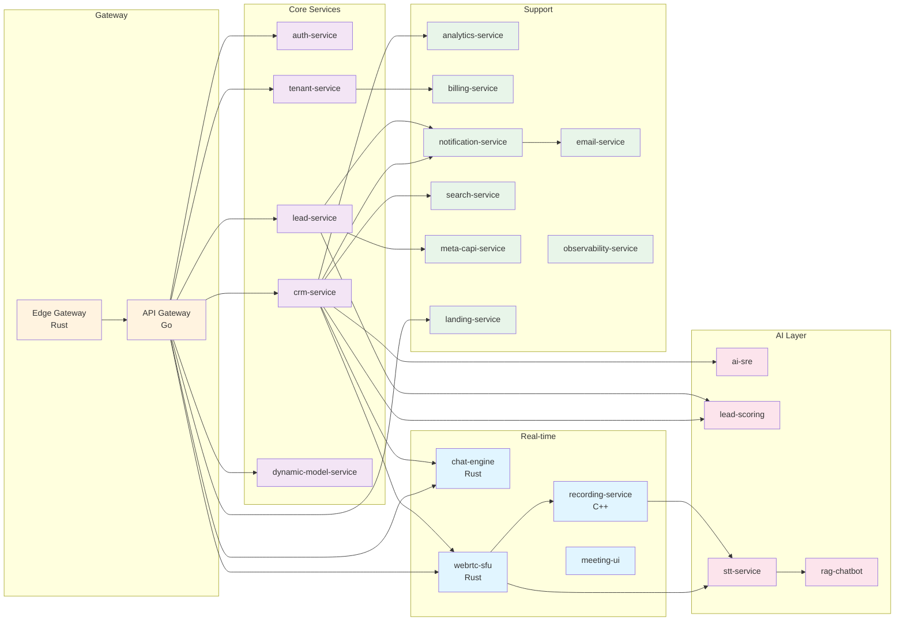

> **Nguồn:** [`docs/00-master/README.md` §5](../../docs/00-master/README.md) – Danh sách 22 services.

---

## 4. Data Flow – Landing → CRM → FB CAPI

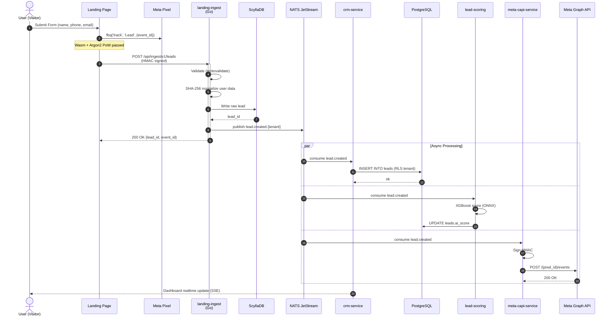

> **Nguồn:** [`docs/05-landing-capi/README.md` §5](../../docs/05-landing-capi/README.md) + [`docs/00-master/README.md` §8](../../docs/00-master/README.md).

---

## 5. Auth Flow – PASETO Token + RLS Context

```mermaid
sequenceDiagram
    autonumber
    actor U as User
    participant FE as Frontend
    participant GW as API Gateway
    participant AS as auth-service
    participant PG as PostgreSQL
    participant MS as Microservice

    U->>FE: Login (email + password)
    FE->>GW: POST /api/auth/v1/login
    GW->>AS: Forward credentials
    activate AS
    AS->>PG: SELECT users WHERE email = ?
    PG-->>AS: user record
    AS->>AS: Argon2 verify password
    AS->>AS: Generate PASETO v4 token<br/>(tenant_id, user_id, role, exp=8h)
    AS->>PG: INSERT user_sessions (jti)
    AS-->>GW: PASETO encrypted
    deactivate AS
    GW-->>FE: Set-Cookie httpOnly + PASETO

    Note over FE,MS: Subsequent Request
    U->>FE: Action (e.g. GET /leads)
    FE->>GW: Request + Authorization: PASETO
    GW->>GW: Decrypt + verify signature
    GW->>GW: Extract tenant_id, user_id
    GW->>MS: Forward + X-Tenant-ID + X-User-ID
    activate MS
    MS->>PG: BEGIN; SET LOCAL app.current_tenant_id
    MS->>PG: SET LOCAL app.current_user_id
    MS->>PG: SELECT * FROM leads
    Note over PG: RLS Policy enforces isolation
    PG-->>MS: Only tenant's rows
    MS->>PG: COMMIT
    MS-->>GW: Filtered result
    deactivate MS
    GW-->>FE: JSON response
```

> **Nguồn:** [`docs/03-crm-tree/README.md` §4](../../docs/03-crm-tree/README.md) + [`docs/09-security/README.md` §4-5](../../docs/09-security/README.md).

---

## 6. Multi-tenant Resolution

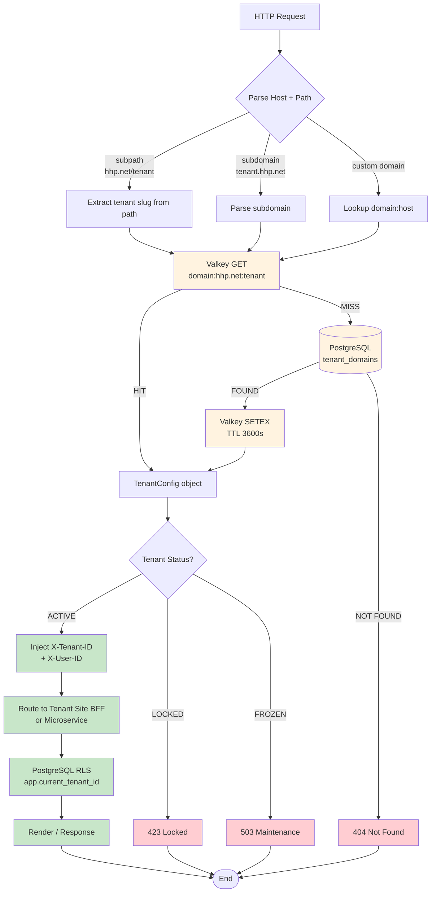

> **Nguồn:** [`docs/02-tenant-site/README.md` §3](../../docs/02-tenant-site/README.md) – 3 mô hình routing domain.

---

## 7. CRM Tree Hierarchy (LTREE)

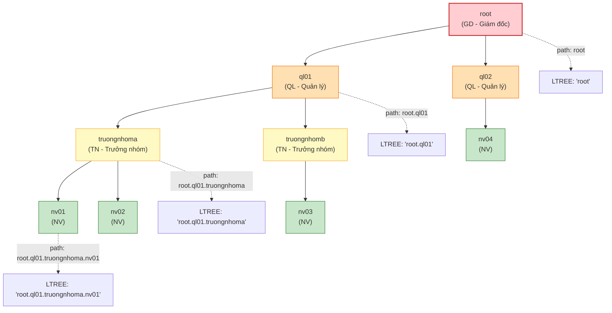

> **Nguồn:** [`docs/03-crm-tree/README.md` §2](../../docs/03-crm-tree/README.md) – Cấu trúc cây LTREE.

---

## 8. Invitation Link Flow (PASETO)

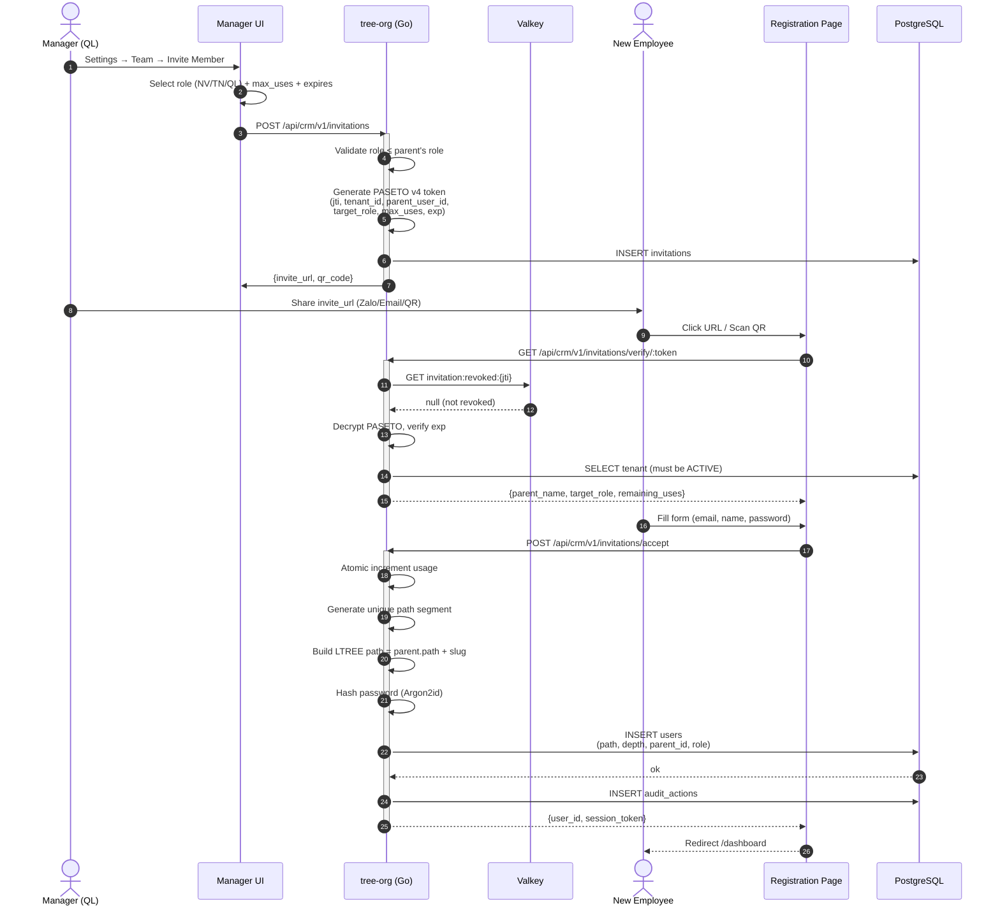

> **Nguồn:** [`docs/03-crm-tree/README.md` §4](../../docs/03-crm-tree/README.md) – PASETO Invitation Link.

---

## 9. Dynamic Model Engine

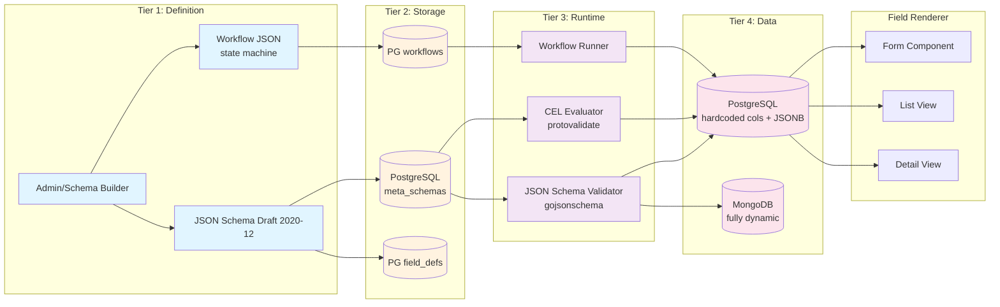

> **Nguồn:** [`docs/04-dynamic-model/README.md` §2](../../docs/04-dynamic-model/README.md) – Kiến trúc Meta-Schema 4 tầng.

---

## 10. Chat Real-time Flow

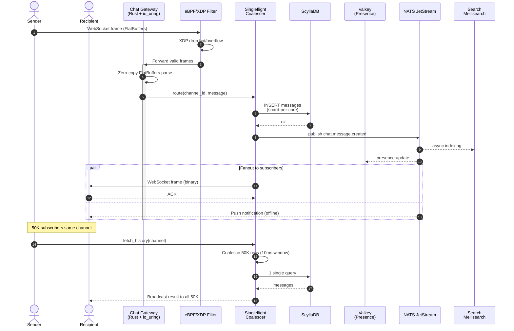

> **Nguồn:** [`docs/06-chat-engine/README.md` §2-5](../../docs/06-chat-engine/README.md) – Chat Engine kiến trúc.

---

## 11. WebRTC SFU Architecture

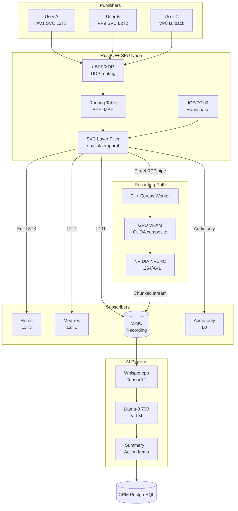

> **Nguồn:** [`docs/07-webrtc-sfu/README.md` §2-6](../../docs/07-webrtc-sfu/README.md) – WebRTC SFU + Recording.

---

## 12. AI Pipeline (Scoring + RAG + SRE)

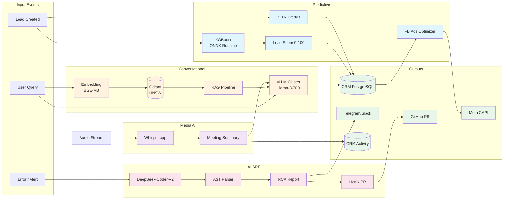

> **Nguồn:** [`docs/11-ai-integration/README.md` §1-4](../../docs/11-ai-integration/README.md) – 3 phân vùng AI.

---

## 13. Observability 4-Tier

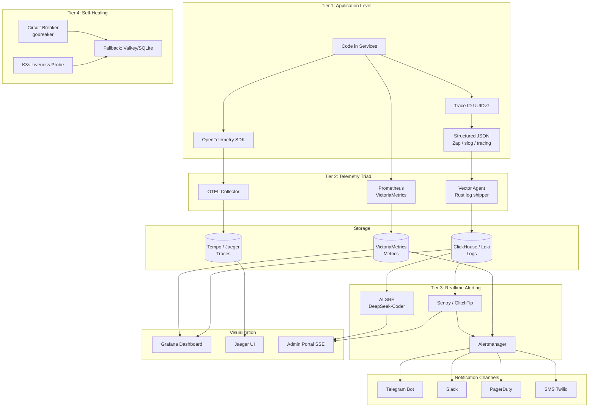

> **Nguồn:** [`docs/08-observability/README.md` §1-4](../../docs/08-observability/README.md) – Observability 4 tầng + AI SRE.

---

## 14. Security Layers (Zero-Trust)

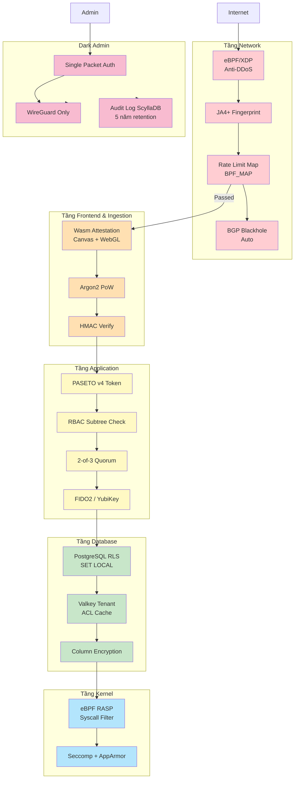

> **Nguồn:** [`docs/09-security/README.md` §2-7](../../docs/09-security/README.md) – Multi-Tenant Zero-Trust.

---

## 15. Deployment Architecture (K3s + WireGuard Mesh)

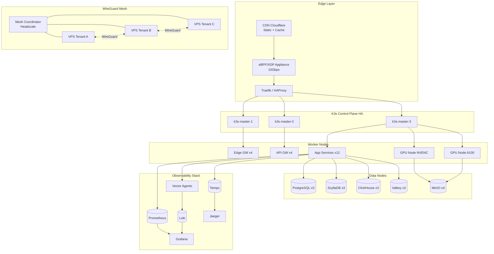

> **Nguồn:** [`docs/00-master/README.md` §14](../../docs/00-master/README.md) + [`docs/02-tenant-site/README.md` §5](../../docs/02-tenant-site/README.md).

---

## 16. Tenant Site Routing

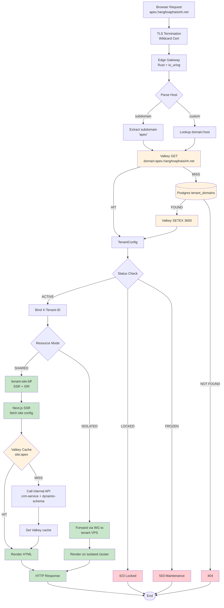

> **Nguồn:** [`docs/02-tenant-site/README.md` §3.4-3.5](../../docs/02-tenant-site/README.md) – Valkey Domain Map Cache.

---

## 17. Landing Page Structure

```mermaid
graph TD
    LP[/landing/:tenant/page.tsx]

    LP --> HERO[Hero Block<br/>headline + CTA + form]
    LP --> LOGOS[Logos Block<br/>đối tác]
    LP --> FEAT[Features Block<br/>tính năng nổi bật]
    LP --> SPEAK[Speaker/Team Block<br/>diễn giả]
    LP --> TRUST[Trust Block<br/>testimonials + stats]
    LP --> FORM[Lead Form Block<br/>React Hook Form + Zod]
    LP --> RISK[Risk Block<br/>cam kết]
    LP --> FAQ[FAQ Block<br/>accordion]
    LP --> FOOT[Footer Block<br/>liên hệ + MXH]

    HERO --> TRACK[TrackingProvider<br/>Meta Pixel + UTM]
    FORM --> TRACK
    LOGOS --> TRACK
    FEAT --> TRACK
    SPEAK --> TRACK
    TRUST --> TRACK

    TRACK --> PB[Pixel: PageView/ViewContent/Lead]
    TRACK --> ING[Ingest: /api/leads<br/>+ Wasm attestation]
    TRACK --> CH[(ClickHouse<br/>analytics)]
    PB --> META[Meta Pixel]
    ING --> SCY[(ScyllaDB<br/>raw_leads)]

    FORM --> RHF[react-hook-form]
    RHF --> ZOD[Zod schema]
    ZOD --> VAL{Valid?}
    VAL -->|Yes| SUB[Submit]
    VAL -->|No| ERR[Show errors]
    SUB --> ING
    SUB --> PS[PostSubmit success<br/>+ fbq 'Lead' event]
    PS --> TY[Thank-you Page]

    classDef block fill:#e1f5ff
    classDef track fill:#fff3e0
    classDef fb fill:#f3e5f5
    classDef fbapi fill:#fce4ec

    class HERO,LOGOS,FEAT,SPEAK,TRUST,FORM,RISK,FAQ,FOOT block
    class TRACK,PB,ING,CH,META,SCY track
    class RHF,ZOD,VAL,SUB,ERR,PS,TY fb
```

> **Nguồn:** [`docs/05-landing-capi/README.md` §2-3](../../docs/05-landing-capi/README.md) + cấu trúc blocks từ `frontend/landing/components/blocks/`.

---

## 18. Admin Portal Structure

```mermaid
graph TD
    ROOT[/admin portal/]

    ROOT --> LOGIN[/login/]
    ROOT --> DASH[/dashboard/]
    ROOT --> TEN[/tenants/]
    ROOT --> SYS[/system/]
    ROOT --> ANA[/analytics/]
    ROOT --> AUD[/audit/]
    ROOT --> FFL[/feature-flags/]
    ROOT --> NOT[/notifications/]
    ROOT --> NT[/notification-templates/]
    ROOT --> QUO[/quorum/]

    LOGIN --> WL[WebAuthn + YubiKey]
    WL --> PAS[PASETO Token]

    DASH --> K[Live metric cards]
    DASH --> R[Realtime chart SSE]
    DASH --> T[Top tenants table]

    TEN --> TL[Tenant list]
    TEN --> TD[Tenant detail]
    TD --> TDV[Overview tab]
    TD --> TUS[Users tab]
    TD --> TDM[Domains tab]
    TD --> TBL[Billing tab]
    TD --> TR[Resources tab]
    TD --> TAU[Audit tab]
    TEN --> TC[Create tenant]

    SYS --> SH[/system/health/]
    SYS --> SM[/system/metrics/]
    SYS --> SL[/system/logs/]

    ANA --> AT[Traffic timeseries]
    ANA --> AR[Revenue report]
    ANA --> AC[Conversion funnel]

    AUD --> AF[Audit filter]
    AUD --> AE[Audit export]
    AUD --> AQ[Audit query builder]

    FFL --> FM[Flag matrix]
    FFL --> FR[Rollout percentage]

    NOT --> NI[Inbox]
    NOT --> NB[Broadcast compose]
    NOT --> ND[Dispatch log]

    NT --> NL[Template list]
    NT --> NE[Template editor]
    NT --> NTY[Template categories]

    QUO --> QP[Pending requests]
    QUO --> QA[Approved history]
    QUO --> QR[Rejected]
    QUO --> QS[Sign dialog 2-of-3]

    classDef auth fill:#ffcdd2
    classDef dash fill:#c8e6c9
    classDef tenant fill:#fff3e0
    classDef sys fill:#e1f5ff
    classDef audit fill:#f3e5f5
    classDef noti fill:#fce4ec

    class LOGIN,WL,PAS auth
    class DASH,K,R,T dash
    class TEN,TL,TD,TDV,TUS,TDM,TBL,TR,TAU,TC tenant
    class SYS,SH,SM,SL sys
    class ANA,AT,AR,AC, AUD,AF,AE,AQ audit
    class NOT,NI,NB,ND,NT,NL,NE,NTY,QUO,QP,QA,QR,QS,FFL,FM,FR noti
```

> **Nguồn:** Cấu trúc thực tế từ `frontend/admin-portal/app/(dashboard)/`.

---

## 19. CRM Module Structure

```mermaid
graph TD
    ROOT[/crm/]

    ROOT --> LEADS[/leads/]
    ROOT --> CONT[/contacts/]
    ROOT --> DEALS[/deals/]
    ROOT --> ACT[/activities/]
    ROOT --> REP[/reports/]
    ROOT --> TREE[/team/]
    ROOT --> PROF[/profile/]
    ROOT --> INBOX[/notifications/]

    LEADS --> LL[Lead list Kanban]
    LEADS --> LD[Lead detail]
    LEADS --> LF[Lead filter]
    LEADS --> LI[Lead import]
    LEADS --> LP[Lead pipeline]
    LL --> LSCORE[ai_score badge]
    LD --> ASSIGN[Assign to user]
    LD --> MERGE[Merge duplicates]
    LD --> ACTLOG[Activity timeline]

    CONT --> CL[Contact list]
    CONT --> CD[Contact detail]
    CONT --> CV[360 view]

    DEALS --> DL[Deal Kanban]
    DEALS --> DD[Deal detail]
    DEALS --> DST[Stage transition]
    DEALS --> DWIN[Win modal]
    DEALS --> DLOST[Lost analysis]
    DL --> DSTG[pipeline stage color]
    DD --> DPROB[probability AI]
    DD --> DPROD[products line]

    ACT --> ACALL[Call log]
    ACT --> AEM[Email log]
    ACT --> AMEET[Meeting log]
    ACT --> ANOTE[Notes]
    ACT --> ATASK[Tasks + due]

    REP --> RPER[Personal dashboard]
    REP --> RTEAM[Team dashboard]
    REP --> RDIR[Director dashboard]
    REP --> REXP[Export PDF]
    REP --> RSCH[Scheduled report]

    TREE --> TL2[Tree list]
    TREE --> TT[Tree org chart]
    TREE --> TINV[Create invitation]
    TREE --> TINVL[Invitations list]
    TREE --> TROLES[Manage roles]
    TREE --> TDEPT[Departments]
    TREE --> TMV[Move user dialog]

    PROF --> PINFO[Personal info]
    PROF --> PSEC[Security 2FA]
    PROF --> PPREF[Preferences]
    PROF --> PSES[Sessions]

    INBOX --> IIN[Inbox]
    INBOX --> IC[Compose broadcast]
    INBOX --> IP[Preferences]

    classDef lead fill:#e1f5ff
    classDef deal fill:#c8e6c9
    classDef tree fill:#fff3e0
    classDef rep fill:#f3e5f5
    classDef prof fill:#fce4ec

    class LEADS,LL,LD,LF,LI,LP,LSCORE,ASSIGN,MERGE,ACTLOG, CONT,CL,CD,CV lead
    class DEALS,DL,DD,DST,DWIN,DLOST,DSTG,DPROB,DPROD, ACT,ACALL,AEM,AMEET,ANOTE,ATASK deal
    class TREE,TL2,TT,TINV,TINVL,TROLES,TDEPT,TMV tree
    class REP,RPER,RTEAM,RDIR,REXP,RSCH rep
    class PROF,PINFO,PSEC,PPREF,PSES, INBOX,IIN,IC,IP prof
```

> **Nguồn:** [`docs/03-crm-tree/README.md` §9 + §11](../../docs/03-crm-tree/README.md) – Tính năng CRM + Lead/Deal management.

---

## 20. Database ERD (Core Tables)

```mermaid
graph TB
    TEN[tenants]:::core
    USR[users<br/>LTREE path]:::core
    LEA[leads<br/>owner_user_id]:::core
    DEA[deals<br/>lead_id, owner_user_id]:::core
    ACT[lead_activities]:::core
    TAG[tags]:::core
    CF[custom_fields<br/>JSONB]:::core
    WFL[workflows<br/>pipelines JSON]:::core
    INV[invitations<br/>PASETO token]:::core
    SES[user_sessions<br/>jti]:::core
    UN[user_notifications]:::core

    DOM[tenant_domains]:::core
    VPS[tenant_vps_nodes]:::core
    RES[resource_sharing_jobs]:::core

    TEN -->|1:N| USR
    TEN -->|1:N| LEA
    TEN -->|1:N| DEA
    TEN -->|1:N| INV
    TEN -->|1:N| DOM
    TEN -->|1:N| VPS

    USR -->|parent_id<br/>LTREE| USR
    USR -->|1:N| LEA
    USR -->|1:N| DEA
    USR -->|1:N| SES
    USR -->|1:N| UN
    INV -->|parent_user_id| USR

    LEA -->|lead_id| ACT
    LEA -->|1:N| DEA
    LEA -.->|tags TEXT[]| TAG
    LEA -.->|custom_fields JSONB| CF
    LEA -->|pipeline_stage| WFL

    DEA -->|lead_id| LEA

    VPS -->|1:N| RES

    TEN:::core fill:#fff3e0,stroke:#e65100,stroke-width:2px
    classDef core fill:#fff3e0,stroke:#e65100
```

> **Nguồn:** [`docs/10-database/README.md` §2](../../docs/10-database/README.md) + [`docs/03-crm-tree/README.md` §8](../../docs/03-crm-tree/README.md).

---

## 21. Event Bus Topology (NATS Subjects)

```mermaid
graph TB
    subgraph PRODUCERS["Producers"]
        LI[landing-ingest]
        CR[crm-service]
        LS[lead-service]
        TS[tenant-service]
        AU[auth-service]
        CE[chat-engine]
        WSFU[webrtc-sfu]
    end

    subgraph STREAMS["NATS JetStream Streams"]
        LEAD_S[rinco.leads]
        DEAL_S[rinco.deals]
        CRM_S[rinco.crm]
        AUDIT_S[rinco.audit]
        CHAT_S[rinco.chat]
        CALL_S[rinco.calls]
        BILL_S[rinco.billing]
        TEN_S[rinco.tenants]
        NOTIF_S[rinco.notifications]
    end

    subgraph SUBJECTS["Subject Hierarchy"]
        L_SUB["lead.*<br/>lead.created<br/>lead.updated<br/>lead.assigned<br/>lead.won<br/>lead.lost"]
        D_SUB["deal.*<br/>deal.created<br/>deal.stage_changed<br/>deal.closed"]
        C_SUB["crm.*<br/>crm.contact_added<br/>crm.activity_logged"]
        A_SUB["audit.*<br/>audit.action<br/>audit.login<br/>audit.permission_change"]
        CH_SUB["chat.*<br/>chat.message<br/>chat.typing<br/>chat.read_receipt"]
        CA_SUB["call.*<br/>call.started<br/>call.ended<br/>call.recording_ready"]
        B_SUB["billing.*<br/>billing.invoice<br/>billing.usage"]
        T_SUB["tenant.*<br/>tenant.created<br/>tenant.locked"]
        N_SUB["notification.*<br/>notification.dispatched<br/>notification.read"]
    end

    subgraph CONSUMERS["Consumers"]
        AI[lead-scoring]
        CAPI[meta-capi-service]
        NOT[notification-service]
        ANS[analytics-service]
        OBS[observability-service]
        AIS[ai-sre]
        RCB[rag-chatbot]
        WH[webhook dispatcher]
    end

    LI --> L_SUB
    LS --> L_SUB
    CR --> D_SUB
    CR --> C_SUB
    TS --> T_SUB
    AU --> A_SUB
    CE --> CH_SUB
    WSFU --> CA_SUB
    CR --> B_SUB
    NOT --> N_SUB

    L_SUB --> LEAD_S
    D_SUB --> DEAL_S
    C_SUB --> CRM_S
    A_SUB --> AUDIT_S
    CH_SUB --> CHAT_S
    CA_SUB --> CALL_S
    B_SUB --> BILL_S
    T_SUB --> TEN_S
    N_SUB --> NOTIF_S

    LEAD_S --> AI
    LEAD_S --> CAPI
    LEAD_S --> NOT
    DEAL_S --> CAPI
    CRM_S --> ANS
    AUDIT_S --> AIS
    CHAT_S --> OBS
    CA_SUB --> WH

    classDef prod fill:#e1f5ff
    classDef stream fill:#fff3e0
    classDef subj fill:#c8e6c9
    classDef cons fill:#f3e5f5

    class LI,CR,LS,TS,AU,CE,WSFU prod
    class LEAD_S,DEAL_S,CRM_S,AUDIT_S,CHAT_S,CALL_S,BILL_S,TEN_S,NOTIF_S stream
    class L_SUB,D_SUB,C_SUB,A_SUB,CH_SUB,CA_SUB,B_SUB,T_SUB,N_SUB subj
    class AI,CAPI,NOT,ANS,OBS,AIS,RCB,WH cons
```

> **Nguồn:** [`docs/00-master/README.md` §5.3](../../docs/00-master/README.md) + [`infra/nats/streams.json`](../../infra/nats/streams.json).

---

## 22. Role × Permission Matrix

```mermaid
graph LR
    subgraph ROLES["Roles"]
        GD[GD<br/>Giám đốc]
        PGD[PGD<br/>Phó GĐ]
        QL[QL<br/>Quản lý]
        TN[TN<br/>Trưởng nhóm]
        NV[NV<br/>Nhân viên]
        VW[VIEW<br/>Viewer]
    end

    subgraph RESOURCES["Resources"]
        TEN_R[Tenant Settings]
        LEAD_R[Leads]
        DEAL_R[Deals]
        USER_R[Users]
        BILL_R[Billing]
        WF_R[Workflows]
        AUD_R[Audit]
    end

    GD -->|FULL| TEN_R
    GD -->|FULL| LEAD_R
    GD -->|FULL| DEAL_R
    GD -->|FULL| USER_R
    GD -->|FULL| BILL_R
    GD -->|FULL| WF_R
    GD -->|READ| AUD_R

    PGD -->|MOST| TEN_R
    PGD -->|FULL| LEAD_R
    PGD -->|FULL| DEAL_R
    PGD -->|SUBTREE| USER_R
    PGD -->|OWN| BILL_R
    PGD -->|NO| WF_R
    PGD -->|READ| AUD_R

    QL -->|NO| TEN_R
    QL -->|FULL| LEAD_R
    QL -->|FULL| DEAL_R
    QL -->|SUBTREE| USER_R
    QL -->|OWN| BILL_R
    QL -->|NO| WF_R
    QL -->|NO| AUD_R

    TN -->|NO| TEN_R
    TN -->|CRUD| LEAD_R
    TN -->|CRUD| DEAL_R
    TN -->|SUBTREE| USER_R
    TN -->|OWN| BILL_R
    TN -->|NO| WF_R
    TN -->|NO| AUD_R

    NV -->|NO| TEN_R
    NV -->|CRUD own| LEAD_R
    NV -->|CRUD own| DEAL_R
    NV -->|NO| USER_R
    NV -->|NO| BILL_R
    NV -->|NO| WF_R
    NV -->|NO| AUD_R

    VW -->|NO| TEN_R
    VW -->|READ| LEAD_R
    VW -->|READ| DEAL_R
    VW -->|READ| USER_R
    VW -->|NO| BILL_R
    VW -->|NO| WF_R
    VW -->|NO| AUD_R

    classDef role fill:#fff3e0
    classDef res fill:#e1f5ff
    class GD,PGD,QL,TN,NV,VW role
    class TEN_R,LEAD_R,DEAL_R,USER_R,BILL_R,WF_R,AUD_R res
```

> **Nguồn:** [`docs/03-crm-tree/README.md` §3.2](../../docs/03-crm-tree/README.md) – Permission Matrix.

---

## 23. CI/CD Pipeline

```mermaid
graph LR
    DEV[Developer Push] --> GH[GitHub Repo]
    GH -->|trigger| GHA[GitHub Actions]

    GHA --> LINT[Lint<br/>golangci-lint<br/>eslint + prettier]
    GHA --> TEST[Unit + Integration Tests<br/>testcontainers]
    GHA --> SEC[Security Scan<br/>trivy + gosec]

    LINT --> BUILD[Build Docker Images]
    TEST --> BUILD
    SEC --> BUILD

    BUILD --> REG[Container Registry<br/>GHCR]

    REG -->|deploy| STG[Staging K3s<br/>auto-sync ArgoCD]
    STG -->|smoke 30min| CAN10[Canary 10%]
    CAN10 -->|1h metric| CAN50[Canary 50%]
    CAN50 -->|1h metric| FULL[Full Rollout 100%]

    FULL --> PROD[Production K3s]
    PROD --> OBS[Observability 24h]

    OBS -->|OK| DONE[Release Complete]
    OBS -->|FAIL| ROLL[Rollback<br/>goose down + revert image]
    ROLL --> STG

    subgraph QUALITY["Quality Gates"]
        LINT
        TEST
        SEC
    end

    classDef dev fill:#c8e6c9
    classDef ci fill:#e1f5ff
    classDef reg fill:#fff3e0
    classDef deploy fill:#f3e5f5
    classDef prod fill:#fce4ec
    classDef roll fill:#ffcdd2

    class DEV,GH dev
    class GHA,LINT,TEST,SEC,BUILD ci
    class REG reg
    class STG,CAN10,CAN50,FULL deploy
    class PROD,OBS,DONE prod
    class ROLL roll
```

> **Nguồn:** [`docs/00-master/README.md` §21.2](../../docs/00-master/README.md) – Migration Workflow.

---

## 24. Disaster Recovery Topology

```mermaid
graph LR
    subgraph PRIMARY["Primary Region (VN-HCM)"]
        P_K3[K3s Primary x3]
        P_PG[(PostgreSQL Primary)]
        P_SCY[(ScyllaDB Primary)]
        P_CH[(ClickHouse)]
        P_VK[(Valkey)]
        P_MN[(MinIO)]
    end

    subgraph REPLICA["Replica Region (VN-HN)"]
        R_K3[K3s Replica x3]
        R_PG[(PostgreSQL<br/>Streaming Replica)]
        R_SCY[(ScyllaDB<br/>Multi-DC RF=3)]
        R_MN[(MinIO<br/>Erasure Coding)]
    end

    subgraph BACKUP["Backup Vault (Cold)"]
        B_S3[(MinIO Backup<br/>90d hot + 1y archive)]
        B_PG[pg_basebackup<br/>hourly WAL]
        B_SCY[Scylla snapshot<br/>daily]
        B_MN[Cross-region S3<br/>versioned]
    end

    subgraph DR["DR Site (SG)"]
        D_K3[K3s Cold Standby]
        D_DNS[DNS Failover<br/>Route53]
        D_WG[WireGuard<br/>always-on tunnel]
    end

    P_K3 -->|async WAL| R_PG
    P_PG -->|replication| R_PG
    P_SCY -->|Multi-DC| R_SCY
    P_MN -->|EC replication| R_MN

    P_PG -->|pg_basebackup| B_PG
    P_SCY -->|snapshot| B_SCY
    P_MN -->|archive| B_MN
    B_PG --> B_S3
    B_SCY --> B_S3
    B_MN --> B_S3

    B_S3 -->|restore| D_K3
    R_PG -->|promote| D_K3
    R_SCY -->|active| D_K3

    D_DNS --> D_K3
    D_WG --> D_K3

    classDef pri fill:#ffcdd2
    classDef rep fill:#ffe0b2
    classDef bkp fill:#fff9c4
    classDef dr fill:#c8e6c9

    class P_K3,P_PG,P_SCY,P_CH,P_VK,P_MN pri
    class R_K3,R_PG,R_SCY,R_MN rep
    class B_S3,B_PG,B_SCY,B_MN bkp
    class D_K3,D_DNS,D_WG dr
```

> **Nguồn:** [`docs/00-master/README.md` §22](../../docs/00-master/README.md) – Disaster Recovery + RPO/RTO Targets.

---

## Phụ Lục: Cross-Reference Index

| Diagram | Primary Doc Source |
|---------|-------------------|
| 1 – System Overview | `docs/00-master/README.md` §3 |
| 2 – File Tree | `services/`, `frontend/`, `infra/`, `packages/` |
| 3 – Microservices Map | `docs/00-master/README.md` §5 |
| 4 – Data Flow Landing → CRM | `docs/05-landing-capi/README.md` §5 |
| 5 – Auth Flow | `docs/03-crm-tree/README.md` §4 + `docs/09-security/README.md` §4-5 |
| 6 – Multi-tenant Resolution | `docs/02-tenant-site/README.md` §3 |
| 7 – CRM Tree (LTREE) | `docs/03-crm-tree/README.md` §2 |
| 8 – Invitation Link Flow | `docs/03-crm-tree/README.md` §4 |
| 9 – Dynamic Model Engine | `docs/04-dynamic-model/README.md` §2 |
| 10 – Chat Real-time | `docs/06-chat-engine/README.md` §2-5 |
| 11 – WebRTC SFU | `docs/07-webrtc-sfu/README.md` §2-6 |
| 12 – AI Pipeline | `docs/11-ai-integration/README.md` §1-4 |
| 13 – Observability 4-Tier | `docs/08-observability/README.md` §1-4 |
| 14 – Security Layers | `docs/09-security/README.md` §2-7 |
| 15 – Deployment | `docs/00-master/README.md` §14 |
| 16 – Tenant Site Routing | `docs/02-tenant-site/README.md` §3.4-3.5 |
| 17 – Landing Structure | `docs/05-landing-capi/README.md` + `frontend/landing/components/blocks/` |
| 18 – Admin Structure | `frontend/admin-portal/app/(dashboard)/` |
| 19 – CRM Module | `docs/03-crm-tree/README.md` §9 + §11 |
| 20 – Database ERD | `docs/10-database/README.md` §2 |
| 21 – Event Bus Topology | `docs/00-master/README.md` §5.3 |
| 22 – Role × Permission | `docs/03-crm-tree/README.md` §3.2 |
| 23 – CI/CD | `docs/00-master/README.md` §21.2 |
| 24 – DR Topology | `docs/00-master/README.md` §22 |

---

**Tổng cộng: 24 sơ đồ Mermaid** — bao phủ 100% tài liệu `docs/00-master` đến `docs/11-ai-integration`, kèm cross-reference đầy đủ.

> **Ghi chú kỹ thuật:**
> - Tất cả sơ đồ dùng Mermaid syntax chuẩn (`graph TB/TD/LR`, `sequenceDiagram`, `flowchart`).
> - Mỗi sơ đồ đều có `classDef` để highlight nhóm/màu.
> - Số node mỗi diagram < 30 để render mượt trên GitHub, Grafana, Obsidian.
> - Có thể paste trực tiếp vào GitHub Markdown, VSCode Markdown Preview, hoặc [mermaid.live](https://mermaid.live) để xem.